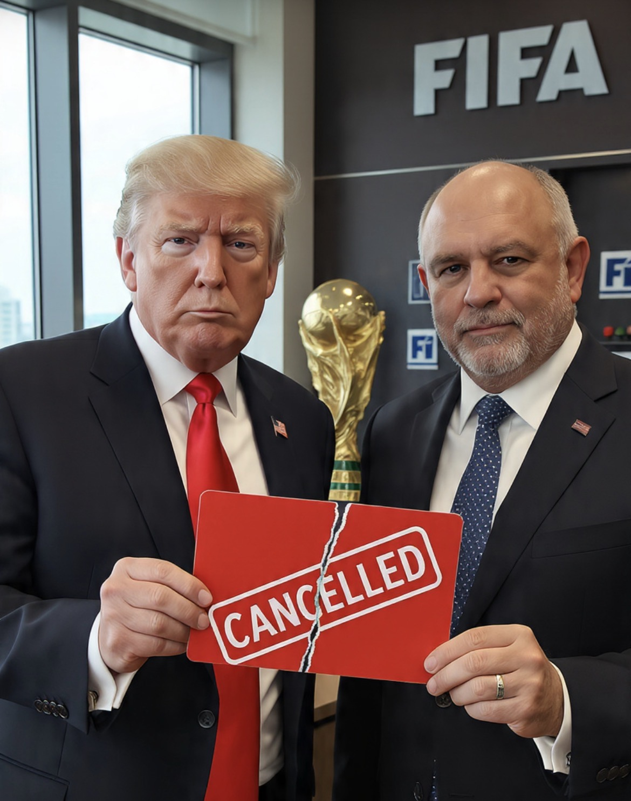

# Ketika Politik Memasuki Ruang Ganti: Kontroversi Intervensi Trump & Ujian Independensi FIFA pada Piala Dunia 2026

*Ilustrasi (pic: Grok AI).*

  
***“Jika satu telepon dari seorang kepala negara mampu mengubah keputusan olahraga, maka yang dipertaruhkan bukan hanya hasil pertandingan, melainkan legitimasi institusi olahraga itu sendiri.”***
  

Piala Dunia diciptakan untuk mempertemukan bangsa-bangsa melalui olahraga. Namun setiap kali politik masuk terlalu jauh ke dalam lapangan, pertandingan yang seharusnya diputuskan oleh kualitas permainan justru mulai diperdebatkan berdasarkan kualitas akses terhadap kekuasaan. 

Kontroversi Piala Dunia 2026 muncul setelah Presiden Donald Trump mengakui telah menghubungi Presiden FIFA, Gianni Infantino, untuk meminta peninjauan kartu merah yang diterima penyerang Amerika Serikat, Folarin Balogun. 

FIFA kemudian menangguhkan pelaksanaan larangan satu pertandingan sehingga Balogun dapat tampil menghadapi Belgia. 

Itulah yang membuat kontroversi ini jauh lebih besar daripada sekadar sebuah kartu merah.

Walaupun Trump menegaskan dirinya hanya meminta “review”, keputusan tersebut memicu kritik dari UEFA, Federasi Sepak Bola Belgia, dan banyak pengamat karena dianggap menimbulkan kesan adanya campur tangan politik dalam proses disipliner FIFA.  

## Mengapa Kasus Ini Menjadi Sangat Besar?

Biasanya kepala negara tidak ikut terlibat dalam keputusan disiplin pertandingan.

Pemerintah memang dapat membangun stadion, menjamin keamanan, juga mendukung penyelenggaraan. Tetapi penentuan hukuman pemain merupakan ranah independen FIFA.

Karena itulah telepon seorang presiden kepada pimpinan FIFA langsung menarik perhatian dunia.  

## Trump Mengatakan Apa?

Trump menjelaskan: “Saya hanya meminta agar keputusan itu ditinjau kembali.” Ia juga mengatakan dirinya tidak memerintahkan FIFA untuk mengubah hasilnya dan menilai kartu merah tersebut tidak adil. 

FIFA menyatakan badan yudisialnya tetap bekerja secara independen. Namun dalam politik internasional, persepsi sering kali sama pentingnya dengan fakta.

Walaupun tidak ada bukti Trump memaksa FIFA, banyak pihak bertanya: Mengapa permintaan dari Presiden AS muncul tepat sebelum keputusan berubah? Itulah sumber kontroversinya.

## Mengapa UEFA Bereaksi Keras?

UEFA menilai keputusan tersebut melewati “garis merah” karena dianggap mengganggu konsistensi penerapan aturan disiplin. 

Federasi Belgia juga menyampaikan keberatan karena merasa lawannya memperoleh perlakuan yang tidak lazim.  

Dalam olahraga, kepercayaan terhadap wasit dan proses disipliner sama pentingnya dengan aturan itu sendiri.

## Masalah Sebenarnya Bukan Balogun

Ironisnya, perdebatan bukan lagi mengenai apakah Balogun memang layak mendapat kartu merah.

Perdebatan berubah menjadi: Apakah seseorang yang memiliki kekuasaan politik dapat memperoleh akses yang tidak dimiliki pihak lain?

Jika jawabannya “ya”, maka muncul pertanyaan berikutnya: Apakah presiden negara lain juga boleh menelepon FIFA?

Apakah semua negara memiliki pengaruh yang sama?

## Soft Power dalam Sepak Bola

Olahraga internasional selalu menjadi instrumen soft power.

Piala Dunia bukan hanya kompetisi sepak bola. Ia juga merupakan panggung diplomasi, citra nasional, investasi, hingga pengaruh budaya.

Karena itu, ketika kepala negara ikut masuk ke dalam perdebatan teknis pertandingan, batas antara olahraga dan politik menjadi semakin kabur.

Kasus ini menyampaikan satu pelajaran penting. Sering kali orang berkata: “Politik jangan dibawa ke olahraga.”

Namun sejarah menunjukkan hal yang berbeda, diantaranya adalah Olimpiade pernah diboikot, Piala Dunia pernah dipakai sebagai alat legitimasi politik, dan Pertandingan internasional pernah dibatalkan karena perang.

Kini muncul pertanyaan baru: Apakah pengaruh politik cukup kuat untuk mengubah keputusan disiplin di lapangan?

Mungkin masalah terbesarnya bukan apakah Trump benar atau salah. Masalah terbesarnya adalah ketika publik mulai percaya bahwa akses kepada pemimpin FIFA bisa lebih menentukan daripada proses yang berlaku bagi semua peserta.

Dalam tata kelola, kepercayaan adalah modal utama. Sekali muncul kesan bahwa keputusan dapat dipengaruhi oleh kedekatan politik, memulihkan legitimasi menjadi jauh lebih sulit daripada membatalkan satu kartu merah.

Terlepas dari apakah intervensi Trump benar-benar memengaruhi hasil akhir, kontroversi ini memperlihatkan rapuhnya batas antara olahraga dan politik di era modern.

Bagi FIFA, tantangan terbesar bukan hanya memastikan aturan diterapkan, tetapi juga memastikan dunia percaya bahwa aturan diterapkan tanpa memandang siapa yang menelepon, siapa tuan rumah, atau siapa yang sedang berkuasa.

  
**Referensi**

FIFA. (2026). FIFA Disciplinary Code.

Reuters: Trump meminta FIFA meninjau kartu merah Balogun⁠.

The Guardian: Trump mengakui menghubungi FIFA⁠.

ABC News Australia: UEFA menyebut keputusan itu melewati "garis merah"⁠.

Financial Times: Analisis kontroversi Trump dan FIFA⁠.
