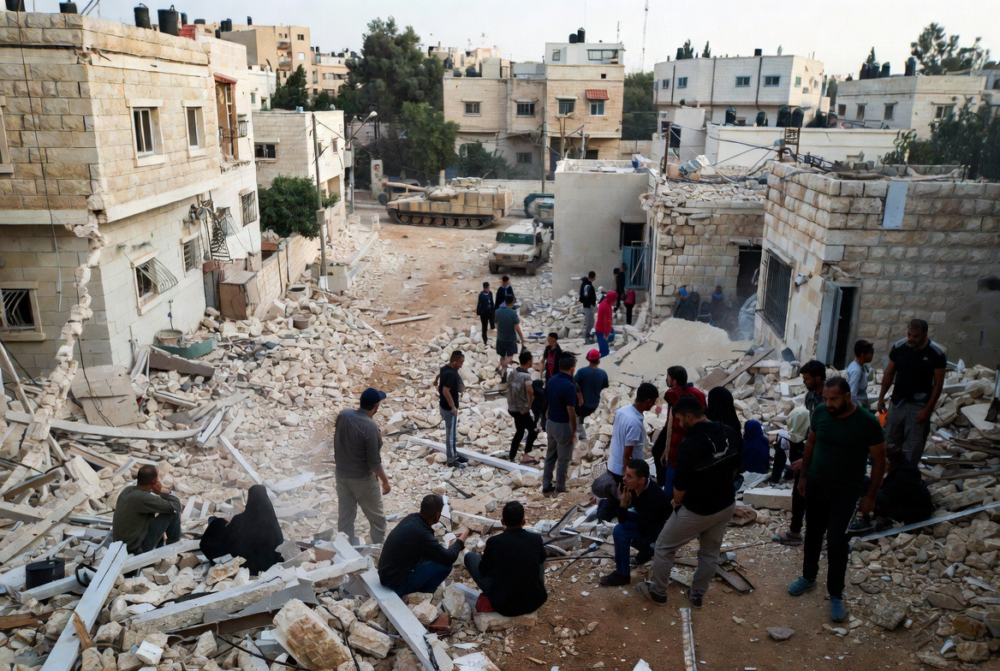

# Ketika Sorotan Dunia Beralih: Mengapa Kekerasan di Tepi Barat Justru Meningkat?

*Ilustrasi (pic: Grok AI).*

  
***“Dalam banyak konflik, bahaya terbesar bukan hanya ledakan bom, tetapi juga saat perhatian dunia berpindah ke tempat lain.”***
  

Dalam studi hubungan internasional terdapat konsep yang disebut attention politics, bahwa perhatian dunia adalah sumber daya yang terbatas.

Ketika satu konflik besar meledak, sorotan media, diplomat, dan organisasi internasional sering terkonsentrasi pada krisis tersebut. Akibatnya, kawasan lain yang masih mengalami kekerasan dapat menerima perhatian yang lebih sedikit.

Pertanyaannya: Apakah berkurangnya perhatian internasional menciptakan ruang bagi meningkatnya kekerasan di wilayah lain?

# Tepi Barat: Konflik yang Tidak Pernah Benar-Benar Berhenti

Berbeda dengan Gaza yang sering menjadi pusat pemberitaan internasional, Tepi Barat mengalami dinamika berbeda.

Di sana terdapat operasi keamanan Israel, aktivitas kelompok bersenjata Palestina, perluasan permukiman Israel yang dianggap ilegal menurut sebagian besar komunitas internasional, serta bentrokan antara pemukim dan warga Palestina.

Konfliknya tidak selalu menjadi berita utama, tetapi berlangsung terus-menerus.

# Pemukim dan Perlindungan Negara

Salah satu isu paling kontroversial adalah kekerasan yang melibatkan sebagian pemukim Israel.

Berbagai organisasi HAM, termasuk lembaga Israel sendiri, telah mendokumentasikan kasus pembakaran lahan, perusakan kebun zaitun, intimidasi terhadap warga Palestina, serta penyerangan terhadap properti.

Sebagian laporan juga mengkritik bahwa respons aparat keamanan terhadap pelaku tidak selalu dianggap memadai oleh para pengamat dan korban.

Pemerintah Israel umumnya menyatakan bahwa tindakan kriminal oleh individu tetap melanggar hukum dan dapat diproses, tetapi juga menekankan bahwa aparat menghadapi ancaman keamanan yang kompleks dari berbagai kelompok bersenjata. 

Posisi ini menjadi bagian dari perdebatan yang terus berlangsung.

# Label “Teroris” dan Pertanyaan tentang Proporsionalitas

Setiap negara memiliki hak mempertahankan keamanan warganya. Namun hukum humaniter internasional juga menuntut bahwa penggunaan kekuatan harus memenuhi prinsip proporsionalitas, pembedaan antara kombatan dan warga sipil, dan akuntabilitas.

Perdebatan muncul ketika terjadi tuduhan bahwa label keamanan digunakan terlalu luas atau ketika warga sipil ikut menjadi korban. 

Di sisi lain, pemerintah Israel menyatakan bahwa mereka menghadapi ancaman nyata dari kelompok bersenjata yang beroperasi di kawasan tersebut.

Di sinilah perdebatan hukum dan politik menjadi sangat tajam.

# Analisis

Ada pola yang menarik dalam sejarah.

Ketika perhatian internasional terpecah oleh krisis besar, wilayah yang sebelumnya telah bergejolak sering mengalami penurunan intensitas pengawasan global.

Pengawasan media berkurang, tekanan diplomatik melemah, agenda internasional bergeser. Bukan berarti semua tindakan yang terjadi sesudahnya disebabkan oleh distraksi global.

Namun, dalam ilmu politik terdapat hipotesis bahwa menurunnya sorotan internasional dapat mengurangi tekanan eksternal terhadap para aktor konflik.

Hipotesis ini masih diperdebatkan, tetapi sering digunakan untuk menganalisis dinamika konflik berkepanjangan.

# Mengapa Dunia Menilai Ini sebagai Persoalan Keadilan?

Di sinilah letak inti persoalannya.

Bagi banyak negara dan organisasi internasional, isu Tepi Barat bukan hanya soal keamanan.Ia juga menyangkut status pendudukan, perluasan permukiman, hak atas tanah, perlindungan warga sipil, dan penerapan hukum internasional yang konsisten.

Karena itu kritik yang muncul sering kali tidak hanya diarahkan pada satu insiden, tetapi pada keseluruhan struktur konflik yang telah berlangsung puluhan tahun.

Sejarah menunjukkan bahwa konflik berkepanjangan tidak hanya mengikis infrastruktur, tapi juga mengikis kepercayaan.

Ketika satu kelompok merasa perlindungan hukum tidak bekerja bagi mereka, sementara kelompok lain dipersepsikan memperoleh perlakuan berbeda, rasa ketidakadilan akan semakin mengakar.

Dan ketika rasa ketidakadilan bertahan lintas generasi, perdamaian menjadi jauh lebih sulit dibangun, sekalipun kekerasan sesaat berhasil dihentikan.

Perhatian internasional yang berkurang terhadap kekerasan di Tepi Barat dapat memengaruhi tingkat pengawasan, tekanan diplomatik, dan persepsi para aktor di lapangan.

Keadilan tidak diuji ketika dunia sedang menonton. Keadilan diuji ketika sorotan kamera telah berpindah, tetapi hak hidup manusia tetap menuntut perlindungan yang sama. 

Bila perhatian global menjadi penentu seberapa besar penderitaan direspons, maka yang sedang melemah bukan hanya diplomasi, melainkan juga kepercayaan bahwa hukum internasional berlaku bagi semua tanpa memandang siapa yang kuat dan siapa yang lemah.

Pada akhirnya, tantangan terbesar bukan hanya menghentikan bentrokan hari ini, melainkan membangun sistem yang memastikan hak, keamanan, dan martabat manusia dilindungi secara konsisten, tanpa bergantung pada siapa yang sedang menjadi pusat perhatian dunia.

  
**Referensi**

United Nations Office for the Coordination of Humanitarian Affairs. (2025-2026). Reports on protection of civilians in the Occupied Palestinian Territory.

International Court of Justice. (2024). Legal Consequences Arising from the Policies and Practices of Israel in the Occupied Palestinian Territory (Advisory Opinion).

B’Tselem. Reports on violence in the West Bank.

Human Rights Watch. Reports on Israel and Palestine.

The Politics of Human Rights. Carey, S. C., Gibney, M., & Poe, S. C. (2010). The Politics of Human Rights. Cambridge University Press.

