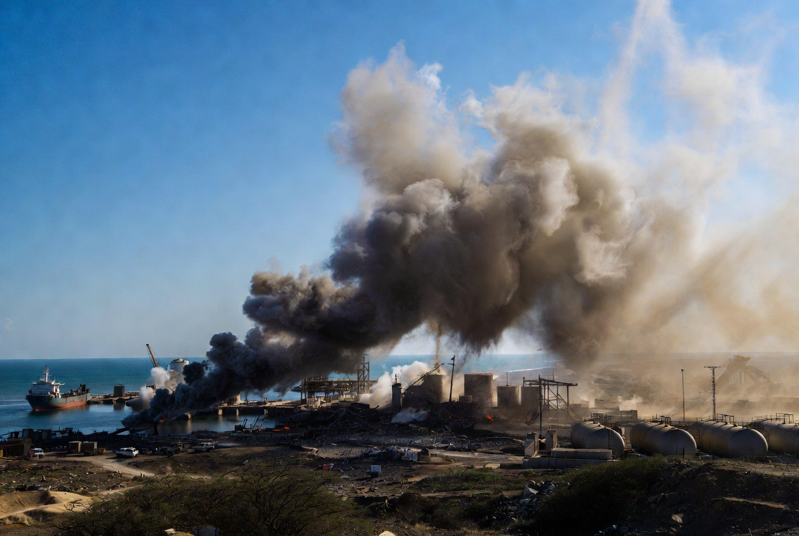

# Ketika Timur Tengah Terpecah: Apakah Konflik Regional Menjadi “Pasar Strategis” bagi Kekuatan Besar?

*Ilustrasi (pic: Grok AI).*

  
***“Dalam sejarah, perang bukan hanya menghasilkan pemenang dan pecundang. Ia juga menciptakan pasar, aliansi, dan ketergantungan baru.”***
  

Timur Tengah merupakan salah satu kawasan paling strategis di dunia. Di sana bertemu cadangan energi, jalur pelayaran, persimpangan tiga benua, rivalitas ideologi, serta kepentingan berbagai kekuatan besar.

Akibatnya, hampir setiap konflik lokal memiliki dimensi internasional.

## Saudi Arabia dan Houthi

Konflik di Yaman bukanlah konflik satu sebab.
Di dalamnya bertemu berbagai lapisan, yaitu konflik politik domestik, persaingan elite, ketegangan antarkelompok, rivalitas regional antara Saudi Arabia dan Iran, serta keterlibatan negara-negara besar.

Artinya, perang ini tidak bisa dijelaskan hanya sebagai “perang proksi” atau hanya sebagai “perang saudara”. Kedua dimensi itu saling bertumpuk.

## Siapa yang Mendapat Keuntungan?

Di sinilah pertanyaan menjadi menarik.

Dalam ekonomi politik perang terdapat konsep bahwa konflik dapat menciptakan permintaan terhadap senjata, sistem pertahanan, logistik, intelijen, serta kontraktor keamanan.

Negara-negara produsen persenjataan memang berpotensi memperoleh keuntungan ekonomi dari meningkatnya permintaan tersebut. Namun, itu tidak otomatis membuktikan bahwa mereka menciptakan setiap konflik. 

Yang dapat dikatakan dengan lebih kuat adalah: ketika konflik terjadi, industri pertahanan dan sejumlah aktor strategis dapat memperoleh manfaat ekonomi maupun geopolitik.

## Pangkalan Militer

Semakin tinggi persepsi ancaman, maka semakin besar pula kemungkinan negara-negara meminta kerja sama keamanan, latihan militer, penjualan sistem pertahanan, atau kehadiran pasukan sekutu.

Dari sudut pandang teori aliansi, ancaman eksternal memang sering memperkuat hubungan keamanan antarnegara.

## Analisis

Sejak era kolonial, ada ungkapan terkenal “Divide et impera.”

Secara historis, strategi ini berarti memanfaatkan atau memperdalam perpecahan agar lebih mudah mempertahankan pengaruh.

Apakah konsep itu masih relevan sekarang?

Sebagian ilmuwan politik berpendapat bahwa bentuknya telah berubah. Bukan selalu berarti “menciptakan konflik”, melainkan kadang memanfaatkan konflik yang sudah ada untuk memperkuat posisi diplomatik, ekonomi, atau militer.

Dengan kata lain, konflik lokal dapat berubah menjadi peluang strategis bagi aktor eksternal.

Tetapi kalau semua dijelaskan dengan “ada pihak luar yang mengatur”, kita juga kehilangan sebagian gambar besarnya.

Konflik Saudi-Houthi tidak akan berlangsung lama jika tidak ada persoalan politik internal, tidak ada perebutan kekuasaan, serta tidak ada ketidakpuasan domestik.

Artinya, aktor luar dapat memengaruhi arah konflik, tetapi biasanya tidak menciptakan seluruh akar konfliknya dari nol.

## Pelajaran Besar

Konflik berkepanjangan menghasilkan lingkaran yang sulit diputus.

Semakin lama perang berlangsung, maka kebutuhan senjata meningkat, ketergantungan keamanan meningkat, anggaran militer meningkat, rekonstruksi tertunda, serta pembangunan ekonomi melambat.

Dalam situasi seperti itu, pihak yang paling menderita biasanya adalah masyarakat sipil, sedangkan keuntungan ekonomi dan strategis lebih banyak dinikmati oleh aktor yang berada jauh dari garis depan.

Timur Tengah memperlihatkan bagaimana konflik lokal dapat berinteraksi dengan persaingan regional dan kepentingan global. 

Industri pertahanan, aliansi keamanan, dan kehadiran militer asing memang dapat memperoleh manfaat tertentu ketika ancaman meningkat. Namun hal itu tidak berarti setiap konflik semata-mata diciptakan dari luar.

Analisis yang paling kuat adalah melihat konflik sebagai hasil interaksi antara persoalan domestik, rivalitas regional, dan kepentingan kekuatan besar. 

Mengabaikan salah satu unsur akan membuat gambaran menjadi terlalu sederhana.

Sejarah menunjukkan bahwa perang sering kali lebih murah untuk dimulai daripada diakhiri. 

Ketika kawasan-kawasan strategis terus dilanda konflik, pihak yang kehilangan rumah biasanya adalah warga sipil, sedangkan sebagian aktor lain memperoleh kontrak, pengaruh, atau posisi tawar yang lebih besar. 

Karena itu, pertanyaan paling penting dalam geopolitik bukan hanya ‘siapa yang menembak?’, tetapi juga ‘siapa yang diuntungkan ketika tembakan itu terus berlanjut?’

  
**Referensi**

The Tragedy of Great Power Politics. Mearsheimer, J. J. (2014). The Tragedy of Great Power Politics. W. W. Norton & Company.

The Anarchical Society. Bull, H. (2012 ed.). The Anarchical Society. Columbia University Press.

Stockholm International Peace Research Institute. SIPRI Yearbook (edisi terbaru), khususnya data mengenai perdagangan senjata internasional.

International Institute for Strategic Studies. The Military Balance (edisi terbaru).
