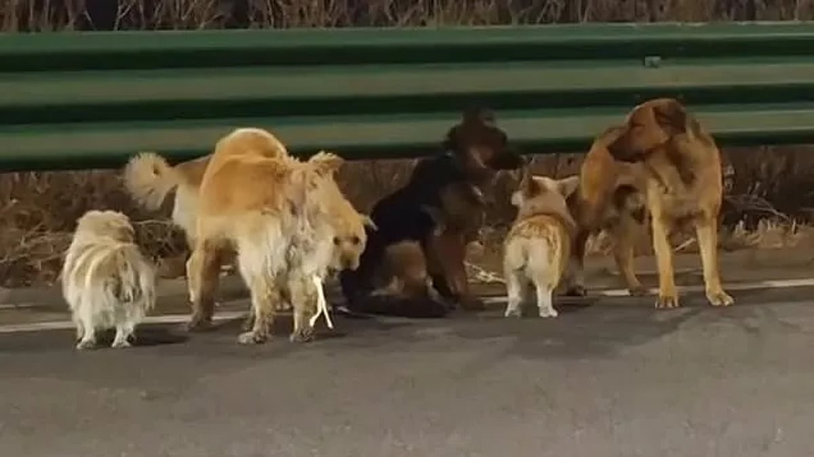

# Kisah 7 Anjing yang Kembali: Analisis Biopsikososial Empati, Navigasi Hewan, dan Implikasi Etika Konsumsi dalam Kehidupan Modern

*Tujuh anjing terlantar di Jilin, China (pic: Grok AI).*

  
***Ketujuh anjing berhasil kabur dari truk penjagal yang sedang dalam perjalanan untuk perdagangan daging anjing ilegal***
  

Kisah mengharukan ini terjadi di sekitar 16 Maret 2026 di daerah Changchun, Provinsi Jilin, China (northeast China).

Ketujuh anjing ini adalah anjing peliharaan dari desa yang sama (bukan anjing liar). Mereka berasal dari 3 keluarga tetangga, termasuk ras Corgi (yang jadi “pemimpin” rombongan, namanya Dapang alias “Big Fatty”), German Shepherd (yang sempat terluka dan dilindungi teman-temannya), Golden Retriever, Labrador, dan Pekingese.

Mereka dicuri oleh pencuri yang diduga bekerja untuk perdagangan daging anjing ilegal.

Entah bagaimana, mereka berhasil kabur dari truk pengangkut yang sedang dalam perjalanan.

Alih-alih lari ke mana-mana, mereka tetap kompak sebagai satu kelompok (“band of little brothers”), berjalan bersama menyusuri pinggir jalan tol (Changshuang Expressway) dan ladang selama 2 hari, menempuh jarak sekitar 17 km (sekitar 10,5 mil) untuk pulang ke desa mereka.

Fenomena tujuh anjing yang melarikan diri dari truk penjagalan dan berjalan sejauh ±17 km untuk kembali ke lingkungan asal mencerminkan kompleksitas kognitif dan emosional hewan non-manusia. 

Studi ini menganalisis fenomena tersebut melalui pendekatan biopsikososial, serta mengevaluasi implikasi etika dan kesehatan publik dari konsumsi anjing dan kucing. 

Dengan merujuk pada literatur perilaku hewan dan kesehatan zoonosis, artikel ini berargumen bahwa peningkatan empati manusia terhadap hewan berkorelasi dengan kesadaran kesehatan dan perkembangan moral masyarakat.

## Pendahuluan

Dalam banyak budaya, anjing diposisikan sebagai:

•	hewan peliharaan

•	penjaga

•	bahkan anggota keluarga

Namun di beberapa wilayah, anjing juga diperlakukan sebagai komoditas konsumsi. 

Kontradiksi ini memunculkan konflik etika, terutama ketika muncul peristiwa ekstrem seperti: pelarian tujuh anjing dari ancaman kematian, diikuti perjalanan panjang untuk kembali ke “rumah”.

Fenomena ini menantang persepsi manusia tentang batas antara insting dan kesadaran hewan.

## Perspektif Biologis dan Kognitif Hewan

Penelitian dalam bidang Animal Cognition menunjukkan bahwa anjing memiliki:

•	kemampuan navigasi berbasis penciuman (olfactory mapping)

•	memori spasial yang kuat

•	keterikatan emosional terhadap manusia dan lingkungan

Perilaku kembali sejauh 17 km dapat dijelaskan sebagai: kombinasi insting bertahan hidup + memori emosional terhadap tempat aman.

## Perspektif Psikologis: Emosi Hewan

Dalam Comparative Psychology, anjing diketahui mampu:

•	merasakan takut

•	mengalami stres

•	menunjukkan loyalitas

Perjalanan tersebut bukan sekadar reaksi biologis, tetapi: indikasi bahwa hewan memiliki bentuk pengalaman subjektif terhadap dunia.

## Perspektif Etika: Hewan sebagai Subjek Moral

Perkembangan etika modern menggeser pandangan:

•	dari hewan sebagai objek
menjadi

•	hewan sebagai makhluk yang layak dipertimbangkan secara moral

Peristiwa ini memperkuat argumen bahwa:

➡️ penderitaan hewan bukan hal netral

➡️ tetapi memiliki dimensi etis yang signifikan

## Implikasi Kesehatan: Risiko Konsumsi Anjing dan Kucing

Di luar aspek etika, terdapat pertimbangan kesehatan yang serius.

1. Risiko Zoonosis

Konsumsi anjing/kucing berpotensi menularkan penyakit seperti:

•	Rabies

•	Trichinellosis

•	infeksi bakteri dari daging yang tidak terkontrol

Karena: banyak hewan tersebut tidak dibesarkan dalam sistem peternakan higienis.

2. Proses Distribusi Tidak Aman

•	transportasi ilegal

•	penyembelihan tanpa standar sanitasi

•	stres ekstrem pada hewan → meningkatkan kontaminasi

3. Dampak Kesehatan Jangka Panjang

•	risiko infeksi parasit

•	potensi penyakit sistemik

•	ancaman kesehatan masyarakat luas

## Analisis Sosial Budaya

Konsumsi anjing/kucing tidak dapat dilepaskan dari:

•	tradisi lokal

•	kondisi ekonomi

•	sejarah pangan

Namun dalam masyarakat modern:

➡️ terjadi pergeseran menuju animal welfare

➡️ meningkatnya penolakan terhadap praktik tersebut

Empati sebagai Evolusi Moral

Kisah tujuh anjing tersebut memicu:

•	respon emosional global

•	refleksi etis kolektif

Empati terhadap hewan menunjukkan: perkembangan kesadaran moral manusia menuju sistem nilai yang lebih inklusif.

Fenomena tujuh anjing yang kembali ke rumah merupakan:

•	bukti kemampuan kognitif dan emosional hewan

•	pemicu refleksi etika manusia

•	indikator penting dalam diskursus kesehatan publik

Konsumsi anjing dan kucing, dalam konteks modern, menghadapi tantangan serius dari aspek etika, aspek kesehatan, dan perkembangan nilai kemanusiaan.

  
**Referensi**

Shettleworth, S. J. (2010). Cognition, evolution, and behavior. Oxford University Press.

Papini, M. R. (2002). Comparative psychology. Psychology Press.

World Health Organization. (2020). Rabies and zoonotic diseases report.
