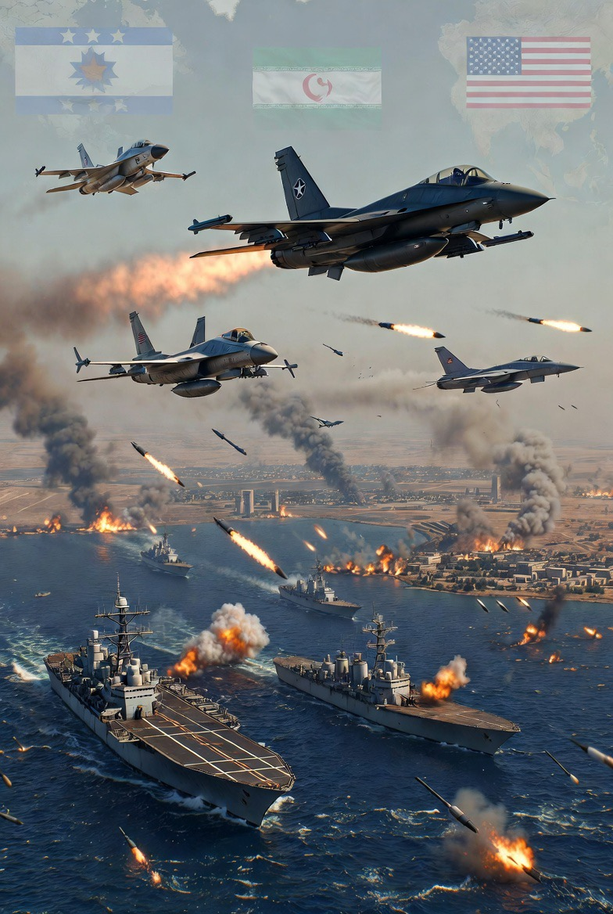

# Konflik Iran–Israel sebagai Simpul Geopolitik Global: Energi, Ideologi, dan Warisan Kolonial dalam Sistem Internasional Kontemporer

*Ilustrasi perang (pic: Grok AI).*

  
***Keamanan energi, persaingan kekuatan besar, identitas ideologis, serta warisan kolonial telah menciptakan struktur konflik yang sangat rumit***
  

Konflik antara Iran dan Israel sering dipahami sebagai perseteruan bilateral yang dipicu oleh ancaman keamanan dan rivalitas regional. 

Namun analisis yang lebih luas menunjukkan bahwa konflik ini merupakan simpul kompleks dari berbagai dinamika global, termasuk keamanan energi, persaingan kekuatan besar, ideologi politik, dan warisan kolonial di Timur Tengah. 

Artikel ini menggunakan pendekatan studi hubungan internasional untuk menganalisis bagaimana konflik Iran–Israel terhubung dengan struktur sistem internasional yang lebih luas. 

Penelitian ini berargumen bahwa eskalasi konflik tidak hanya ditentukan oleh kepentingan nasional kedua negara, tetapi juga oleh jaringan kepentingan global yang melibatkan kekuatan besar, pasar energi, serta identitas ideologis dan historis yang terbentuk sejak abad ke-20.

## Pendahuluan

Konflik Iran–Israel merupakan salah satu dinamika keamanan paling kompleks dalam politik internasional modern. 

Ketegangan antara kedua negara tidak hanya dipicu oleh faktor keamanan langsung, tetapi juga oleh berbagai dimensi struktural yang lebih luas.

Sejak Revolusi Iran 1979, hubungan antara Iran dan Israel berubah menjadi antagonistik. Iran memandang Israel sebagai simbol dominasi Barat di Timur Tengah, sementara Israel melihat Iran sebagai ancaman eksistensial karena dukungannya terhadap kelompok militan regional dan program nuklirnya.

Namun konflik ini tidak dapat dipahami hanya melalui hubungan bilateral. Sebaliknya, konflik tersebut berfungsi sebagai simpul geopolitik yang menghubungkan kepentingan energi global, persaingan kekuatan besar, ideologi politik, serta sejarah kolonial kawasan.

## Realisme dan Keseimbangan Kekuatan

Dalam perspektif realis, negara bertindak untuk mempertahankan keamanan dan mencegah dominasi kekuatan lain dalam sistem internasional.

Konflik Iran–Israel mencerminkan upaya mempertahankan keseimbangan kekuatan di Timur Tengah, di mana Israel dan sekutunya berusaha mencegah Iran menjadi kekuatan hegemonik regional.

## Geopolitik Energi

Teori geopolitik energi menekankan bahwa sumber daya energi dan jalur distribusinya memainkan peran penting dalam konflik internasional.

Iran memiliki posisi strategis di dekat jalur perdagangan energi global yang vital, terutama Strait of Hormuz,yang dilalui oleh sebagian besar ekspor minyak dari Teluk Persia.

Ketegangan di kawasan ini dapat mempengaruhi stabilitas pasar energi global.

## Konstruktivisme dan Identitas Ideologis

Pendekatan konstruktivis menyoroti bagaimana identitas, ideologi, dan narasi sejarah membentuk perilaku negara.

Konflik Iran–Israel dipengaruhi oleh identitas ideologis yang berbeda:

•	ideologi revolusi Islam Iran

•	nasionalisme Israel dan ideologi Zionisme

•	solidaritas regional terhadap isu Palestina.

Identitas ini membentuk persepsi ancaman dan legitimasi politik di masing-masing pihak.

## Dimensi Energi dalam Konflik

Timur Tengah merupakan pusat produksi energi global, dan stabilitas kawasan memiliki dampak langsung terhadap ekonomi dunia.

Iran memiliki posisi strategis dalam sistem energi global karena kedekatannya dengan jalur perdagangan minyak internasional.

Gangguan terhadap jalur tersebut dapat menyebabkan:

•	kenaikan harga energi

•	ketidakstabilan pasar global

•	tekanan ekonomi internasional.

Karena itu, konflik Iran–Israel sering kali memiliki implikasi yang jauh melampaui kawasan Timur Tengah.

## Persaingan Kekuatan Besar

Konflik Iran–Israel juga terkait dengan dinamika persaingan kekuatan global.

Amerika Serikat secara historis menjadi sekutu utama Israel dan memainkan peran penting dalam sistem keamanan regional Timur Tengah.

Sebaliknya, Iran memiliki hubungan strategis dengan beberapa kekuatan global yang menantang dominasi Barat dalam sistem internasional.

Dengan demikian, konflik Iran–Israel tidak hanya mencerminkan rivalitas regional tetapi juga bagian dari kompetisi geopolitik global.

## Warisan Kolonial dan Pembentukan Konflik

Akar historis konflik di Timur Tengah sebagian berasal dari transformasi politik setelah runtuhnya Kekaisaran Ottoman pada awal abad ke-20.

Wilayah tersebut kemudian dibagi melalui perjanjian kolonial seperti Sykes–Picot Agreement, yang membentuk batas negara modern di kawasan tersebut.

Selain itu, konflik Israel–Palestina memiliki hubungan erat dengan periode Mandat Inggris di Palestina dan perkembangan nasionalisme Arab serta Zionisme.

Warisan sejarah ini menciptakan struktur konflik yang masih mempengaruhi dinamika politik kawasan hingga saat ini.

## Implikasi terhadap Stabilitas Global

Konflik Iran–Israel memiliki potensi dampak yang luas terhadap stabilitas internasional.

Beberapa implikasi utama meliputi:

1.	risiko eskalasi konflik regional melalui jaringan milisi dan sekutu

2.	gangguan terhadap perdagangan energi global

3.	peningkatan polarisasi geopolitik antara blok kekuatan dunia

4.	ketidakstabilan politik di kawasan Timur Tengah.

Karena banyaknya kepentingan yang terlibat, konflik ini sulit diselesaikan melalui pendekatan militer semata.

Konflik Iran–Israel bukan sekadar perseteruan bilateral antara dua negara, tetapi merupakan simpul kompleks dari berbagai dinamika geopolitik global.

Faktor-faktor seperti keamanan energi, persaingan kekuatan besar, identitas ideologis, serta warisan kolonial telah menciptakan struktur konflik yang sangat rumit.

Dalam konteks ini, penyelesaian konflik memerlukan pendekatan multilateral yang mempertimbangkan tidak hanya kepentingan regional tetapi juga dinamika sistem internasional yang lebih luas.

Jika sebuah konflik hanya punya satu penyebab, biasanya mudah selesai.

Konflik Iran–Israel memiliki energi, ideologi, sejarah, keamanan, dan politik global sekaligus.

Itulah sebabnya ia bertahan lama seperti simpul tali yang sudah ditarik terlalu kencang selama satu abad.

  
**Referensi**

Freedman, L. (2013). Strategy: A history. Oxford University Press.

Mearsheimer, J. J. (2001). The tragedy of great power politics. W. W. Norton.

Walt, S. M. (1987). The origins of alliances. Cornell University Press.

Yergin, D. (2011). The quest: Energy, security, and the remaking of the modern world. Penguin Press.

Halliday, F. (2005). The Middle East in international relations. Cambridge University Press.
