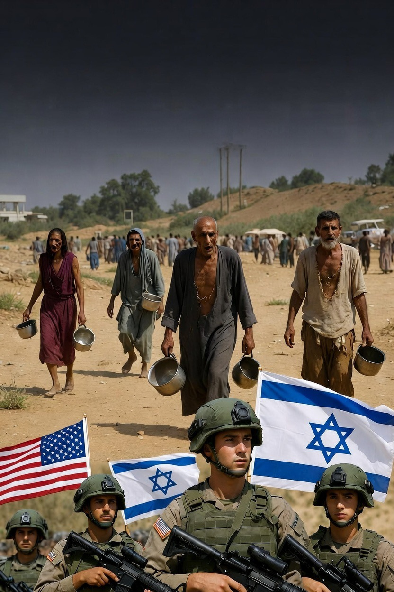

# Konflik Regional dan Invisibilitas Krisis Palestina: Analisis Geopolitik Perang Iran–Israel terhadap Dinamika Gaza dan Tepi Barat

*Ilustrasi konflik (pic: Grok AI).*

  
***Satu tragedi menutupi tragedi lain. Dunia menonton yang paling besar, sementara yang lain tetap berdarah di pinggir panggung***
  

Perang antara Israel dan Iran yang meningkat pada awal 2026 telah mengalihkan perhatian komunitas internasional dari krisis kemanusiaan yang sedang berlangsung di wilayah Palestina. 

Artikel ini menganalisis bagaimana eskalasi konflik regional memengaruhi situasi di Gaza Strip dan West Bank, khususnya terkait akses bantuan kemanusiaan, kekerasan pemukim, dan dinamika kekuasaan di wilayah pendudukan. 

Menggunakan pendekatan analisis geopolitik dan kajian konflik, tulisan ini berargumen bahwa perang regional menciptakan efek “invisibilitas konflik”, yaitu kondisi ketika krisis lokal menjadi kurang terlihat karena tertutupi oleh konflik yang lebih besar. 

Temuan menunjukkan bahwa eskalasi regional justru memperburuk kondisi kemanusiaan Palestina melalui pembatasan bantuan, meningkatnya kekerasan pemukim, dan berkurangnya tekanan internasional terhadap kebijakan Israel.

## Pendahuluan

Konflik Palestina–Israel merupakan salah satu konflik paling panjang dalam politik internasional modern. 

Sejak pecahnya 2023 Israel–Hamas War, situasi kemanusiaan di Gaza memburuk secara drastis. Infrastruktur sipil hancur, sistem kesehatan runtuh, dan sebagian besar populasi mengalami pengungsian internal.

Namun pada awal 2026, eskalasi militer antara Israel dan Iran mengubah fokus perhatian global. 

Konflik antarnegara ini menciptakan dinamika geopolitik baru yang berpotensi menggeser prioritas diplomasi internasional dan perhatian media.

Fenomena tersebut memunculkan pertanyaan penting:
Apakah konflik regional yang lebih besar dapat membuat krisis Palestina menjadi kurang terlihat dan kurang mendapat tekanan internasional?

## Teori Invisibilitas Konflik

Dalam studi hubungan internasional, konflik besar sering menciptakan fenomena attention displacement, yaitu pergeseran perhatian media, diplomasi, dan organisasi internasional dari konflik lokal menuju konflik yang lebih besar.

Akibatnya:

•	pengawasan internasional melemah

•	pelanggaran HAM lebih jarang disorot

•	aktor lokal memiliki ruang lebih luas untuk mengubah realitas di lapangan.

## Geopolitik Energi dan Timur Tengah

Timur Tengah memiliki posisi strategis karena kedekatannya dengan jalur energi global dan cadangan minyak dunia. 

Setiap konflik yang melibatkan Iran atau Israel memiliki implikasi langsung terhadap stabilitas regional dan pasar energi global.

Karena itu konflik regional sering mendapat perhatian jauh lebih besar dibanding krisis kemanusiaan lokal.

## Metodologi

Penelitian ini menggunakan metode analisis kualitatif berbasis sumber sekunder.

Sumber data meliputi:

•	laporan organisasi internasional seperti United Nations

•	laporan kemanusiaan dari World Health Organization

•	laporan hak asasi manusia dari Human Rights Watch

•	pemberitaan media internasional dan analisis kebijakan.

Pendekatan ini digunakan untuk memahami hubungan antara eskalasi konflik regional dan perubahan kondisi lapangan di Gaza serta Tepi Barat.

## Hasil dan Pembahasan

1. Pembatasan Bantuan Kemanusiaan di Gaza

Sejumlah laporan menunjukkan bahwa akses bantuan ke Gaza kembali terhambat ketika konflik Israel–Iran meningkat.

Penutupan jalur penyeberangan menyebabkan:

•	penurunan pasokan makanan dan obat-obatan

•	kenaikan harga bahan pokok

•	memburuknya kondisi rumah sakit.

Bagi organisasi kemanusiaan, hambatan ini memperparah krisis yang sudah terjadi sejak 2023.

2. Eskalasi Kekerasan di West Bank

Sementara perhatian global tertuju pada konflik Israel–Iran, situasi di Tepi Barat justru mengalami peningkatan ketegangan.

Beberapa laporan mencatat:

•	meningkatnya kekerasan pemukim terhadap warga Palestina

•	perluasan checkpoint dan pembatasan mobilitas

•	meningkatnya pengusiran penduduk dari beberapa desa.

Fenomena ini memperlihatkan bagaimana konflik regional dapat menciptakan ruang politik bagi perubahan situasi lokal tanpa pengawasan internasional yang kuat.

3. Pergeseran Fokus Global

Dalam sistem media global, konflik antarnegara dengan potensi perang besar sering mendominasi pemberitaan. Akibatnya konflik yang sebelumnya menjadi pusat perhatian dapat kehilangan sorotan.

Fenomena ini memiliki implikasi serius:

1.	tekanan diplomatik terhadap aktor konflik menurun

2.	organisasi internasional kesulitan memobilisasi perhatian publik

3.	korban sipil di konflik lokal menjadi kurang terlihat dalam diskursus global.

## Implikasi Geopolitik

Analisis ini menunjukkan bahwa perang Iran–Israel tidak hanya berdampak pada stabilitas regional tetapi juga pada dinamika konflik Palestina.

Konflik regional tersebut berfungsi sebagai pengalih perhatian geopolitik, yang memungkinkan perubahan realitas di wilayah Palestina terjadi dengan pengawasan internasional yang lebih lemah.

Dengan kata lain, konflik Timur Tengah tidak berdiri sendiri. Setiap perang baru sering berinteraksi dengan konflik lama dan mengubah keseimbangan kekuasaan di kawasan.

Perang regional antara Israel dan Iran menciptakan efek geopolitik yang melampaui medan tempur langsung. 

Konflik tersebut menggeser perhatian global dari krisis Palestina dan secara tidak langsung memperburuk situasi kemanusiaan di Gaza serta meningkatkan ketegangan di Tepi Barat.

Fenomena ini menunjukkan bahwa konflik Timur Tengah merupakan sistem konflik yang saling terhubung. 

Dalam sistem tersebut, perang besar sering kali tidak mengakhiri krisis yang ada, melainkan menambah lapisan kompleksitas baru pada konflik yang sudah berlangsung lama.

Sedikit catatan sinis sebelum menutup tulisan ini, perang modern tidak selalu mematikan konflik lama. Ia hanya menumpuknya seperti lapisan sedimen sejarah. 

Satu tragedi menutupi tragedi lain. Dunia menonton yang paling besar, sementara yang lain tetap berdarah di pinggir panggung. Humanitas punya bakat aneh untuk itu.

  
**Referensi**

Amnesty International. (2025). Israel/Occupied Palestinian Territory: Reports on civilian harm in Gaza.

Human Rights Watch. (2026). Aid restrictions and settler violence in West Bank.

United Nations. (2026). Humanitarian situation in Gaza Strip.

World Health Organization. (2026). Health crisis in Gaza during regional conflict.

International Crisis Group. (2025). Middle East conflict dynamics and regional escalation.

