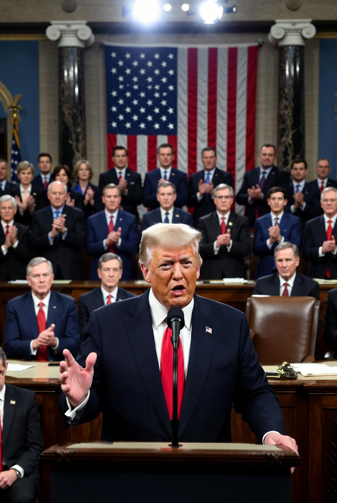

# Kongres AS Mulai Menahan Trump Soal Iran: Ketika Presiden Berperang, tetapi Parlemennya Menarik Rem Darurat

*Ilustrasi (pic: Grok AI).*

  
***Untuk pertama kalinya sejak konflik dimulai, DPR Amerika berhasil mengirim pesan terbuka kepada presidennya: “Perang bukan hanya urusan Gedung Putih.”***
  

Pada 3-4 Juni 2026, Dewan Perwakilan Rakyat Amerika Serikat meloloskan resolusi War Powers dengan suara 215 berbanding 208, yang bertujuan membatasi kemampuan Presiden Donald Trump untuk melanjutkan operasi militer terhadap Iran tanpa persetujuan Kongres. 

Yang membuat peristiwa ini bersejarah bukan hanya keberhasilan resolusi tersebut, tetapi fakta bahwa empat anggota Partai Republik membelot dan ikut menentang presiden dari partainya sendiri.  

Peristiwa ini menunjukkan bahwa pertanyaan besar di Washington bukan lagi: “Bagaimana mengalahkan Iran?” melainkan: “Siapa yang berhak memutuskan perang, Presiden atau Kongres?”

## Trump Sedang Melawan Iran atau Melawan Kongres?

Jawabannya: sedikit dari keduanya. Secara eksternal, Trump sedang berhadapan dengan Iran. Secara internal, Trump mulai berhadapan dengan lembaga legislatifnya sendiri.

Bila dianalogikan seperti kapal besar di tengah badai, Trump sedang memegang kemudi dan berteriak, “Aku tahu ke mana arah pelayaran!”

Lalu Kongres berdiri di belakang sambil menarik rem darurat dan berkata “Masalahnya bukan arah kapal, Pak Presiden… masalahnya Anda berlayar tanpa izin seluruh awak.” 

Dalam sistem Amerika, Presiden memang Panglima Tertinggi. Tetapi Konstitusi memberikan kewenangan perang kepada Kongres.

Itulah sebabnya sejak awal konflik Iran, muncul perdebatan: Apakah Trump memiliki dasar hukum yang cukup untuk mempertahankan perang tanpa persetujuan Kongres?

Pertanyaan itu kini berubah menjadi pemberontakan politik terbuka.  

## Mengapa Kongres Tiba-Tiba Bergerak?

Karena perang punya tagihan. Tagihan itu bukan hanya amunisi, melainkan:
inflasi,
harga energi,
biaya logistik,
ketidakpastian pasar,
dan tekanan terhadap pemilih.

Dalam ilmu politik dikenal istilah Rally Around the Flag Effect. Ketika perang baru dimulai, rakyat cenderung mendukung pemimpinnya.

Namun jika perang berlarut-larut? Efeknya bisa berbalik. Dukungan berubah menjadi pertanyaan: “Kapan ini selesai?”

Itulah yang mulai terlihat di Washington.  

## Empat Republikan yang Membuat Gedung Putih Kesal

Hal paling menarik bukan suara Demokrat. Memang sudah diduga mereka akan menentang. 

Yang mengejutkan adalah empat Republikan yang ikut mendukung resolusi tersebut:
Thomas Massie,
Brian Fitzpatrick,
Tom Barrett,
Warren Davidson.

Mereka memberikan sinyal bahwa keberatan terhadap perang Iran tidak lagi hanya berasal dari oposisi, tetapi juga dari dalam kubu Trump sendiri.  

## Mengapa Trump Marah?

Trump langsung menyebut para pendukung resolusi tersebut sebagai “unpatriotic” dan menuduh mereka sedang mengganggu proses negosiasi dengan Iran.  

Dari sudut pandang Gedung Putih, logikanya sederhana, “Jika Iran melihat Kongres membatasi presiden, posisi tawar Amerika melemah.”

Namun dari sudut pandang Kongres: “Justru karena perang terlalu penting, Presiden tidak boleh bertindak sendirian.”

Dua logika ini saling bertabrakan.

## Ini Sebenarnya Bukan Tentang Iran

Nah, bagian ini yang paling menarik.

Iran hanyalah panggung. Pertunjukan sebenarnya adalah perebutan kekuasaan antara cabang eksekutif dan legislatif.

Sejak Perang Dunia II, presiden-presiden AS semakin sering melakukan operasi militer tanpa deklarasi perang resmi.

Akibatnya banyak anggota Kongres merasa:

“Kewenangan perang perlahan-lahan dicuri dari Capitol Hill.”

Kasus Iran menjadi titik ledak frustrasi tersebut.  

## Apa Dampaknya bagi Dunia?

Jika Kongres semakin berhasil membatasi Trump:

✅ kemungkinan operasi militer besar berkurang.

✅ tekanan untuk diplomasi meningkat.

✅ peluang negosiasi dengan Iran membesar.

Namun jika Trump mengabaikan tekanan politik tersebut:

⚠️ konflik konstitusional di Washington bisa membesar.

⚠️ hubungan Gedung Putih dan Kongres memburuk.

⚠️ dunia melihat Amerika terpecah saat menghadapi krisis internasional.

Resolusi War Powers yang lolos pada 3-4 Juni 2026 mungkin belum otomatis menghentikan perang Iran.

Secara hukum dan politik masih banyak rintangan di depan. Tetapi makna simboliknya sangat besar.

Untuk pertama kalinya sejak konflik dimulai, DPR Amerika berhasil mengirim pesan terbuka kepada presidennya: “Perang bukan hanya urusan Gedung Putih.”

Dan di situlah ironi terbesar muncul.

Trump selama ini dikenal sebagai sosok yang suka menantang Iran. Namun pada awal Juni 2026, lawan politik yang paling merepotkannya justru mungkin bukan Teheran, melainkan gedung berkubah putih beberapa kilometer dari Gedung Putih itu sendiri, yaitu Kongres Amerika Serikat. 

  
**Referensi**

Reuters. (2026, June 3). U.S. House backs resolution curbing Trump Iran war powers.  

Associated Press. (2026, June 4). House approves war powers resolution to halt military action against Iran.  

The Guardian. (2026, June 3). House passes war powers resolution to curb Trump’s authority in Iran.  

The Washington Post. (2026, June 4). The four Republicans who broke with Trump on the Iran war.  

NPR/KPBS. (2026, June 3). House passes war powers resolution directing Trump to end hostilities with Iran.  
