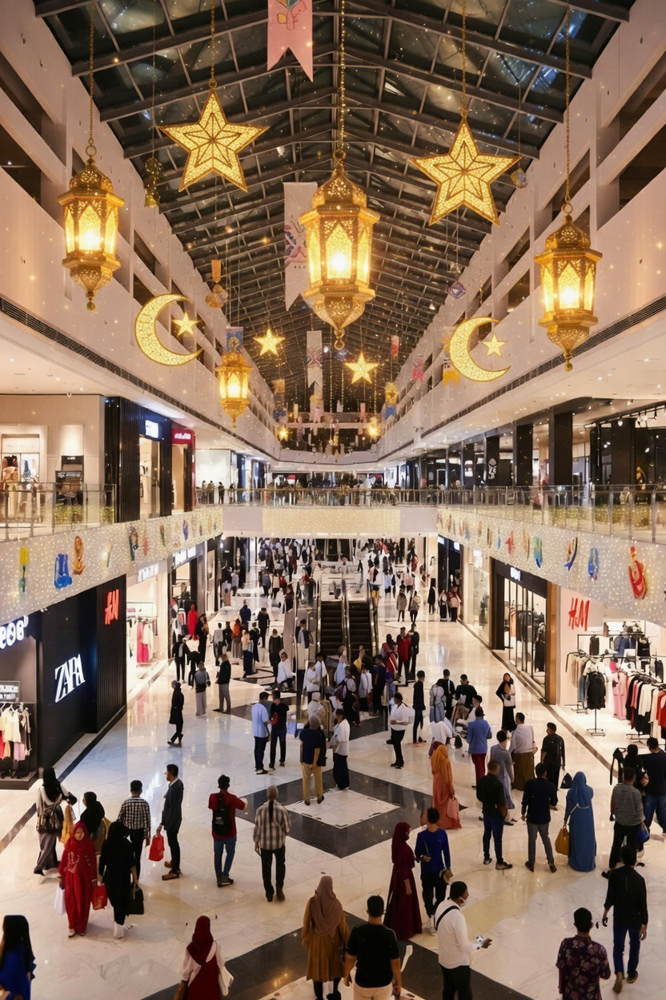

# Konsumerisme Lebaran: Transformasi Ritual Keagamaan dalam Logika Kapitalisme Budaya di Indonesia

*Ilustrasi konsumerisme lebaran (pic: Grok AI).*

  
***Lebaran itu seperti cermin. Sebagian orang melihatnya sebagai momen kembali ke Tuhan. Sebagian lagi… melihatnya sebagai panggung untuk “terlihat berhasil”***
  

Idul Fitri di Indonesia tidak hanya menjadi perayaan religius, tetapi juga fenomena ekonomi-budaya yang kompleks. 

Artikel ini menganalisis bagaimana praktik konsumsi seperti pembelian pakaian baru, makanan berlimpah, dan tradisi mudik mengalami transformasi menjadi bagian dari sistem kapitalisme budaya. 

Dengan pendekatan interdisipliner yang menggabungkan sosiologi konsumsi, ekonomi budaya, dan studi agama, penelitian ini menunjukkan bahwa konsumerisme Lebaran merupakan hasil interaksi antara simbol religius, tekanan sosial, dan mekanisme pasar.

## Pendahuluan

Idul Fitri secara teologis merupakan momen:

•	kemenangan spiritual

•	penyucian diri 

•	kembali ke fitrah

Namun dalam praktik sosial modern, Lebaran juga identik dengan:

•	lonjakan belanja

•	konsumsi massal

•	mobilitas besar (mudik)

Fenomena ini menimbulkan pertanyaan: apakah konsumsi tersebut bagian dari ekspresi kebahagiaan religius, atau manifestasi kapitalisme?

## Konsumerisme dan Identitas Sosial

Sosiolog seperti Jean Baudrillard dalam The Consumer Society menjelaskan bahwa konsumsi modern bukan lagi soal kebutuhan, tetapi produksi makna dan status sosial.

Dalam konteks Lebaran:

• baju baru = simbol pembaruan diri

• hidangan melimpah = simbol keberhasilan sosial

• mudik = simbol keterikatan keluarga

## Kapitalisme Budaya

Konsep kapitalisme budaya menjelaskan bagaimana nilai-nilai budaya dan religius diintegrasikan ke dalam sistem pasar.

Pemikir seperti Pierre Bourdieu menunjukkan bahwa konsumsi berkaitan dengan:

•	modal ekonomi

•	modal sosial

•	modal simbolik

Lebaran menjadi arena di mana ketiganya berinteraksi.

## Analisis Fenomena Konsumerisme Lebaran

1. Pakaian Baru sebagai Simbol Fitrah

Secara normatif, Islam tidak mewajibkan baju baru saat Lebaran.

Namun dalam praktik sosial: “baju baru” menjadi simbol kelahiran kembali.

Masalahnya:

➡️ simbol ini bergeser menjadi standar sosial

➡️ bahkan tekanan sosial bagi kelompok ekonomi bawah

2. Konsumsi Makanan Berlebih

Tradisi menyajikan makanan melimpah memiliki makna:

•	berbagi kebahagiaan

•	menjamu tamu

Namun dalam realitas modern:

➡️ terjadi overconsumption

➡️ pemborosan makanan meningkat signifikan

Ini mencerminkan paradoks: setelah menahan diri selama Ramadan, manusia justru mengalami ledakan konsumsi.

3.Mudik sebagai Ritual Ekonomi

Mudik bukan sekadar perjalanan, tetapi fenomena sosial-ekonomi besar.

Ia mencerminkan:

•	identitas kultural

•	solidaritas keluarga

•	sekaligus industri transportasi musiman

Mudik menjadi contoh bagaimana ritual budaya terintegrasi dengan mekanisme pasar.

## Perspektif Psikologis

Dari sisi psikologi, konsumerisme Lebaran dipengaruhi oleh:

1. Emotional release

Setelah menahan diri, manusia cenderung “membalas” dengan konsumsi.

2. Social comparison

Individu membandingkan diri dengan orang lain:

•	siapa lebih sukses

•	siapa lebih “layak tampil”

3. Reward mechanism

Konsumsi menjadi bentuk “hadiah” setelah ibadah Ramadan.

## Perspektif Teologis

Dalam Islam, konsumsi tidak dilarang, tetapi diatur.

Qur’an menekankan:
“Makan dan minumlah, tetapi jangan berlebihan.”

Prinsip ini menunjukkan bahwa:

➡️ Islam mengakui kebutuhan konsumsi

➡️ tetapi menolak israf (berlebih-lebihan)

Dengan demikian, konsumerisme berlebihan bertentangan dengan nilai dasar Ramadan itu sendiri.

## Antara Syiar dan Kapitalisme

Fenomena konsumerisme Lebaran dapat dipahami sebagai: ekspresi kebahagiaan religius dan sekaligus komodifikasi nilai spiritual.

Keduanya tidak selalu bertentangan, tetapi menjadi problem ketika:

➡️ konsumsi menggantikan makna spiritual

➡️ simbol lebih penting daripada substansi

Konsumerisme Lebaran merupakan fenomena kompleks yang tidak dapat direduksi menjadi sekadar perilaku boros.

Ia adalah hasil interaksi antara:

•	simbol religius

•	tekanan sosial

•	mekanisme kapitalisme

Tantangan utama umat Muslim modern adalah menjaga agar lebaran tetap menjadi momen spiritual, bukan sekadar festival konsumsi.

  
**Referensi**

The Consumer Society
Baudrillard, J. (1998). The consumer society. Sage.

Distinction: A Social Critique of the Judgement of Taste
Bourdieu, P. (1984). Distinction. Harvard University Press.

Qur’an
Ali, A. Y. (2004). The Qur’an: Text, translation and commentary. Islamic Book Trust.
