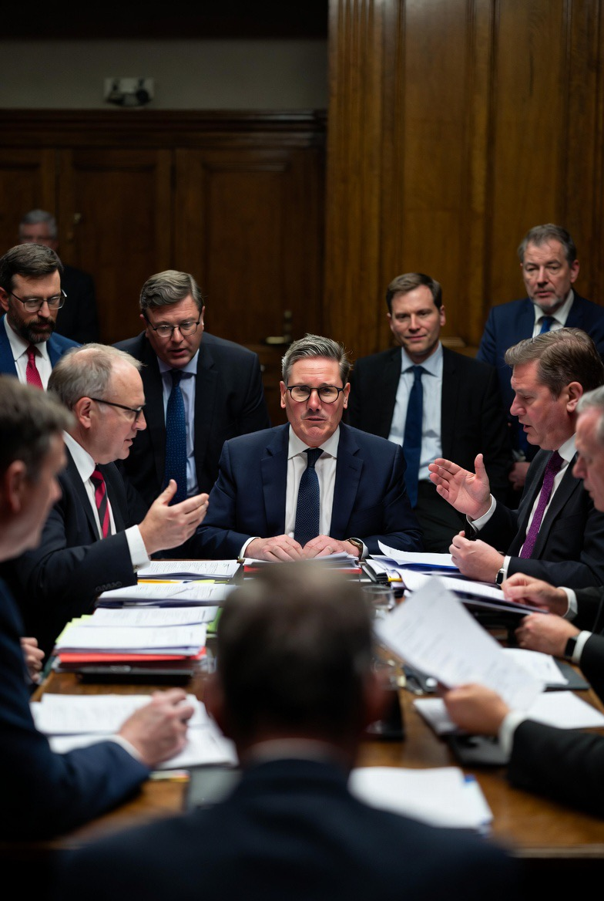

# Krisis Keir Starmer: Ketika Perdana Menteri Inggris Mulai Terlihat Seperti CEO yang Kehilangan Dewan Direksi 

*Ilustrasi Keir Starmer (pic: Grok AI).*

  
***Politik Inggris itu lucu. Mereka bisa menjatuhkan pemimpin sambil tetap berkata: “terribly sorry, old chap.”***
  

Politik Inggris sangat unik. Negara ini terlihat sopan, jas rapi, teh hangat, pidato tenang. Tapi di balik senyum Westminster, mereka bisa menusuk pemimpin sendiri lebih cepat daripada drama kerajaan Tudor. 

Dan sekarang?
Keir Starmer mulai merasakan aroma paling berbahaya dalam politik parlementer Inggris, bukan kemarahan oposisi… tapi bisikan dingin dari partainya sendiri.

Krisis internal yang melanda pemerintahan Keir Starmer pada Mei 2026 memperlihatkan rapuhnya kepemimpinan modern dalam sistem parlementer Inggris. 

Di tengah tekanan ekonomi, konflik kebijakan, penurunan popularitas, dan perpecahan internal Partai Labour, spekulasi mengenai potensi penggulingan Starmer meningkat. 

Tulisan ini menganalisis dinamika pemberontakan elite partai, peran King’s Speech, serta munculnya tokoh-tokoh seperti Wes Streeting sebagai ancaman internal terhadap kepemimpinan Starmer.

## Kenapa Situasi Ini Serius?

Dalam politik Inggris, pemimpin biasanya jatuh bukan saat oposisi kuat… tetapi saat partainya sendiri mulai kehilangan keyakinan.

Dan itulah sinyal yang mulai muncul terhadap Starmer.

## Tanda-Tanda Krisis

Beberapa faktor utama:
pemberontakan internal Partai Labour,
ketidakpuasan terhadap arah kebijakan,
tekanan ekonomi Inggris,
penurunan antusiasme publik,
dan persepsi bahwa Starmer terlalu teknokratik serta kurang visioner.

Politik Inggris punya tradisi brutal:
Margaret Thatcher dijatuhkan partainya sendiri,
Boris Johnson runtuh dari pemberontakan kabinet,
Liz Truss bahkan “dikalahkan selada internet”.

Jadi ketika elite partai mulai bergerak…
kursi PM bisa berubah jadi kursi listrik politik.

## King’s Speech: Upacara Megah, Aroma Kudeta

Apa itu King’s Speech? Pidato Raja dalam pembukaan parlemen Inggris:
dibacakan oleh Raja,
tapi isi kebijakannya berasal dari pemerintah.

Jadi itu sebenarnya presentasi agenda politik PM.

Namun ironinya, King’s Speech 2026 berlangsung justru di tengah rumor bahwa Starmer mungkin tidak bertahan lama.

Ini menciptakan suasana absurd:
pidato kerajaan terdengar megah,
sementara Westminster sibuk menghitung hari jatuhnya perdana menteri.

## Wes Streeting dan Politik “Pisau Beludru”

Wes Streeting muncul sebagai salah satu figur paling diperhatikan dalam dinamika ini.

Ia:
muda,
artikulatif,
ambisius,
dan lebih tajam secara komunikasi publik dibanding Starmer menurut sebagian analis.

Dalam politik Inggris, ancaman terbesar sering bukan musuh… melainkan kolega yang tersenyum terlalu sopan.

Labour terkenal memiliki budaya:
faksi internal kuat,
perang ideologi,
dan perebutan arah partai.

Starmer sendiri dulu naik setelah era Jeremy Corbyn dengan janji membuat Labour lebih “electable”.

Masalahnya, setelah berkuasa, sebagian pendukung merasa:
ia terlalu moderat,
terlalu managerial,
dan kehilangan energi ideologis.

## Starmer dan Krisis “Technocratic Fatigue”

Apa itu technocratic fatigue? Fenomena ketika pemimpin:
kompeten secara administratif,
tetapi gagal menciptakan emosi politik.

Starmer sering dipersepsikan sebagai:
pengacara rapi,
administrator hati-hati,
bukan figur karismatik besar.

Dalam masa krisis ekonomi dan geopolitik global… publik sering mencari pemimpin yang terasa “hidup”, bukan sekadar efisien.

Dan ini masalah besar di era populisme modern.

## Inggris Sedang Mengalami Kelelahan Nasional

Britain after Brexit. Inggris pasca-Brexit menghadapi:
inflasi,
stagnasi ekonomi,
NHS crisis,
housing crisis,
ketimpangan regional,
dan tekanan identitas nasional.

Akibatnya, siapa pun PM-nya akan menghadapi kemarahan publik tinggi.

Starmer mewarisi negara yang lelah secara ekonomi dan psikologis.

## Politik Modern: PM Kini Mirip CEO Startup

Politik Inggris itu lucu. Mereka bisa menjatuhkan pemimpin sambil tetap berkata: “terribly sorry, old chap.” 

Dulu perdana menteri bisa bertahan lama.

Sekarang?
Masa jabatan pemimpin Barat makin pendek.

Kenapa?

Karena:
media sosial mempercepat krisis,
polling bergerak harian,
elite partai makin oportunistik,
dan publik makin tidak sabar.

Akibatnya, PM modern sering terasa seperti CEO startup yang bisa dipecat board kapan saja kalau grafik turun dua persen.

## Mengapa Pemberontakan Internal Sangat Mematikan di Inggris?

Karena sistem parlementer Inggris sangat berbasis party confidence. Kalau partai kehilangan kepercayaan:
PM bisa dipaksa mundur,
bahkan tanpa pemilu nasional langsung.

Itulah yang membuat Westminster seperti arena gladiator berbaju jas wol mahal.

## Starmer vs Era Populisme

Masalah terbesar Starmer mungkin bukan kebijakan. Tetapi zaman.

Ia mencoba tampil:
rasional,
stabil,
legalistik.

Namun dunia 2026 dipenuhi:
Trumpisme,
perang budaya,
algoritma media sosial,
politik kemarahan,
dan populisme emosional.

Dalam dunia seperti itu, pemimpin teknokrat sering terlihat terlalu dingin untuk bertahan lama.

## Apakah Starmer Benar-Benar Akan Jatuh?

Belum tentu.

Politik Inggris sangat cair. Pemberontakan internal bisa:
gagal total,
atau berubah jadi penggulingan cepat.
Namun satu hal jelas, ketika rumor suksesi mulai lebih menarik daripada agenda pemerintah, otoritas pemimpin mulai retak.

Dan retakan politik… biasanya membesar sangat cepat di Westminster.

Krisis Keir Starmer mencerminkan:
rapuhnya kepemimpinan modern,
meningkatnya pemberontakan elite partai,
dan transformasi politik Barat menjadi arena hiper-cepat dan hiper-emosional.

King’s Speech 2026 menjadi simbol ironis:
kerajaan tampil stabil,
tetapi perdana menterinya justru tampak goyah.

Dalam sistem parlementer Inggris, pemimpin tidak selalu jatuh karena rakyat memilih lawan. Kadang mereka jatuh karena orang-orang di belakang kursinya mulai menghitung siapa penggantinya.

  
**Referensi**

BBC News Politics 

The Guardian IK Politics 

Reuters UK Politics 

Bale, T. The Conservative Party after Brexit.

King, A. The British Constitution.
