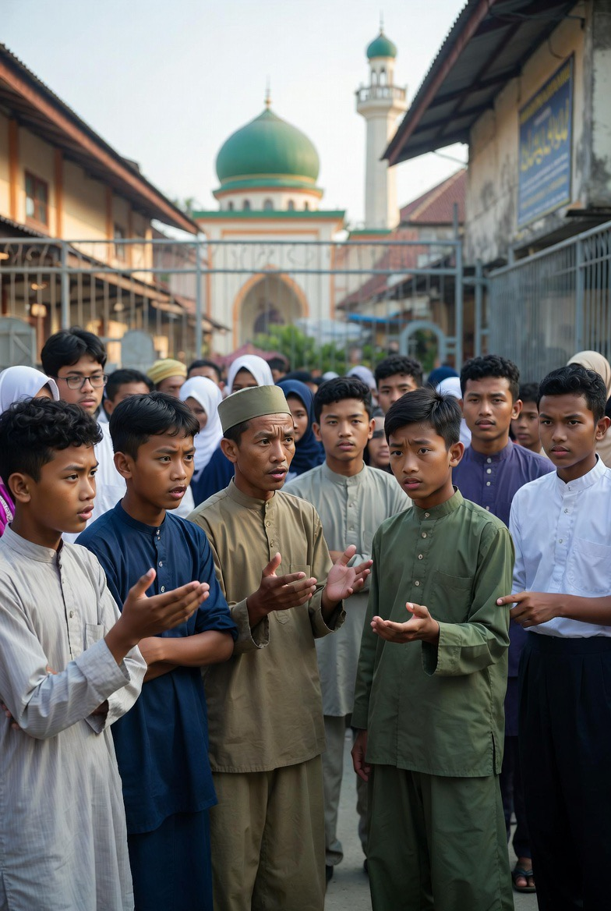

# Krisis Kepercayaan dalam Lembaga Pendidikan Agama: Kekerasan Seksual, Stigma Institusional, dan Reformasi Tata Kelola Pesantren

*Ilustrasi krisis kepercayaan (pic: Grok AI).*

  
***Media sering memproduksi fenomena yang disebut moral panic, padahal secara statistik, banyak pesantren tetap berfungsi normal sebagai pusat pendidikan moral***
  

Kasus kekerasan seksual di lembaga pendidikan agama, termasuk pesantren, dalam beberapa tahun terakhir menimbulkan krisis kepercayaan publik terhadap institusi yang secara historis menjadi pusat transmisi moral dan spiritual. 

Studi ini menganalisis fenomena tersebut melalui tiga perspektif: 

(1) struktur kekuasaan dalam lembaga pendidikan tertutup, 

(2) dinamika moral panic dan stigmatisasi institusi religius, serta 

(3) strategi reformasi kelembagaan untuk memulihkan legitimasi sosial. 

Artikel ini berargumen bahwa kasus kekerasan seksual lebih tepat dipahami sebagai kegagalan tata kelola dan pengawasan, bukan karakter inheren pendidikan agama itu sendiri.

## Pendahuluan

Pesantren memiliki peran historis penting dalam perkembangan masyarakat Muslim di Indonesia. Selama berabad-abad, institusi ini membentuk tradisi keilmuan, etika sosial, dan kepemimpinan religius.

Namun dalam dekade terakhir, beberapa kasus kekerasan seksual di lembaga pendidikan agama telah memicu perdebatan publik. Kasus-kasus tersebut menciptakan dilema:

1.	bagaimana melindungi santri sebagai kelompok rentan,

2.	bagaimana menjaga legitimasi institusi pendidikan agama.

Isu ini menjadi semakin kompleks karena lembaga keagamaan sering dianggap memiliki otoritas moral yang tinggi, sehingga ketikap terjadi penyimpangan, dampak reputasionalnya jauh lebih besar.

## Kekerasan Seksual dalam Institusi Tertutup

Penelitian sosiologi organisasi menunjukkan bahwa kekerasan seksual lebih mudah terjadi dalam institusi dengan karakteristik:

•	hierarki otoritas yang kuat

•	kontrol informasi yang terbatas

•	relasi kuasa tidak seimbang antara guru dan murid

Konsep ini sering disebut institutional abuse.

Fenomena ini tidak eksklusif pada lembaga agama. Ia juga ditemukan di:

•	sekolah elite

•	institusi olahraga

•	militer

•	bahkan lembaga keagamaan di berbagai negara.

## Moral Panic dan Stigmatisasi

Ketika kasus kekerasan seksual muncul di institusi religius, media sering memproduksi fenomena yang disebut moral panic.

Akibatnya:

•	satu kasus dapat digeneralisasi menjadi stigma kolektif

•	reputasi institusi secara keseluruhan ikut terdampak

Padahal secara statistik, banyak pesantren tetap berfungsi normal sebagai pusat pendidikan moral.

## Kekuasaan Karismatik dalam Pendidikan Tradisional

Dalam banyak pesantren, figur kyai memiliki otoritas karismatik yang kuat.

Teori kepemimpinan karismatik dari Max Weber menjelaskan bahwa otoritas semacam ini dapat menghasilkan:

•	loyalitas tinggi

•	tetapi juga risiko minimnya mekanisme kontrol.

Jika tidak diimbangi sistem akuntabilitas modern, kekuasaan karismatik dapat disalahgunakan oleh oknum.

Selain itu terdapat sistem hierarki informal antara:

•	santri baru

•	santri menengah

•	santri senior

Senior sering diberi tanggung jawab mengawasi junior. Dalam teori organisasi, ini menciptakan delegated authority without institutional control.

Artinya:

•	ada kekuasaan

•	tetapi tidak ada mekanisme akuntabilitas formal

Situasi ini juga membuka peluang penyalahgunaan.

## Analisis

1. Faktor Internal

Beberapa faktor internal yang memungkinkan terjadinya penyimpangan:

A. Minimnya mekanisme pengawasan independen

Banyak pesantren masih berbasis kepercayaan personal.

B. Kultur tabu membicarakan seksualitas

Hal ini membuat korban sering takut melapor.

c. Relasi kuasa guru–santri

Santri sering berada dalam posisi sangat bergantung pada pengasuh.

2. Faktor Eksternal

Selain faktor internal, dinamika eksternal juga berperan:

•	tekanan media

•	politisasi agama

•	persaingan ideologis

Namun klaim bahwa seluruh kasus merupakan konspirasi eksternal memerlukan bukti empiris yang kuat. Pendekatan ilmiah menuntut kehati-hatian sebelum menarik kesimpulan tersebut.

## Strategi Reformasi Pesantren

Untuk menjaga legitimasi sosial, lembaga pendidikan agama perlu melakukan reformasi struktural.

1. Transparansi Institusional

Membangun mekanisme pengawasan eksternal dan sistem pelaporan independen.

2. Pendidikan Perlindungan Anak

Santri perlu mendapat edukasi tentang:

•	batas tubuh

•	hak perlindungan

•	mekanisme pelaporan.

3. Standar Etika Pengajar

Kyai dan ustadz perlu mengikuti pelatihan profesional terkait etika pendidikan.

4. Sistem Intelijen Internal

Dalam konteks kelembagaan, ini berarti:

•	audit perilaku

•	evaluasi pengajar

•	sistem whistleblower.

## Perspektif Teologis

Dalam Islam, penyalahgunaan otoritas religius merupakan pelanggaran serius.

Nabi Muhammad SAW menekankan bahwa pemimpin adalah amanah, bukan privilese.

Kepercayaan masyarakat terhadap ulama dan pendidik agama didasarkan pada integritas moral. Ketika amanah tersebut dilanggar, kerusakan sosial yang ditimbulkan jauh lebih besar daripada kejahatan biasa.

Kasus kekerasan seksual di lembaga pendidikan agama harus dipahami sebagai:

1.	kegagalan tata kelola institusional,

2.	penyalahgunaan relasi kuasa oleh oknum,

3.	tantangan reformasi bagi lembaga pendidikan tradisional.

Solusi yang efektif bukan sekadar membela institusi atau menyalahkan pihak luar, tetapi membangun sistem yang memastikan:

•	transparansi

•	perlindungan santri

•	akuntabilitas moral.

Hanya dengan reformasi semacam ini, pesantren dapat mempertahankan perannya sebagai pusat pendidikan spiritual dan moral dalam masyarakat Muslim modern.

  
**Referensi**

Economy and Society
Weber, M. (1978). Economy and society. University of California Press.

Moral Panics
Cohen, S. (2011). Folk devils and moral panics. Routledge.

Child Abuse in Institutions
Gallagher, B. (2004). Child abuse in institutions. Jessica Kingsley.

Islamic Education in Indonesia
Tan, C. (2014). Educative traditions in Islam: Religious education in Indonesia. Routledge.
