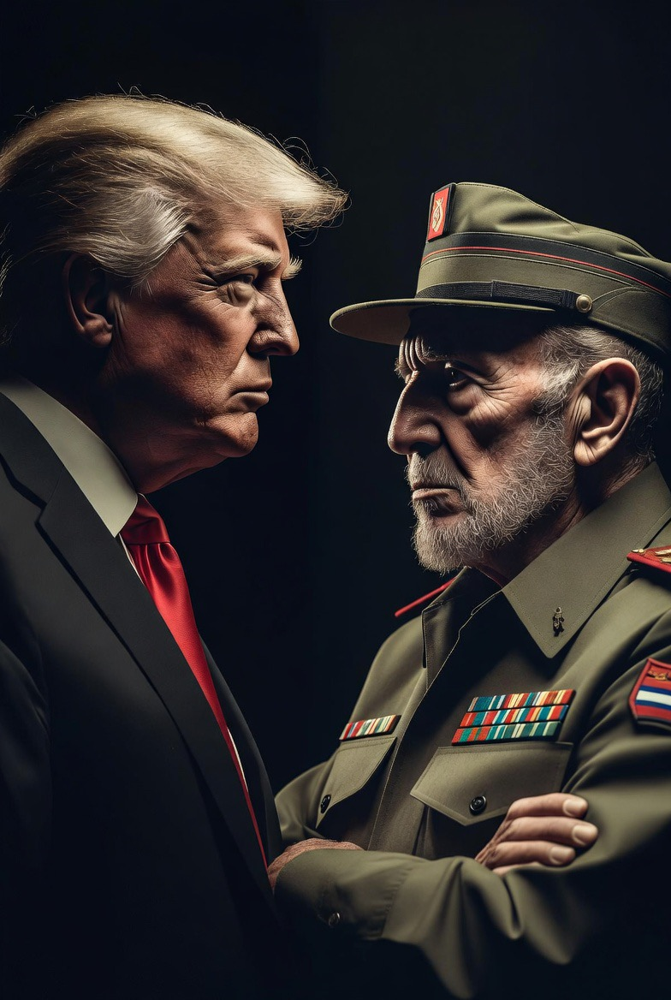

# Krisis Kuba 2026, USS Gerald R. Ford, & Kembalinya Aroma Perang Dingin di Karibia

*Ilustrasi Donald Trump dan Raul Castro (pic: Grok AI).*

  
***Semakin keras kekuatan besar mempertahankan dominasinya maka semakin dunia terlihat seperti kembali ke era Perang Dingin baru***
  

Eskalasi besar terjadi pada 28 Mei 2026 setelah Raúl Castro didakwa di pengadilan Amerika Serikat, diikuti mobilisasi militer penuh oleh Kuba, pengerahan kapal induk USS Gerald R. Ford ke kawasan Karibia, dan langkah China yang menembus blokade tekanan AS dengan mengirim kapal kargo besar ke Havana. 

Krisis ini memperlihatkan bahwa dunia sedang bergerak menuju bentuk baru “Perang Dingin multipolar”, di mana konflik bukan hanya soal ideologi, tetapi juga perebutan pengaruh simbolik, jalur perdagangan, dan legitimasi global.

## Mengapa Kuba Tiba-Tiba Memanas?

Karena Kuba bukan sekadar pulau kecil. Ia adalah simbol sejarah paling memalukan bagi dominasi AS di Belahan Barat.

Sejak Revolusi Kuba:
Havana menjadi lambang pembangkangan anti-Washington,
dan trauma itu masih hidup dalam memori strategis Amerika.

Maka ketika:
Raúl Castro didakwa,
kapal induk AS mendekat,
mobilisasi militer diumumkan,
…ini bukan cuma soal hukum. Ini pertarungan: simbol kekuasaan.

## Dakwaan Raul Castro: Hukum atau Tekanan Rezim?

Secara formal, AS membingkai dakwaan sebagai:
penegakan hukum,
pertanggungjawaban historis.

Namun secara geopolitik timing-nya terasa seperti bagian dari pressure campaign terhadap rezim Kuba.

Dan di Amerika Latin… intervensi hukum oleh AS sering dipandang skeptis karena sejarah panjang:
embargo,
operasi CIA,
kudeta era Perang Dingin,
regime change.

Akibatnya banyak negara melihat “pengadilan” kadang menjadi instrumen geopolitik.

## USS GERALD R. FORD: Pesan atau Ancaman?

USS Gerald R. Ford bukan kapal biasa.
Ia adalah:
simbol supremasi militer AS,
kota terapung bersenjata,
pesan visual kepada lawan.

Ketika kapal induk mendekat ke Kuba, pesan implisitnya: “kami serius.”

Dalam diplomasi militer modern, kapal induk sering dipakai sebagai coercive diplomacy, yaitu diplomasi tekanan melalui kehadiran militer.

## China Masuk: Ini Bagian Paling Berbahaya

Nah ini yang membuat situasi naik level.

Ketika China mengirim:
kapal kargo besar,
menembus tekanan/blokade AS.

Itu bukan sekadar pengiriman logistik.

Itu simbol Beijing menolak monopoli kontrol AS di Karibia. 

Dan ini sangat sensitif, karena Karibia selama ratusan tahun dianggap  “halaman belakang Amerika.”

#% Ini Sudah Mirip Miniatur Krisis Misil Kuba 1962

Bedanya:
dulu AS vs Uni Soviet,
sekarang AS vs China.

Dulu:
misil nuklir.

Sekarang:
logistik,
ekonomi,
kapal dagang,
tekanan finansial,
dan perang pengaruh.

Perang Dingin modern lebih licin, tank diganti:
supply chain,
pelabuhan,
AI,
utang,
perdagangan.

## Mengapa China Berani?

Karena Beijing ingin menunjukkan AS tidak lagi bisa menentukan aturan global sendirian.

Dengan membantu Kuba China mendapat:
pengaruh simbolik di Amerika Latin,
citra “pelindung negara kecil”,
peluang ekonomi & intelijen.

Dan yang paling penting mempermalukan dominasi AS di dekat wilayahnya sendiri.

## Trump dan  Politik “Warisan Besar”

Trump ingin dicatat sejarah, dan memang gaya Trump sering:
teatrikal,
simbolik,
sangat sadar legacy.

Maka “menyelesaikan Kuba” akan terasa seperti kemenangan historis konservatif AS setelah puluhan tahun gagal menjatuhkan rezim Castro.

Masalahnya, semakin keras tekanan, semakin mudah Kuba menjual narasi: “kami sedang melawan imperialisme.”

Dan itu justru bisa membangkitkan solidaritas Global South.

## Apakah Dunia Menuju Blok Baru?

Perlahan… iya.
Mulai terlihat pembelahan:

| Blok Barat | Blok Penyeimbang |
|------|-------|
| AS | China |
| NATO | BRICS+ |
| dominasi dolar | dedolarisasi |
| sanksi & tekanan | perdagangan alternatif|

Kuba menjadi panggung kecil untuk pertarungan sistem global yang jauh lebih besar.

Dulu dunia takut perang nuklir karena misil.
Sekarang… dunia bisa mendekati konflik besar hanya karena embargo, kapal dagang, dakwaan pengadilan, dan ego negara besar yang tak mau kehilangan wibawa. 

Krisis Kuba 2026 menunjukkan dunia tidak lagi unipolar, sebab kini negara-negara seperti China mulai berani:
menantang tekanan AS,
masuk ke wilayah simbolik Amerika,
dan mendukung rezim yang dibenci Washington.

Sementara AS sendiri tampak semakin agresif mempertahankan:
pengaruh historis,
otoritas geopolitik,
dan citra hegemon global.

Masalahnya, semakin keras kekuatan besar mempertahankan dominasinya maka semakin dunia terlihat seperti kembali ke era Perang Dingin baru.

  
**Referensi**

Reuters. (2026, May 28). US carrier group approaches Cuba amid escalating tensions.

Al Jazeera. (2026, May 28). China sends cargo ships to Havana despite US pressure.

Gaddis, J. L. (2005). The Cold War: A New History.

USS Gerald R. Ford strategic deployment analyses, 2026.
