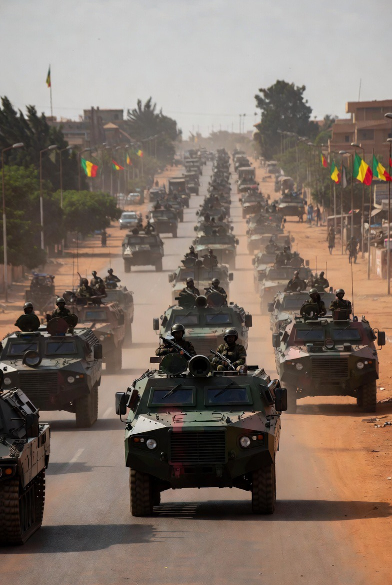

# Krisis Mali dan Kematian Menteri Pertahanan Sadio Camara: Analisis Konflik Internal, Jihadisme Regional, dan Erosi Negara Pasca-Kolonial

*Ilustrasi krisis di Mali (pic: Grok AI).*

  
***Perang tidak dimulai hanya oleh peluru tetapi oleh ketidakpercayaan yang dipelihara bertahun-tahun***
  

Krisis keamanan di Mali kembali memuncak setelah laporan serangan terkoordinasi yang dikaitkan dengan kematian Menteri Pertahanan Sadio Camara. 

Peristiwa ini memperlihatkan rapuhnya struktur negara Mali di tengah kombinasi konflik etnis, jihadisme regional, intervensi asing, dan warisan kolonial. 

Artikel ini menganalisis apakah keterpecahan Mali dapat dipahami sebagai hasil dari strategi divide et impera modern, propaganda politik, dan kegagalan integrasi negara pasca-kolonial.

## Pendahuluan

Selama lebih dari satu dekade, Mali berubah dari negara yang relatif stabil menjadi salah satu episentrum konflik paling rumit di kawasan Sahel.

Negara menghadapi:

pemberontakan etnis

kelompok jihad transnasional

kudeta militer berulang

krisis ekonomi

intervensi asing

Kematian figur penting seperti Sadio Camara, jika terkonfirmasi luas, bukan sekadar kehilangan individu:

melainkan simbol retaknya kapasitas negara dalam mempertahankan monopoli kekerasan.

Dan seperti biasa dalam sejarah manusia… garis peta yang ditarik penguasa lama terus menghantui generasi berikutnya. 

Kolonialisme itu seperti tamu mabuk yang pulang puluhan tahun lalu tapi masih meninggalkan rumah berantakan.

## Warisan kolonial Prancis

Mali merupakan bekas koloni France.

Perbatasan modern Mali:

dibuat berdasarkan kepentingan kolonial
tidak selalu sesuai dengan realitas etnis dan sosial lokal

Akibatnya:

komunitas berbeda dipaksa hidup dalam satu negara

identitas nasional lemah dibanding identitas suku/klan.

## Konflik Tuareg dan Marginalisasi Utara

Wilayah utara Mali lama merasa:

diabaikan pemerintah pusat

miskin pembangunan

minim representasi politik

Kelompok Tuareg beberapa kali memberontak.

Ini menciptakan:

👉 ruang kosong kekuasaan

👉 yang kemudian dimasuki kelompok jihad

## Jihadisme Regional

Kelompok seperti:

afiliasi Al-Qaeda

afiliasi Islamic State

memanfaatkan:

kemiskinan

ketidakpercayaan pada negara

konflik etnis

Mereka menawarkan:

perlindungan

identitas

bahkan “keadilan alternatif”

## Divide et Impera Modern

🧠 1. Apakah Mali korban “divide et impera”?

Sebagian iya.

Tapi bukan dalam bentuk kartun konspirasi sederhana.

Strategi pecah belah modern bekerja melalui:

dukungan pada elite tertentu

pengelolaan konflik lokal

ketergantungan keamanan pada aktor luar

propaganda informasi.

📡 2. Propaganda dan perang narasi

Di Mali, banyak narasi saling bertabrakan:

pemerintah menyebut lawan “teroris”

oposisi menyebut pemerintah “boneka asing”

aktor asing mengklaim “stabilisasi”

warga lokal melihat semuanya sebagai perebutan kekuasaan

👉 hasilnya:

rakyat kehilangan kepercayaan pada semua pihak.

🌍 3. Intervensi asing

Operasi militer asing di Sahel sering dibenarkan sebagai:

kontra-terorisme

stabilisasi regional

Namun kritik muncul karena:

konflik tetap meluas

kekerasan tidak berhenti

negara semakin bergantung pada militer.

## Kematian Sadio Camara dan Simbol Krisis Negara

Jika laporan kematian Sadio Camara benar dan terkonfirmasi luas, implikasinya besar:

⚡ Dampak simbolik:

menunjukkan elite negara pun rentan

memperlihatkan penetrasi kelompok bersenjata

memperburuk persepsi ketidakamanan nasional.

🧩 Dampak politik:

potensi perebutan pengaruh dalam militer

risiko fragmentasi lebih lanjut

kemungkinan respons represif meningkat.

## Mengapa Mali Mudah Terpecah?

🏚️ Faktor utama:

a. Negara lemah

b. Ketimpangan ekonomi

c. Identitas etnis lebih kuat dari identitas nasional

d. Korupsi elite

e. Intervensi asing

f. Perang informasi & propaganda

## Analisis Teoretis

⚖️ 1. Fragile State Theory

Mali memenuhi ciri:

kontrol wilayah lemah

legitimasi rendah

kapasitas keamanan terbatas.

2. Security Vacuum

Ketika negara gagal hadir:

👉 kelompok bersenjata mengisi ruang kosong.

🧠 3. Divide et Impera

Strategi pecah belah berhasil ketika:

masyarakat sudah rapuh

ketidakpercayaan tinggi

elite lebih sibuk berebut kuasa daripada membangun negara.

Krisis Mali bukan sekadar hasil “propaganda asing”, tetapi kombinasi kompleks antara warisan kolonial, marginalisasi internal, jihadisme regional, dan kegagalan negara pasca-kolonial membangun identitas nasional yang stabil.

Divide et impera memang berperan, tetapi ia bekerja efektif hanya karena fondasi sosial-politik Mali sudah rapuh sejak lama.

Dan seperti banyak konflik modern lainnya: perang tidak dimulai hanya oleh peluru tetapi oleh ketidakpercayaan yang dipelihara bertahun-tahun.

  
**Referensi**

United Nations. (2024–2026). Reports on Mali and the Sahel.

International Crisis Group. (2025). Mali’s Security Fragmentation.

African Union. (2025). Sahel Stability Assessments.

Lecocq, B. (2010). Disputed Desert: Decolonisation, Competing Nationalisms and Tuareg Rebellions in Mali.

Keita, K. (1998). Conflict and Conflict Resolution in the Sahel.

Reuters. (2026). Reports on coordinated attacks in Mali.

BBC. (2026). Mali security crisis coverage.
