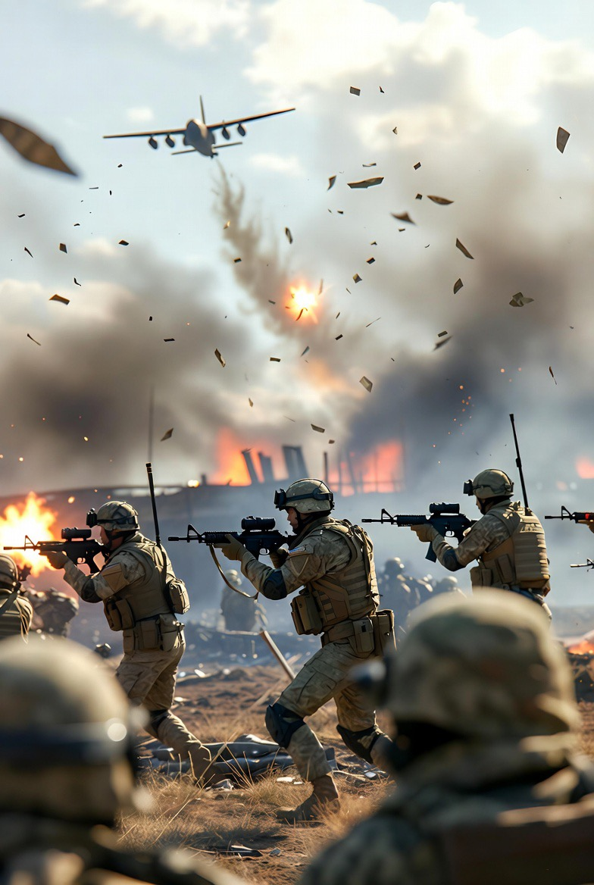

# Kuantifikasi Korban Sipil dalam Konflik Multiteater 2023–2026: Analisis Kematian di Gaza, Lebanon, dan Eskalasi Iran–Israel

*Ilustrasi (pic: Grok AI).*

  
***Perspektif Human Security, Civilian Harm Metrics, dan Stratifikasi Korban***
  

Kita bisa tahu jumlahnya
tapi kita tidak pernah benar-benar “mengalami” besarnya kehilangan itu.

Penelitian ini mengkaji jumlah korban jiwa akibat operasi militer Israel di tiga teater konflik utama—Gaza, Lebanon, dan eskalasi terhadap Iran—hingga 26 Maret 2026. 

Dengan pendekatan civilian harm metrics dan human security, studi ini mengidentifikasi bahwa korban sipil, khususnya anak-anak, perempuan, jurnalis, dan tenaga medis, merupakan proporsi signifikan dari total kematian. 

Temuan menunjukkan bahwa konflik modern tidak hanya menghasilkan korban massal, tetapi juga memperlihatkan pola stratifikasi korban berdasarkan kerentanan sosial.

## Metodologi

Data dikompilasi dari:

•	laporan kementerian kesehatan lokal

•	organisasi HAM internasional

•	estimasi studi independen

Catatan penting:

👉 angka bersifat estimasi minimum–menengah

👉 banyak korban belum terdata (reruntuhan, wilayah tertutup)

## Total Korban Jiwa (hingga ±26 Maret 2026)

1. Gaza (teater utama)

Total tewas: ±75.000 – 76.000+  

Rincian:

•	Anak-anak: 18.000 – 20.000+  

•	Perempuan: ±12.000+  

•	Tenaga medis: ±1.400 – 1.600+  

•	Jurnalis: ±250+  

2. Lebanon (Maret 2026 eskalasi)

Total tewas: ±687 – 826  

Rincian:

•	Anak-anak: 98 – 106  

•	Perempuan: 62 – 65  

•	Tenaga medis: 18 – 31  

3. Iran (eskalasi terbatas 2026)

Total tewas: ±1.000 (perkiraan konflik AS–Iran–Israel)  

Catatan:

•	data rinci (anak, perempuan, jurnalis) belum transparan

•	korban sipil dilaporkan ada, tapi tidak terklasifikasi jelas

Total Agregat (Estimasi Konservatif)

🧮 Total korban jiwa:

👉 ±76.700 – 78.000+ jiwa

Stratifikasi korban (perkiraan minimum global):

| Kategori | Jumlah |
|------|-------|
| Anak-anak | ±18.100 – 20.100+|
| Perempuan | ±12.000+ |
| Jurnalis | ±250+ |
| Tenaga medis |±1.400 – 1.600+ |

## Analisis

1. Dominasi korban sipil

Mayoritas korban:

👉 bukan kombatan

👉 tapi populasi sipil

Ini menunjukkan: 

konflik modern = perang terhadap ruang hidup, bukan hanya militer

2. Anak sebagai “korban struktural”

Proporsi anak sangat tinggi.

Implikasi:

•	bukan hanya korban langsung

•	tapi generasi yang hilang

3. Penargetan sistem kesehatan

Tingginya korban tenaga medis menunjukkan:

•	sistem kesehatan ikut runtuh

•	kemampuan menyelamatkan nyawa menurun

👉 efek domino kematian meningkat

4. Jurnalis sebagai korban narasi

Korban jurnalis signifikan.

Artinya:
perang tidak hanya menghancurkan manusia
tapi juga informasi tentang perang itu sendiri

## Dari Angka ke Makna

Angka-angka ini sering terlihat seperti statistik.

Padahal sebenarnya:

- setiap angka = satu kehidupan yang berhenti

- satu keluarga yang pecah

- satu masa depan yang tidak pernah terjadi

Konflik Israel di Gaza, Lebanon, dan eskalasi Iran menunjukkan bahwa perang modern menghasilkan korban sipil dalam skala besar dengan distribusi yang tidak merata, terutama terhadap kelompok rentan. 

Data menunjukkan bahwa anak-anak, perempuan, tenaga medis, dan jurnalis menjadi korban signifikan, menandakan bahwa kekerasan telah melampaui batas militer menuju kehancuran sosial yang lebih luas.

  
**Referensi**

Kementerian Kesehatan Lebanon. (2026). Casualty Report.  

Databoks. (2026). Statistik korban Gaza.  

KNRP. (2025). Gaza casualty statistics.  

Reuters/Al Jazeera. (2026). Lebanon escalation data.  

Suara.com. (2026). Iran war casualty estimate.  
