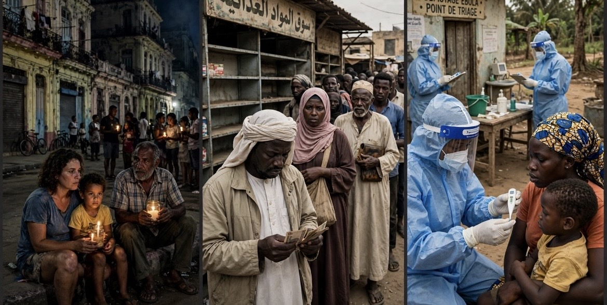

# Kuba, Sudan, dan Kongo: Darurat Kemanusiaan yang Tenggelam

*Ilustrasi (pic: Meta AI).*

  
***Dunia tidak kekurangan kamera, ahli, atau peringatan, tetapi kekurangan kemauan politik untuk memperlakukan nyawa manusia sebagai priorittas***
  

Kuba, Sudan, dan Kongo memiliki perbedaan penyebab, tetapi memperlihatkan pola yang sama.

Ini sisi paling kejam dari politik perhatian global: sebuah perang besar bisa menyedot kamera, uang, diplomasi, dan bandwidth media, sementara krisis yang membunuh secara perlahan dianggap “kurang mendesak”. 

## Kuba: Krisis Energi yang Berubah Menjadi Krisis Kemanusiaan

Pada 18 September 2026, jaringan listrik Kuba kembali mengalami keruntuhan nasional. Reuters melaporkan bahwa penyebab langsungnya adalah kegagalan jaringan transmisi tegangan tinggi, sementara kekurangan bahan bakar dan infrastruktur pembangkit yang menua memperparah kerentanan sistem.

## Apa Dampaknya?

Listrik bukan sekadar lampu menyala atau mati. Ia adalah infrastruktur kehidupan. Misalnya pompa air membutuhkan listrik, makanan membutuhkan pendinginan, rumah sakit membutuhkan generator dan bahan bakar, tansportasi, komunikasi, dan kegiatan ekonomi ikut terganggu, serta krisis sanitasi dapat meningkatkan risiko penyakit.

Krisis ini juga memiliki dua lapisan penyebab, yakni:

1. Masalah struktural domestik: pembangkit tua, pemeliharaan, investasi terbatas, dan kelemahan pengelolaan.

2. Tekanan eksternal: pembatasan bahan bakar dan sanksi Amerika Serikat yang menurut laporan Reuters memperburuk akses Kuba terhadap pasokan energi. Washington, sebaliknya, menyoroti kegagalan pengelolaan pemerintah Kuba.

Kalau sebuah negara dibuat kesulitan mengakses bahan bakar, lalu masyarakatnya menderita karena listrik, air, dan layanan kesehatan terganggu, dampak kemanusiaannya tidak menghilang hanya karena kebijakan tersebut disebut sebagai alat tekanan terhadap pemerintah.

Namun, kritik terhadap embargo AS tidak berarti kita harus membebaskan pemerintah Kuba dari tanggung jawab atas pengelolaan infrastruktur dan transparansi.

Rakyat tidak boleh dijadikan papan sasaran dalam perang tekanan ekonomi. Tetapi pemerintah juga tidak boleh menjadikan embargo sebagai alasan untuk menutup evaluasi terhadap kegagalannya sendiri.

## Sudan: Negara yang Kehilangan Daya Hidup Ekonomi

Perang antara Sudanese Armed Forces (SAF) dan Rapid Support Forces (RSF) telah menghancurkan aktivitas ekonomi, memindahkan jutaan orang, dan merusak jalur distribusi makanan. 

Reuters melaporkan bahwa sekitar 14 juta orang telah mengungsi dan hampir 20 juta orang menghadapi kelaparan.

## Krisis Pendanaan Menjadi Krisis Kelangsungan Hidup

Anggaran World Food Programme untuk Sudan turun menjadi sekitar US$206 juta, dari US$645 juta pada tahun sebelumnya. WFP memperkirakan membutuhkan hampir US$300 juta tambahan agar operasi bantuan dapat dipertahankan. 

Karena dana terbatas, bantuan diprioritaskan untuk sekitar 5 juta orang paling rentan, dengan sekitar 4 juta orang saat ini menerima jatah makanan yang tidak penuh.

Di sisi ekonomi, laporan Sudan Tribune pada 19 September menyebut nilai pound Sudan jatuh ke titik terendah historis di pasar paralel, sementara inflasi dan perang mengikis daya beli rumah tangga. 

Angka ini berasal dari laporan media lokal dan perlu dibaca dengan kehati-hatian, terutama karena pasar valuta asing Sudan sangat terfragmentasi.

## Mengapa Sudan Sering Kalah dalam Kompetisi Perhatian?

Perang Sudan tidak selalu menghasilkan gambar yang mudah dikonsumsi media global seperti: serangan rudal yang dramatis, konferensi pers pemimpin negara besar, ancaman terhadap jalur minyak global, atau konflik yang melibatkan kekuatan militer Barat secara langsung.

Padahal, kelaparan akibat perang adalah kekerasan yang berjalan dengan kecepatan lebih lambat, bukan penderitaan yang lebih kecil.

Dan terdapat persoalan tanggung jawab eksternal: dukungan senjata, pembiayaan, dan jaringan perdagangan dari aktor regional dapat mempertahankan kapasitas pihak-pihak yang berperang. 

Tuduhan terhadap aktor eksternal harus dibuktikan per kasus, tetapi perang Sudan jelas tidak bisa dipahami hanya sebagai persoalan internal tanpa melihat dimensi regionalnya.

## Kongo: Wabah dengan Varian yang Tidak Memiliki Vaksin Berlisensi Khusus

WHO melaporkan bahwa wabah ini disebabkan oleh virus Ebola Bundibugyo, bukan spesies Zaire yang menjadi sasaran vaksin Ervebo. 

Hingga 7 September, DRC melaporkan 6.757 kasus terkonfirmasi dan 3.267 kematian, dengan tingkat kematian kasar sekitar 48,3%.

## Mengapa Situasinya Sangat Berbahaya?

Wabah meluas ke 61 zona kesehatan di enam provinsi, sementara deteksi kasus yang terlambat meningkatkan penularan di rumah tangga dan fasilitas kesehatan.

Konflik, perpindahan penduduk, serta akses geografis yang sulit menghambat pelacakan kontak. Di sisi lain vaksin Ervebo sedang digunakan melalui program compassionate use dan uji klinis, tetapi belum merupakan vaksin berlisensi khusus untuk Bundibugyo.

Ada laporan terbaru yang menggambarkan penurunan transmisi di Ituri, tetapi WHO tetap menekankan bahwa situasi berbeda-beda antarwilayah. Karena itu, “mulai menurun” tidak sama dengan “darurat telah selesai.”

Dunia belajar dari Ebola Afrika Barat 2014–2016 bahwa wabah lokal dapat menjadi ancaman lintas batas. Namun respons global sering menunggu sampai risiko tersebut terasa dekat dengan negara-negara kaya.

Nyawa di wilayah terpencil menjadi kurang berharga hanya karena pasarnya kecil, medianya terbatas, dan wabahnya belum mencapai bandara negara maju.

## Apakah Ketiganya Benar-benar “Tenggelam” di Balik Konflik Besar?

Sebagian iya, tetapi mekanismenya lebih kompleks daripada sekadar media sengaja mengabaikan.

1. Ekonomi perhatian

Media dan pemerintah cenderung mengalokasikan perhatian berdasarkan kedekatan geopolitik, keterlibatan kekuatan besar, ancaman terhadap energi dan perdagangan, dramatisasi visual, kepentingan audiens domestik, serta ketersediaan akses jurnalis.

Konflik besar menghasilkan siklus berita yang terus-menerus. Krisis kronis seperti Sudan dan Kuba sering muncul sebagai laporan sesekali, meskipun dampaknya berlangsung setiap hari.

2. Hierarki nilai strategis

Ada perbedaan antara nilai kemanusiaan dan nilai strategis menurut negara besar.

| Krisis | Nilai kemanusiaan | Perhatian strategis global |
|--------|--------|--------|
| Kuba|Listrik, air, kesehatan, pangan|Sanksi, hubungan AS-Kuba, politik rezim|
|Sudan|Kelaparan, pengungsian, kehancuran ekonomi|Laut Merah, emas, persaingan regional|
|Kongo|Kematian akibat wabah, lemahnya layanan kesehatan|Risiko lintas batas, tetapi pengaruh geopolitik langsung lebih kecil|

Ini bukan berarti tidak ada perhatian sama sekali. WHO, WFP, IOM, dan organisasi kemanusiaan tetap bekerja. Persoalannya adalah skala respons, pendanaan, dan kesinambungan perhatian sering tidak sebanding dengan kebutuhan.

## Apakah Ada Pihak yang Sengaja Membiarkan Krisis-krisis ini Tenggelam?

Di sini kita perlu memisahkan tiga proposisi:

1. Terbukti secara umum
Sistem bantuan dan media memang dipengaruhi oleh prioritas donor, kepentingan strategis, dan kompetisi perhatian.

2. Perlu analisis kasus
Aktor tertentu dapat mengeksploitasi atau mengabaikan penderitaan karena menguntungkan kepentingan politik dan ekonomi mereka.

3. Belum boleh disimpulkan
Ada satu komando rahasia yang mengatur agar Kuba, Sudan, dan Kongo ditenggelamkan secara bersamaan dari pemberitaan.

Yang bisa kita kritik dengan kuat adalah ketidaksetaraan respons, bukan mengarang satu dalang universal.

Misalnya, ketika donor mengurangi anggaran bantuan Sudan sementara kebutuhan meningkat, itu menghasilkan konsekuensi nyata. 

Dan ketika energi Kuba dijadikan instrumen tekanan geopolitik, rakyat menanggung dampak.  Juga kettika riset dan respons terhadap varian Ebola yang langka tidak memperoleh dukungan setara, negara terdampak menghadapi risiko lebih besar.

## Konsep Utama: Humanitarian Triage Berubah Menjadi Ketidakadilan Struktural

Dalam keadaan darurat, organisasi kemanusiaan memang harus melakukan triase: memilih prioritas karena sumber daya terbatas.

Masalahnya muncul ketika keterbatasan tersebut diproduksi oleh struktur politik, bahwa negara kaya menentukan prioritas pendanaan, media mengikuti pusat kekuasaan, krisis tertentu memperoleh visibilitas, lalu donor kembali mengarahkan uang ke krisis yang terlihat.

Terbentuklah lingkaran siklus invisibilitas kemanusiaan, yaitu konflik besar mendominasi perhatian, krisis kronis kehilangan liputan berkelanjutan, tekanan publik terhadap donor menurun, pendanaan darurat berkurang atau terlambat, Krisis memburuk, tetapi tetap dianggap “krisis lama”.

Ini bukan hukum alam. Ini hasil pilihan institusional dan politik yang dapat diubah.

Kuba mengalami keruntuhan listrik yang memperburuk krisis pangan, air, kesehatan, dan ekonomi. Sudan menghadapi kombinasi perang, kehancuran daya beli, kelaparan, dan runtuhnya pendanaan bantuan. Kongo menghadapi wabah Ebola Bundibugyo yang meluas dalam kondisi konflik dan keterbatasan medis.

Ketiganya memiliki perbedaan penyebab, tetapi memperlihatkan pola yang sama: Ketika sebuah krisis tidak mengancam kepentingan strategis negara-negara kuat secara langsung, penderitaan masyarakatnya lebih mudah diperlakukan sebagai latar belakang, bukan agenda utama.

Dunia tidak kekurangan kamera, ahli, atau peringatan, tetapi kekurangan kemauan politik untuk memperlakukan nyawa manusia sebagai prioritas yang tidak ditentukan oleh nilai strategis wilayahnya.

Namun kita juga harus jujur, perhatian yang tidak merata bukan bukti bahwa setiap krisis sengaja diciptakan atau dikendalikan oleh aktor yang sama. 

Kritik yang paling kuat justru ketika kita bisa menunjukkan siapa yang mengambil keputusan, siapa yang memperoleh keuntungan, siapa yang menanggung biaya, dan bukti apa yang menghubungkan semuanya.

  
**Referensi**

World Health Organization. (2026, September 10). Ebola disease caused by Bundibugyo virus: Democratic Republic of the Congo. WHO.

Reuters. (2026, September 14). World Food Programme funding for Sudan plummets as more go hungry. Reuters.

Reuters. (2026, September 18). Cuba’s electrical grid collapses again, plunging island into darkness. Reuters.

Associated Press. (2026, September 19). Congo begins Ebola vaccinations for health workers in the epicenter of the outbreak. AP.
