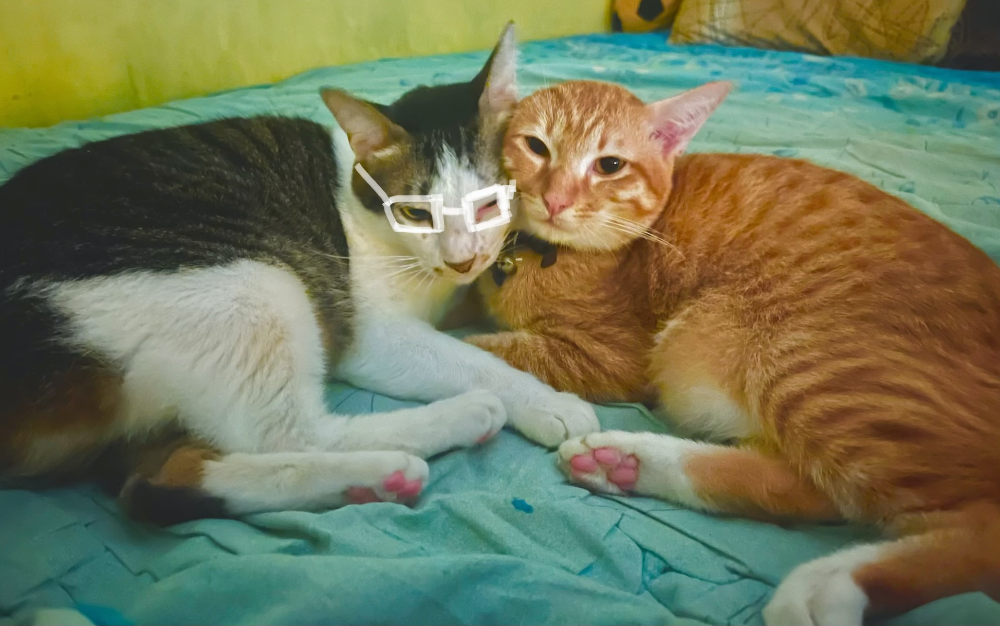

# Kucing, Cinta, dan Kekuasaan: Membaca Relasi Ahong–BotBot sebagai Cermin Psikologi dan Struktur Sosial

*My beloved cat BotBot and Ahong (pic: koleksi pribadi).*

  
***Hubungan yang bertahan bukan yang tanpa konflik, tetapi yang mampu menyeimbangkan kasih dan batas***
  

Tulisan ini menganalisis relasi antara dua kucing domestik, Ahong dan BotBot, sebagai model mikro untuk memahami dinamika cinta, kekuasaan, dan keterikatan dalam sistem sosial. 

Dengan pendekatan etologi, psikologi attachment, dan teori kekuasaan simbolik, artikel ini menunjukkan bahwa relasi non-manusia dapat merefleksikan struktur emosional dan sosial yang juga hadir dalam hubungan manusia. 

Ahong merepresentasikan ketergantungan afektif, sementara BotBot mencerminkan ambiguitas antara dominasi dan kasih sayang.

## Pendahuluan

Relasi antar hewan sering dianggap instingtif dan sederhana. Namun observasi mendalam menunjukkan bahwa interaksi tersebut dapat memuat:

•	struktur kekuasaan,

•	negosiasi emosional,

•	dan pembentukan identitas relasional.

Kasus Ahong–BotBot memperlihatkan bagaimana:
cinta dan kekuasaan tidak selalu berlawanan, tetapi sering kali saling bertumpuk dalam bentuk yang paradoks.

## Teori Attachment – John Bowlby

Attachment menjelaskan bagaimana individu mencari:

•	keamanan,

•	kenyamanan,

•	dan stabilitas emosional.

Ahong:
membentuk secure base pada BotBot, terlepas dari realitas biologis.

## Kapital & Kekuasaan Simbolik – Pierre Bourdieu

Kekuasaan tidak selalu berbentuk dominasi fisik.

Ia bisa hadir sebagai:

•	posisi emosional,

•	kebutuhan yang tidak simetris,

•	atau ketergantungan yang mengikat.

## Etologi Kucing Domestik

Dalam sistem sosial kucing:

•	tidak ada hierarki absolut,

•	dominasi bersifat situasional,

•	relasi dibentuk oleh pengalaman dan kebutuhan.

## Analisis

1. Cinta sebagai Ketergantungan

Ahong:

•	menyusu

•	mencari perlindungan

•	memanggil “mamih”

Ini bukan sekadar perilaku lucu.

Ini adalah:
cinta dalam bentuk paling dasar: kebutuhan untuk bertahan.

2. Kekuasaan dalam Bentuk Lembut

BotBot:

•	merawat

•	melindungi

•	tapi juga “menonjok”

Di sini kekuasaan muncul bukan sebagai kontrol keras, melainkan sebagai:
kemampuan menetapkan batas dalam relasi penuh kasih.

3. Paradoks: Kasih Sayang yang Menampar

Fenomena “jilatin lalu nonjok” mencerminkan:

•	cinta → memberi rasa aman

•	kekuasaan → menjaga struktur

Dalam satu tubuh, BotBot menjalankan keduanya.

4. Identitas yang Tidak Konsisten

BotBot:

•	jantan

•	tapi berperan sebagai induk.

Ahong:

•	dewasa

•	tapi berperilaku bayi.

Ini menunjukkan:
identitas dalam relasi tidak ditentukan oleh fakta biologis, tetapi oleh fungsi emosional.

## Diskusi

Relasi Ahong–BotBot mengungkap tiga hal penting:

1. Cinta tidak selalu setara

Satu memberi lebih, satu membutuhkan lebih.

2. Kekuasaan tidak selalu keras

Ia bisa hadir dalam bentuk perlindungan.

3. Ketergantungan bukan kelemahan mutlak

Ia bisa menjadi dasar stabilitas relasi.

Ahong dan BotBot bukan sekadar dua kucing.

Mereka adalah: model kecil tentang bagaimana cinta dan kekuasaan bekerja dalam dunia nyata.

Di antara:
	
  •	jilatan penuh kasih,
	
  •	dan tonjokan kecil penuh batas,

terdapat pelajaran bahwa:

hubungan yang bertahan bukan yang tanpa konflik, tetapi yang mampu menyeimbangkan kasih dan batas.

Kadang…
yang kita sebut “cinta” itu bukan yang paling lembut.

Tapi yang:

•	tetap menjilati setelah marah,

•	tetap menjaga meski mengeluh,

•	dan tetap tinggal… meski sempat ingin pergi.

ini bukan sekadar cerita kucing.
Ini bisa jadi: cermin manusia yang tidak berani mengakui dirinya sendiri.

  
**Referensi**

Bowlby, J. (1969). Attachment and loss: Vol. 1. Attachment. Basic Books.

Bradshaw, J. W. S. (2013). Cat sense: How the new feline science can make you a better friend to your pet. Basic Books.

Bourdieu, P. (1986). The forms of capital. Greenwood.

Crowell-Davis, S. L., Curtis, T. M., & Knowles, R. J. (2004). Social organization in the cat. Journal of Feline Medicine and Surgery, 6(1), 19–28.

Riedman, M. L. (1982). The evolution of alloparental care and adoption in mammals and birds. Quarterly Review of Biology, 57(4), 405–435.

Turner, D. C., & Bateson, P. (2014). The domestic cat: The biology of its behaviour (3rd ed.). Cambridge University Press. 🐾
