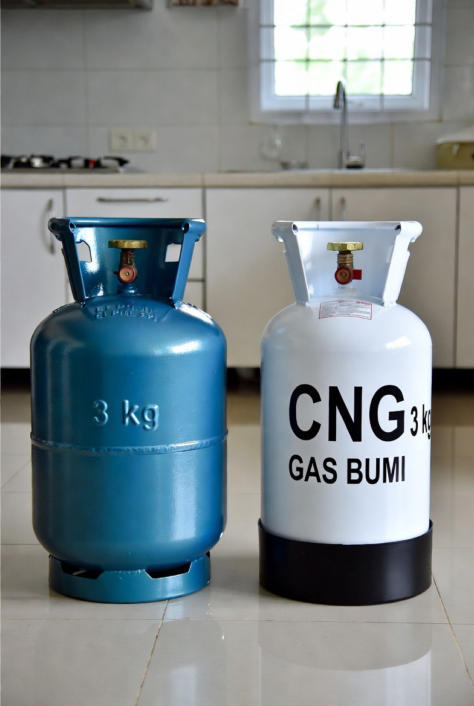

# LPG vs CNG: Apakah Konversi Gas Rumah Tangga Lebih Aman atau Justru Menambah Risiko?

*Ilustrasi LPG dan CNG  (pic: Grok AI).*

  
***Rakyat biasanya tidak takut pada teknologi baru, yang mereka takutkan adalah jika pengelolaannya sembarangan***
  

Wacana penggantian LPG dengan CNG (Compressed Natural Gas) untuk rumah tangga kembali muncul karena alasan efisiensi energi dan pengurangan subsidi. 

Namun publik mempertanyakan aspek keselamatan: apakah gas bertekanan tinggi seperti CNG justru lebih berbahaya dibanding LPG? 

Tulisan ini membandingkan karakteristik fisik, risiko ledakan, efisiensi ekonomi, dan implikasi infrastruktur kedua jenis bahan bakar tersebut. 

Temuan menunjukkan bahwa CNG memang bekerja pada tekanan jauh lebih tinggi dibanding LPG, tetapi risiko aktualnya bergantung pada desain tabung, sistem distribusi, dan standar keamanan negara.

## Pendahuluan

Bagian paling penting yang sering diabaikan orang: “murah itu bagus… tapi aman gak?”. Karena rakyat bukan kelinci percobaan energi.

Belakangan muncul wacana:
pemakaian CNG,
LNG kecil,
bahkan DME (dimethyl ether),
sebagai alternatif LPG.

Tapi masyarakat langsung mikir: “lah kalau tekanannya lebih tinggi bukannya malah lebih serem?”. Dan pertanyaan itu valid banget.

## Apa Itu CNG?

CNG  adalah Compressed Natural Gas. Yakni:
gas alam (mayoritas metana/CH₄),
yang dimampatkan dalam tekanan sangat tinggi.

Kalau LPG:
bentuknya campuran propana & butana,
disimpan dalam bentuk cair.

**Perbedaan Dasarnya**

| Aspek | LPG | CNG |
|--------|--------|--------|
| bahan utama  | propana/butana  | metana  |
| tekanan tabung  | relatif rendah  | sangat tinggi  |
| bentuk penyimpanan | cair | gas terkompresi |
| berat gas | lebih berat dari udara | lebih ringan dari udara |
| perilaku bocor | mengendap di bawah | naik ke atas |

## Mana yang Lebih Berbahaya?

Jawaban jujurnya, dua-duanya bisa berbahaya… tapi dengan cara berbeda.

LPG:
mudah terkumpul di lantai/ruangan bawah,
sangat mudah terbakar,
kalau bocor di ruang tertutup → bisa memicu ledakan besar.

Makanya banyak kasus:
rumah meledak,
dapur hancur,
karena gas mengendap tanpa disadari.

Nah CNG beda, karena:
tekanannya sangat tinggi,
tabungnya bekerja seperti “wadah energi terkompresi”.

Tapi kalau tabung rusak parah, efeknya bisa sangat brutal. Bukan cuma kebakaran…tapi ledakan mekanis tekanan tinggi.

Tapi Ada Twist Penting, 
Metana (CNG):
lebih ringan dari udara,
cepat naik dan menyebar.

Artinya, kalau bocor di ruang terbuka, CNG justru lebih sulit membentuk “awan ledakan” dibanding LPG yang diam di bawah, dan ngumpul diam-diam.

## Jadi Mana Lebih Aman?

Kalau sistemnya bagus, CNG bisa sangat aman. Karena:
tabungnya dibuat sangat kuat,
ada katup otomatis,
gas cepat menguap.

Tapi kalau infrastrukturnya buruk? nah ini masalah negara berkembang.

Karena CNG butuh:
standar tabung tinggi,
inspeksi rutin,
regulator presisi,
jaringan distribusi aman.

Kalau:
tabung murahan,
pengawasan lemah,
korupsi proyek,
teknisi asal-asalan.

Bahaya jadi besar, dan ini yang bikin masyarakat waswas.

## DME Itu Apa?

DME (dimethyl ether) adalah alternatif LPG berbasis batu bara/gas/biomassa.

Indonesia sempat dorong DME karena ingin kurangi impor LPG. Tapi problemnya:
infrastrukturnya mahal,
nilai ekonominya diperdebatkan,
dan belum matang sepenuhnya.

## Kenapa Pemerintah Tertarik CNG?

Karena:
gas alam domestik melimpah,
subsidi LPG berat,
impor LPG mahal sekali.

Jadi logikanya, “kenapa impor terus kalau punya gas sendiri?”. Secara ekonomi memang masuk akal.

Masalah Besarnya Bukan Gasnya… Tapi kualitas tata kelola. Karena bahkan teknologi aman pun, kalau:
proyeknya korup,
pengawasan jelek,
alat murah,
edukasi minim,
bisa berubah jadi bencana nasional.

## Inti Terdalam

Yang sebenarnya ditakutkan rakyat bukan “CNG atau LPG?” tapi “apakah negara benar-benar mampu menjamin keselamatan publik?” dan itu pertanyaan yang jauh lebih besar.

Karena sejarah menunjukkan, banyak tragedi energi terjadi bukan karena teknologinya jahat… melainkan karena:
standar dilanggar,
inspeksi dipalsukan,
dan keselamatan kalah oleh efisiensi biaya.

CNG bukan otomatis lebih berbahaya daripada LPG, tetapi memiliki karakter risiko berbeda:
LPG lebih mudah menciptakan ledakan akibat akumulasi gas,
CNG memiliki tekanan jauh lebih tinggi sehingga memerlukan sistem keamanan lebih ketat.

Keamanan akhirnya sangat ditentukan oleh:
kualitas infrastruktur,
pengawasan,
dan budaya keselamatan publik.

Rakyat biasanya tidak takut pada teknologi baru, yang mereka takutkan adalah jika pengelolaannya sembarangan.

  
**Referensi**

International Energy Agency. (2023). Gas market report Q4 2023.

U.S. Department of Energy. (2022). Alternative fuels data center: Natural gas safety.

NFPA. (2021). NFPA 52: Vehicular natural gas fuel systems code.

Mokhatab, S., et al. (2019). Handbook of natural gas transmission and processing. Gulf Professional Publishing.

