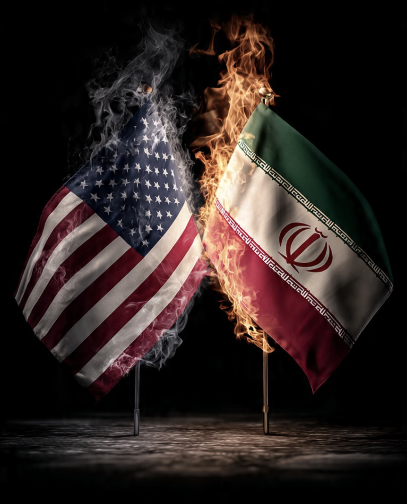

# Lebanon Menembak, Geneva Membeku: Ketika Hezbollah Menjadi Bayangan di Meja Perundingan AS-Iran

*Ilustrasi (pic: Grok AI).*

  
***Apakah Israel benar-benar sedang membela keamanannya atau secara tidak langsung sedang menguji bahkan mungkin mengganggu arsitektur damai yang dibangun Trump?***
  

Ini ironis sekali, AS dan Iran ingin bicara soal Selat Hormuz, program nuklir, sanksi, aset yang dibekukan. Tetapi…yang membuat meja perundingan kosong justru roket dan bom di Lebanon.

Israel memang kembali melakukan serangan udara di Lebanon selatan setelah bentrokan dengan Hezbollah. Bahkan serangan itu terjadi hanya beberapa jam setelah gencatan senjata diumumkan. Israel beralasan mereka merespons serangan proyektil Hezbollah.  

Ketegangan di Lebanon inilah yang membuat pembicaraan implementasi MoU AS-Iran di Swiss menjadi berantakan. Iran menunda delegasinya dan menyatakan sulit melanjutkan negosiasi sementara serangan di Lebanon masih berlangsung.  

JD Vance memang membatalkan perjalanannya ke Swiss. Pemerintah Swiss juga mengonfirmasi pembicaraan yang dijadwalkan pada 19 Juni tidak jadi berlangsung.  

## Mengapa Lebanon Bisa Menggagalkan Damai AS-Iran?

Karena Hezbollah bukan sekadar kelompok bersenjata Lebanon. Bagi Iran, Hezbollah adalah sekutu strategis, alat deterrence terhadap Israel, dan bagian dari apa yang sering disebut: Axis of Resistance.

Jika Israel menyerang Hezbollah, Iran akan menganggap: “Sekutuku sedang diserang.”Maka Iran bertanya: “Bagaimana aku bisa membahas perdamaian, kalau sekutuku sedang dibombardir?”

## Mengapa Israel Tetap Menyerang?

Karena… Israel bukan penandatangan MoU AS-Iran, 

Ini penting. Israel merasa “Kalau Hezbollah masih punya rudal, maka ancamanku belum selesai.” Jadi bagi Netanyahu, damai AS-Iran bukan damai Israel-Hezbollah.

Akibatnya, Trump ingin meredakan perang, Netanyahu ingin memastikan Hezbollah tidak bangkit,  dan Iran ingin melindungi sekutunya.

Tiga pemain, tiga tujuan berbeda, satu meja perundingan.

## JD Vance Membatalkan Perjalanan Itu Artinya Apa?

Banyak orang langsung berpikir: “Wah, damainya batal!”. Belum tentu.

Lebih tepatnya, implementasi damai ditunda. Karena MoU awal sudah ditandatangani, tetapi aturan pelaksanaannya belum dibahas.

Dan aturan inilah yang justru paling sulit, karena siapa mengawasi nuklir Iran? kapan sanksi dicabut? bagaimana dengan Lebanon? bagaimana dengan Hezbollah?

Semua itu belum selesai.  

Kalau benar serangan Israel ke Lebanon membuat negosiasi Swiss gagal, maka kita sedang melihat sesuatu yang sangat menarik: Israel tidak perlu menyerang Iran untuk membuat Iran marah. Cukup serang Hezbollah.

Karena Hezbollah bagi Iran bukan sekadar teman. Melainkan garis pertahanan pertama. Dan selama garis itu terbakar, Teheran akan sulit percaya pada perdamaian.

Maka pertanyaan besarnya adalah: Apakah Israel benar-benar sedang membela keamanannya? atau secara tidak langsung sedang menguji, bahkan mungkin mengganggu, arsitektur damai yang dibangun Trump?

Karena dari luar terlihat aneh, Trump berkata: “Kita sudah berdamai.” Lalu beberapa hari kemudian Israel menyerang Lebanon, Iran menunda negosiasi, JD Vance batal terbang, Geneva menjadi sunyi.

Seolah-olah dunia berkata: Perdamaian sudah ditandatangani tetapi perang belum selesai menulis catatan kakinya. 

  
**Referensi**

Reuters, 19 Juni 2026. US-Iran peace talks in Geneva called off, clouding prospects for lasting truce.  

Reuters, 19 Juni 2026. US vice president cancels trip for peace talks with Iran.  

The Guardian, 19 Juni 2026. US-Iran peace talks abruptly cancelled amid renewed Israeli strikes in Lebanon.  

Reuters, 20 Juni 2026. Israeli strikes kill 10 in Lebanon hours after ceasefire.  
