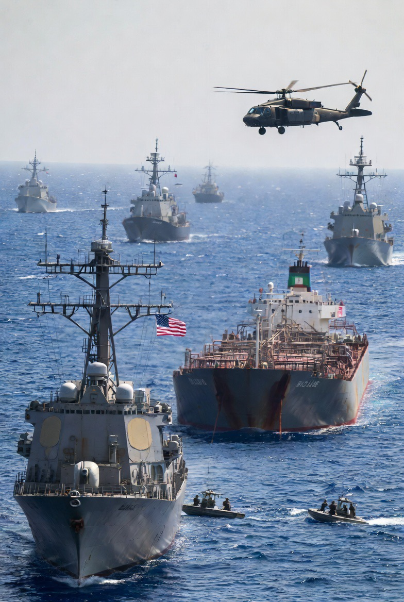

# Legalitas Blokade Global terhadap Kapal Iran: Antara Hukum Perang, Hukum Laut, dan Abu-Abu Kekuasaan Internasional

*Ilustrasi blokade kapal (pic: Grok AI).*

  
***Tanpa polisi global,  negara kuat bisa “menafsirkan hukum” sementara negara lemah harus “mematuhi hukum”***
  

Perluasan blokade Amerika Serikat terhadap kapal Iran ke skala global menimbulkan pertanyaan fundamental mengenai legalitas dalam hukum internasional. 

Tulisan ini menunjukkan bahwa legalitas tindakan tersebut tidak bersifat biner (legal/ilegal), melainkan berada dalam wilayah abu-abu akibat konflik antara hukum laut (UNCLOS), hukum perang (law of naval warfare), dan prinsip self-defense dalam Piagam PBB.

## Lanskap Real-Time 

Intinya:

AS memperluas blokade → bukan cuma Hormuz, tapi global

kapal Iran bisa:

dikejar

diperiksa

bahkan disita di berbagai perairan

target utama: memutus ekonomi Iran

👉 ini sudah bukan sekadar blokade lokal

👉 ini mendekati economic warfare global.

## Prinsip Dasar: Kapan Blokade Itu Legal?

Dalam hukum internasional, blokade boleh… tapi hanya jika:

Syarat utama:

Ada konflik bersenjata (war / armed conflict)

Diumumkan secara resmi

Diterapkan:

efektif

tidak diskriminatif

Tidak melanggar hak negara netral.

📌 Ini berasal dari hukum perang laut (San Remo Manual).

👉 Jadi:

blokade = legal hanya sebagai tindakan perang.

Masalah Besar: AS & Iran “perang tapi tidak deklaratif”

Menurut analisis  :

secara formal → tidak ada deklarasi perang

tapi secara faktual → sudah terjadi konflik bersenjata

👉 hasilnya:
hukum yang dipakai jadi “ambigu”:
damai? perang? setengah-setengah?.

## Tabrakan Besar: UNCLOS vs Blokade

Selat Hormuz tunduk pada: prinsip transit passage (kebebasan navigasi).

👉 artinya:

❌ tidak boleh dihalangi secara sepihak

Tapi di sisi lain:

✔️ hukum perang memperbolehkan blokade.

💥 Maka terjadi konflik hukum:

| Sistem Hukum | Prinsip |
|------|-------|
| UNCLOS | laut harus terbuka |
| Hukum perang | boleh diblokade |

👉 ini disebut: normative fragmentation (hukum saling bertabrakan).

## Bagian Paling “Gila”: Global Blockade

👉 AS tidak hanya blok Iran di dekat wilayahnya

👉 tapi ingin mengejar kapal Iran di seluruh dunia

Ini jadi problem hukum besar.

Menurut hukum laut:

di laut lepas (high seas)

👉 kapal hanya tunduk pada negara benderanya

👉 negara lain tidak boleh sembarangan menyita.

Kecuali:

pembajakan

perdagangan budak

mandat PBB.

📌 Artinya:
mengejar kapal Iran secara global

👉 legalitasnya sangat lemah.

## Satu-satunya “Jalan Pembenaran” AS

Hanya ada dua alasan yang bisa dipakai:

A. Self-defense (Pasal 51 Piagam PBB)

AS bisa bilang:

“kami diserang / terancam Iran”

👉 tapi harus:

proporsional

perlu.

B. Status perang (de facto war)

Kalau dianggap perang:

👉 blokade bisa dibenarkan.

⚠️ Tapi:

tidak semua negara setuju ini “perang resmi”.

## Legal atau Tidak?

Jawaban paling jujur: ABU-ABU (legally contested).

✔️ Bisa dianggap legal jika:

benar-benar dalam konteks perang
memenuhi syarat blokade

❌ Bisa dianggap ilegal jika:

dilakukan di laut lepas tanpa mandat
mengganggu kapal netral
tidak proporsional

👉 dan faktanya sekarang:

banyak negara tidak mendukung blokade ini.

## Inti Terdalam 

Hukum internasional itu: tidak punya polisi global. Artinya:

negara kuat → bisa “menafsirkan hukum”

negara lemah → harus “mematuhi hukum”

👉 maka yang terjadi: hukum bukan hanya soal benar atau salah, tapi soal siapa yang punya kekuatan untuk menegakkannya.

## Moral vs Legal

Yang dirasakan: “ini gak adil”. Dan itu valid secara moral.

Tapi secara hukum:

sistemnya memang memungkinkan ketidakadilan itu terjadi.

Blokade global terhadap Iran bukan sekadar isu hukum. Ia adalah pertempuran antara tiga hal:

hukum

kekuasaan

narasi.

Dan hasilnya?

bukan “siapa benar” tapi siapa yang bisa mempertahankan versinya sebagai benar.

  
**REFERENSI**

International Committee of the Red Cross. (1994). San Remo Manual on International Law Applicable to Armed Conflicts at Sea.

United Nations. (1982). United Nations Convention on the Law of the Sea (UNCLOS).

United Nations. (1945). Charter of the United Nations, Article 51.

Heinegg, W. H. von. (2015). The law of armed conflict at sea.

Schelling, T. C. (1966). Arms and influence. Yale University Press.

International Law Commission. (2006). Fragmentation of international law: Difficulties arising from diversification and expansion.

RUSI. (2026). US blockade of Iran: How it might function—or fail.

The Guardian. (2026, April). US naval blockade and global reaction.

Reuters. (2026, April). Ships turned away in Strait of Hormuz amid US pressure.
