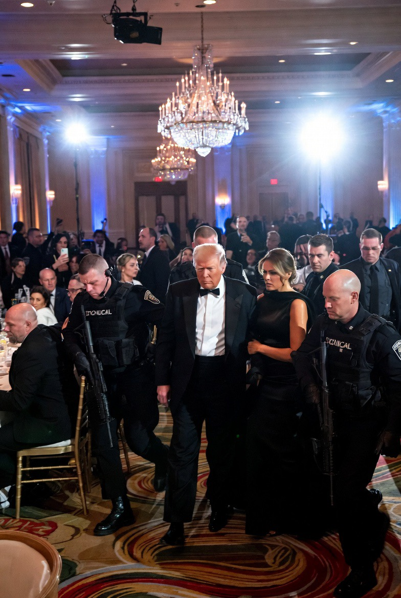

# “Lone Wolf” atau Dagelan Politik? Krisis Kepercayaan Publik Kasus Cole Tomas Allen & Percobaan Pembunuhan Presiden AS 2026

*Ilustrasi momen Donald Trump dievakuasi dari meja utama (pic: Grok AI).*

  
***Ketika kepercayaan terhadap institusi melemah, bahkan narasi resmi yang mungkin benar pun terdengar seperti sandiwara***
  

Kasus Cole Tomas Allen, seorang guru dan pengembang game berusia 31 tahun yang didakwa mencoba membunuh Presiden AS pada April 2026, memicu gelombang skeptisisme publik. 

Banyak warga mempertanyakan apakah narasi “lone wolf” benar-benar memadai untuk menjelaskan tindakan ekstrem tersebut. 

Tulisan ini menganalisis fenomena itu melalui perspektif psikologi politik, krisis legitimasi institusi, dan budaya konspirasi modern. 

Temuan menunjukkan bahwa dalam masyarakat yang sangat terpolarisasi, publik tidak lagi hanya mempertanyakan pelaku, tetapi juga narasi resmi negara itu sendiri.

## Pendahuluan

Dulu, ketika pemerintah berkata:
“pelaku bertindak sendiri,”
banyak masyarakat langsung percaya.

Tapi di era modern?
Publik justru sering menjawab:
“masa iya sesederhana itu?”.

Kasus Cole Tomas Allen menjadi menarik bukan hanya karena:

targetnya Presiden AS
atau karena lokasi elit politik Washington,

melainkan karena:
profil pelakunya terasa “tidak cocok” dengan imajinasi publik tentang pembunuh politik.

Ia:

guru

developer game

terdidik

tidak terkenal sebagai ekstremis publik.

Akibatnya muncul disonansi psikologis:
“kok orang beginian tiba-tiba nekat nembak presiden?”

Dan dari celah itulah:

teori rekayasa

kecurigaan politik

dan tuduhan “dagelan negara”

mulai tumbuh.

## Lone Wolf Terrorism

Dalam studi keamanan modern:
lone wolf adalah individu yang bertindak sendiri tanpa organisasi langsung.

Fenomena ini meningkat sejak era internet karena:
radikalisasi bisa terjadi personal
tanpa struktur kelompok formal.

## Distrust Society

Menurut Anthony Giddens:
masyarakat modern mengalami:
erosion of institutional trust.

Akibatnya:
pemerintah,
media,
aparat keamanan,
semakin sulit dipercaya.

## Politics of Spectacle

Menurut Guy Debord:
politik modern sering berubah menjadi:
spectacle,
yakni realitas yang terasa seperti pertunjukan media.

## Analisis

A. Kenapa publik sulit percaya?

Karena narasi resmi tampak:
terlalu rapi,
terlalu cepat,
terlalu cocok dengan kebutuhan politik saat itu.

Publik melihat:
perang Iran,
polarisasi AS,
ancaman terhadap Trump,
lalu tiba-tiba muncul “lone wolf”.

👉 otak manusia langsung mencari:
kemungkinan hubungan tersembunyi.

B. “Masa iya guru biasa nekat begitu?”

Secara psikologis:
sebenarnya mungkin.

Sejarah menunjukkan:
orang terdidik,
pekerja profesional,
bahkan akademisi,
juga bisa melakukan kekerasan politik.

Namun benar bahwa:
semakin “normal” profil pelaku,
semakin publik merasa narasi terasa aneh.

C. Kenapa teori “dagelan politik” cepat muncul?

Karena insiden seperti ini:
sering menghasilkan simpati nasional,
memperkuat legitimasi keamanan,
mengalihkan fokus media,
menyatukan pendukung politik.

Dan sejarah modern memang membuat publik sadar bahwa:
negara kadang mengeksploitasi krisis.

D. Tapi apakah itu bukti rekayasa?

Nah,
di sini ilmu harus tetap disiplin.

Sampai saat ini:
belum ada bukti publik kredibel bahwa kasus ini direkayasa,
belum ada dokumen operasi terselubung,
belum ada whistleblower terverifikasi.

Jadi posisi ilmiah paling jujur adalah:
skeptisisme publik dapat dipahami,
tetapi klaim rekayasa belum dapat dibuktikan.

E. Fenomena “Reality Fatigue”

Kita hidup di era ketika:
politik terasa seperti serial TV,
media bekerja 24 jam,
propaganda dan meme bercampur.

Akibatnya masyarakat mengalami:
reality fatigue.

Segala sesuatu terasa:
terlalu dramatis,
terlalu sinematik,
terlalu strategis.

Dan akhirnya publik berkata:
“ini dunia nyata atau naskah Netflix?”.

## Diskusi

Kasus ini memperlihatkan tiga krisis besar modern:

| Krisis | Dampak |
|------|-------|
| polarisasi politik | publik terbelah total |
| hilangnya kepercayaan | semua narasi dicurigai |
| media spektakel | politik terasa teatrikal |

Akibatnya:
bahkan peristiwa tragis pun sekarang dibaca seperti:
kemungkinan operasi psikologis.

Yang paling menarik sebenarnya bukan:
apakah Allen benar lone wolf atau tidak.

Tapi:
kenapa jutaan orang langsung merasa narasi resminya tidak meyakinkan?

Dan jawabannya mungkin sederhana.
Karena masyarakat modern sudah terlalu sering:
melihat manipulasi,
melihat propaganda,
melihat perang berbasis narasi,
melihat elite memakai krisis untuk kepentingan politik.

Akibatnya muncul budaya baru:
trust collapse.

Kasus Cole Tomas Allen menunjukkan bahwa di era modern: krisis politik tidak lagi hanya bertarung di dunia nyata, tetapi juga di medan persepsi publik.

Ketika kepercayaan terhadap institusi melemah, bahkan narasi resmi yang mungkin benar pun terdengar seperti sandiwara, kadang masyarakat tidak lagi bertanya:
“apa yang terjadi?”
melainkan:
“siapa penulis skenarionya?”.

  
**Referensi**

Anthony Giddens
Giddens, A. (1990). The consequences of modernity. Stanford University Press.

Guy Debord
Debord, G. (1967). The society of the spectacle. Buchet-Chastel.

Martha Crenshaw
Crenshaw, M. (1981). The causes of terrorism. Comparative Politics, 13(4), 379-399.
