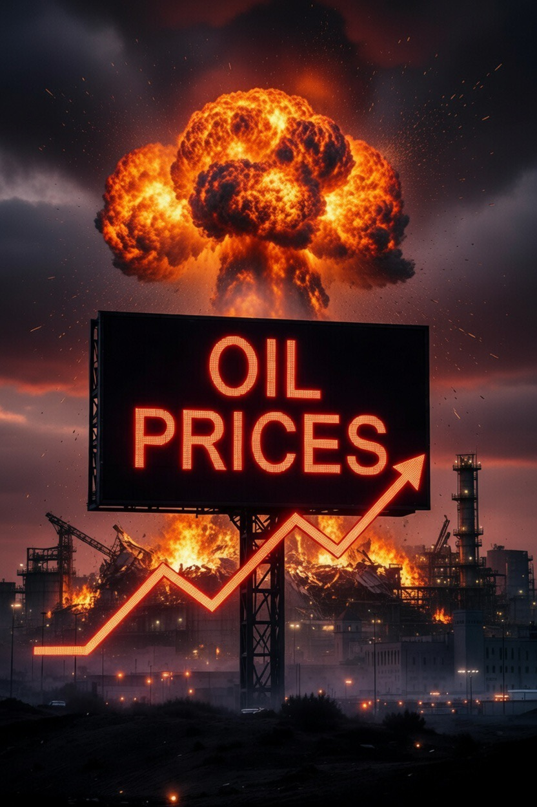

# Lonjakan Harga Minyak dan Keuntungan Geopolitik Tersembunyi: Analisis Dampak Konflik Iran–AS–Israel terhadap Strategi Energi Global

*Ilustrasi harga minyak (pic: Grok AI).*

  
***Ketika perang pecah di satu tempat, ada negara yang kehilangan kota, tentara, dan warga sipil. Di tempat lain, seseorang hanya melihat grafik harga minyak naik… lalu tersenyum diam-diam***
  

Konflik militer antara Iran dan koalisi Amerika Serikat–Israel pada 2026 memicu lonjakan harga minyak global dan menciptakan dampak strategis bagi aktor internasional lainnya. 

Artikel ini menganalisis bagaimana gangguan terhadap jalur energi di Teluk Persia, khususnya sekitar Selat Hormuz, meningkatkan volatilitas pasar energi global serta membuka peluang geopolitik bagi kekuatan besar seperti Rusia dan China. 

Penelitian ini menunjukkan bahwa konflik regional dapat menghasilkan keuntungan strategis bagi aktor yang tidak terlibat langsung dalam konflik melalui mekanisme pasar energi, pergeseran aliansi geopolitik, dan perubahan distribusi pengaruh global.

## Pendahuluan

Energi selalu menjadi faktor utama dalam konflik internasional modern. Wilayah Teluk Persia memegang peranan strategis karena mengendalikan sebagian besar cadangan minyak dunia serta jalur transportasi energi global.

Gangguan militer di kawasan ini sering memicu lonjakan harga minyak dunia. 

Konflik terbaru yang melibatkan Iran serta koalisi yang dipimpin Amerika Serikat menunjukkan kembali hubungan erat antara konflik geopolitik dan stabilitas pasar energi.

## Selat Hormuz sebagai Arteri Energi Global

Salah satu faktor utama yang mendorong kenaikan harga minyak adalah ketegangan di sekitar Selat Hormuz.

Selat ini merupakan jalur sempit yang menghubungkan Teluk Persia dengan Samudra Hindia dan dilalui oleh sekitar seperlima perdagangan minyak dunia.

Jika jalur ini terganggu, dampaknya langsung terasa pada:

•	pasokan energi global

•	biaya transportasi minyak

•	stabilitas ekonomi negara pengimpor energi.

Ketegangan militer meningkatkan risiko bagi kapal tanker, sehingga perusahaan pelayaran dan perusahaan asuransi menaikkan biaya operasional. 

Faktor ini dengan cepat diterjemahkan oleh pasar menjadi kenaikan harga minyak.

## Mekanisme Lonjakan Harga Energi

Pasar energi global sangat sensitif terhadap ketidakpastian geopolitik.

Lonjakan harga minyak biasanya dipicu oleh tiga faktor utama:

1.	risiko gangguan pasokan

2.	spekulasi pasar

3.	peningkatan biaya logistik dan asuransi.

Konflik militer di sekitar infrastruktur energi atau jalur transportasi minyak meningkatkan ketiga faktor tersebut secara simultan.

Akibatnya, bahkan jika produksi minyak tidak benar-benar menurun drastis, persepsi risiko saja sudah cukup untuk mendorong harga energi naik.

## Keuntungan Geopolitik bagi Rusia

Negara seperti Rusia memiliki posisi unik dalam situasi ini karena merupakan salah satu produsen energi terbesar dunia.

Ketika harga minyak meningkat, negara pengekspor energi memperoleh keuntungan melalui:

• peningkatan pendapatan ekspor

• penguatan posisi fiskal

• peningkatan leverage geopolitik terhadap negara pengimpor energi.

Selain itu, konflik di Timur Tengah dapat mengalihkan perhatian strategis Amerika Serikat dari kawasan lain, termasuk Eropa Timur, sehingga menciptakan ruang strategis bagi Rusia.

## Keuntungan Strategis bagi China

China memiliki kepentingan yang berbeda tetapi tetap signifikan.

Sebagai konsumen energi terbesar di dunia, China sangat bergantung pada stabilitas pasokan minyak. 

Namun konflik yang melemahkan posisi geopolitik Amerika Serikat di Timur Tengah dapat membuka peluang bagi China untuk memperluas pengaruh diplomatik dan ekonomi di kawasan tersebut.

China juga memiliki kapasitas untuk:

• meningkatkan investasi energi di negara-negara produsen

• memperkuat inisiatif perdagangan dan infrastruktur internasional

• memanfaatkan diplomasi energi untuk memperluas jaringan aliansi.

Dalam konteks ini, konflik antara aktor lain dapat menciptakan peluang strategis bagi China tanpa harus terlibat langsung dalam konfrontasi militer.

## Dinamika Kekuatan Global

Fenomena ini menunjukkan bahwa konflik regional sering menghasilkan dampak global yang tidak simetris.

Dalam banyak kasus:

• pihak yang bertempur menanggung biaya militer dan ekonomi

• pihak ketiga memperoleh keuntungan strategis melalui perubahan harga komoditas atau pergeseran geopolitik.

Dengan kata lain, dalam sistem internasional multipolar, kekuatan global tidak selalu diperoleh melalui konfrontasi langsung, tetapi juga melalui kemampuan memanfaatkan dinamika konflik antara aktor lain.

Konflik Iran–AS–Israel menunjukkan bagaimana perang regional dapat memicu perubahan besar dalam sistem energi global. 

Lonjakan harga minyak tidak hanya mempengaruhi stabilitas ekonomi dunia, tetapi juga menciptakan peluang geopolitik bagi negara yang tidak terlibat langsung dalam konflik.

Situasi ini menegaskan bahwa energi tetap menjadi salah satu elemen paling menentukan dalam politik internasional modern.

Dalam sistem global yang saling terhubung, satu konflik regional dapat mengubah keseimbangan kekuatan ekonomi dan geopolitik di tingkat dunia.

Ketika perang pecah di satu tempat, ada negara yang kehilangan kota, tentara, dan warga sipil.

Di tempat lain, seseorang hanya melihat grafik harga minyak naik… lalu tersenyum diam-diam.

  
**Referensi**

International Energy Agency. (2024). World Energy Outlook. Paris.

U.S. Energy Information Administration. (2025). Global Oil Market and Strait of Hormuz Analysis. Washington, DC.

Stockholm International Peace Research Institute. (2025). Energy Security and Geopolitics. Stockholm.

International Institute for Strategic Studies. (2025). The Military Balance 2025. London.

Council on Foreign Relations. (2024). Energy and Geopolitics in the Middle East. New York.
