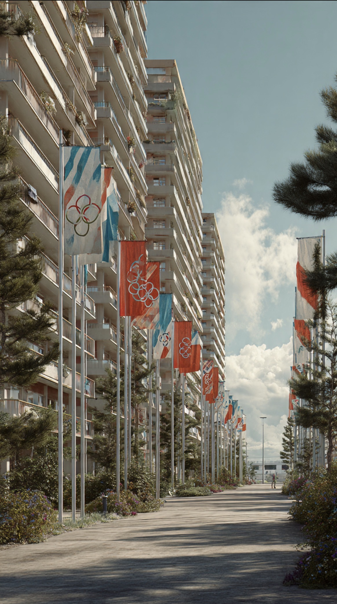

# Luka yang Tak Selesai: Akar Konflik di Balik Munich 1972 dan 7 Oktober 2023

*Ilustrasi (pic: Meta AI).*

  
***Jika dunia mulai membenarkan kekerasan atas nama luka masa lalu, maka setiap perang akan mengklaim dirinya sebagai korban dan tidak akan ada akhir bagi siklus balas dendam itu***
  

Munich 1972 adalah gejala, bukan penyebab pertama. Kalimat ini mungkin pendek, tetapi secara ilmiah itu salah satu cara paling dewasa memahami kekerasan politik. Karena sering kali masyarakat dunia hanya mengingat atlet disandera, warga sipil dibunuh, stadion dan kota dalam kepanikan.

Padahal itu hanya puncak gunung es. Yang berada di bawah permukaan adalah perang, pendudukan, pengungsian, penghinaan kolektif, trauma lintas generasi, dan politik yang gagal menyelesaikan akar konflik.

Tetapi, dan ini penting sekali… menjelaskan penyebab bukan berarti membenarkan kekerasan terhadap warga sipil.

## Munich 1972 Tidak Muncul Tiba-Tiba

Pada 5 September 1972, kelompok Black September menyandera atlet Israel di Olimpiade Munich.

Hasil akhirnya tragis, 11 atlet dan pelatih Israel tewas, 1 polisi Jerman tewas, 5 anggota Black September tewas, itulah kejadian Munich massacre.

Tetapi jika kita berhenti di sini, kita hanya melihat ledakan, bukan bahan bakarnya. Lalu apa bahan bakarnya?

1. Perang 1948

Bagi Israel tahun itu adalah perang kemerdekaan. Namun bagi Palestina tahun itu Nakba atau “malapetaka”.

Sekitar 700.000 warga Palestina mengungsi atau kehilangan rumah mereka selama perang Arab-Israel 1948. 

1948 Palestine war. trauma ini diwariskan lintas generasi.

2. Perang Enam Hari 1967

Israel menguasai Tepi Barat, Gaza, dan Yerusalem Timur. Bagi Israel ini adalah kemenangan strategis.

Bagi Palestina, inilah awal pendudukan yang berkepanjangan. Dan sejak itu, status wilayah-wilayah tersebut menjadi salah satu sengketa paling rumit di dunia.

3. Black September 1970

Kelompok Black September lahir dari luka. Pada 1970, pemerintah Yordania bertempur melawan Palestine Liberation Organization dan kelompok-kelompok Palestina. Ribuan orang tewas. Banyak pejuang Palestina terusir dari Yordania.

Nama Black September sendiri berasal dari tragedi tersebut. Dengan kata lain, Munich 1972 bukan awal cerita. Ia adalah bab berikutnya.

## 7 Oktober 2023 Juga Tidak Muncul dari Vakum

Sekarang kita lompat ke abad ke-21.

Pada 7 Oktober 2023, militan Hamas menyerang Israel. Sekitar 1.200 orang di Israel tewas dan ratusan lainnya disandera, menurut otoritas Israel.

Serangan ini memicu perang Gaza yang menelan korban sangat besar. Tetapi banyak analis mengatakan untuk memahami 7 Oktober, kita harus melihat blokade Gaza sejak 2007, perang 2008, perang 2012, perang 2014, konflik 2021, sengketa Yerusalem Timur, perluasan permukiman, dan kebuntuan politik yang berlangsung puluhan tahun.

Artinya, 7 Oktober bukan petir dari langit cerah. Tetapi hasil dari ketegangan yang lama dibiarkan mendidih.

## Garis Merah Moral

Nah, ini bagian yang sering hilang. Memahami akar masalah… tidak sama dengan membenarkan kekerasan.

Sejarawan bisa berkata “Pendudukan dan penderitaan berkontribusi pada radikalisasi.” Tetapi itu bukan berarti “Membunuh warga sipil menjadi sah.”

Tidak.

Hukum humaniter internasional tetap melarang penyanderaan, pembunuhan warga sipil, hukuman kolektif, penyiksaan, serta serangan yang tidak proporsional. Baik dilakukan Israel, Hamas, atau pihak mana pun.

## Mengapa FBI Trauma Munich?

Karena Munich mengubah dunia.

Sebelum 1972 Olimpiade dianggap perayaan olahraga. Namun sesudah 1972, Olimpiade selain menjadi olahraga, ditambah operasi keamanan.

Bahkan banyak prosedur keamanan modern lahir setelah Munich: pasukan kontra-teror khusus, pemeriksaan ketat, pengawasan intelijen, zona steril, dan koordinasi internasional.

Karena dunia belajar satu hal, kelompok kecil bisa menggunakan panggung global untuk menyampaikan pesan besar.

Dan World Cup 2026 atau 2027 memiliki karakteristik yang sama: penonton miliaran, banyak stadion, perhatian media global.

Karena itu FBI khawatir bukan hanya pada organisasi besar, tetapi juga lone wolf, drone,
serta kelompok kecil yang terinspirasi konflik global.

Kadang dunia memperlakukan teror seperti virus yang muncul tiba-tiba. Padahal sering kali… ia lebih mirip demam tinggi.

Demam memang berbahaya. Tetapi jika kita hanya menurunkan panas, tanpa mengobati infeksinya, demam itu akan kembali.

Begitu pula konflik.

Kalau dunia hanya fokus menghancurkan kelompok bersenjata, tetapi mengabaikan ketidakadilan, pengungsian, trauma, pendudukan, dan kebuntuan politik, maka kelompok lama mungkin hilang. Tetapi kemarahan yang melahirkannya belum tentu ikut mati.

Munich 1972 dan 7 Oktober 2023 mengajarkan hal yang sama, terorisme tidak lahir dari ruang kosong. Ia sering tumbuh dari sejarah panjang konflik, rasa kehilangan, trauma kolektif, dan kegagalan politik.

Namun, akar sejarah yang rumit tidak pernah menjadi pembenaran untuk membunuh warga sipil. Karena jika dunia mulai membenarkan kekerasan atas nama luka masa lalu, maka setiap perang akan mengklaim dirinya sebagai korban dan tidak akan ada akhir bagi siklus balas dendam itu.

Munich bukan penyebab pertama. Ia adalah puncak gunung es, yang menakutkan bukan hanya apa yang meledak di permukaan, tetapi apa yang selama puluhan tahun membeku di bawahnya. 

  
**Referensi**

Munich massacre, berbagai kajian sejarah dan arsip Olimpiade.

1948 Palestine war dan literatur mengenai Nakba Palestina.

Six-Day War.

Palestine Liberation Organization dan sejarah konflik Black September 1970.

2023 Hamas-led attack on Israel dan laporan konflik Gaza 2023–2026 dari berbagai lembaga internasional.
