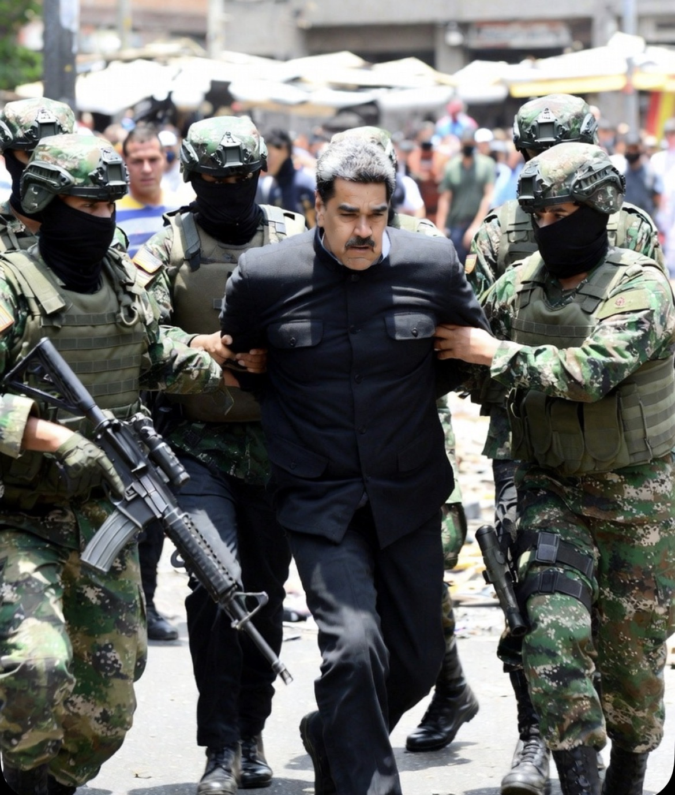

# Kedaulatan di Bawah Ancaman: Penangkapan Kepala Negara, Hukum Internasional, dan Dominasi Kekuasaan Global

<figure>
  
  <figcaption><strong>Gambar.</strong> Ilustrasi penangkapan Presiden Venezuela Nicholas Maduro (pic:Grok)</figcaption>
</figure>

  

***Tindakan penangkapan atau penculikan pemimpin negara oleh negara lain harus melalui mekanisme hukum internasional yang sah***

  

Kasus dugaan penangkapan atau penculikan Presiden Venezuela pada 4 Januari 2026 (dengan sejumlah media melaporkan intervensi AS) memperlihatkan ketegangan antara prinsip kedaulatan negara dan praktik intervensi oleh negara kuat. 

Penelitian ini menggunakan pendekatan hukum internasional, hubungan internasional realistis, dan ekonomi politik kekuasaan untuk mengevaluasi apakah tindakan semacam itu legal, konsisten dengan preseden global, dan sejalan dengan klaim pemberantasan kejahatan transnasional. 

Tulisan ini membandingkan kasus Venezuela dengan penanganan rezim Irak (Saddam Hussein) dan Libya (Muammar Khadafi), serta menguraikan bagaimana narasi “ancaman” atau “narkoba” dapat digunakan untuk melegitimasi tindakan yang secara normatif kontroversial. 

Kesimpulan menunjukkan bahwa tindakan semacam itu menimbulkan pertanyaan serius mengenai erosinya terhadap kedaulatan negara, supremasi hukum internasional, dan potensi gangguan terhadap tatanan global berbasis aturan.

## Pendahuluan

Kedaulatan negara telah menjadi fondasi utama orde dunia modern sejak Westphalia (1648). Setiap rezim pemerintahan diakui memiliki hak eksklusif atas yurisdiksi di wilayahnya. 

Namun dalam praktik kontemporer, negara-negara kuat membawa pendekatan baru dalam kebijakan eksternal: intervensi langsung, sanksi ekonomi berat, dan dakwaan terhadap kepala negara asing atas tuduhan kriminal (termasuk narkotika, terorisme, atau pelanggaran HAM).

Kasus terbaru Venezuela mengundang pertanyaan pokok: 
Apakah negara kuat berhak menangkap pemimpin negara lain atas tuduhan kriminal lintas batas? Apakah ini legal menurut hukum internasional? Atau justru pola yang menggerus kedaulatan nasional?

## Hukum Internasional dan Imunitas Kepala Negara

Dalam hukum internasional:
•	Kepala negara menikmati imunitas kekuasaan sipil selama masa menjabat.
•	Tidak boleh ditangkap atau diadili oleh pengadilan asing tanpa persetujuan negaranya atau Mahkamah Internasional (International Court of Justice).

Ini disebut dalam konsep immunity ratione personae (imunitas pribadi), yang tidak bisa dicabut oleh satu negara saja.

Preseden klasik: Interpol tidak boleh mengeluarkan red notice jika melanggar imunitas kepala negara sah.

Jadi, secara teks hukum internasional, penculikan atau penangkapan Presiden Venezuela oleh negara asing tidak legal tanpa mandat internasional yang kuat (mis. Rangkaian dari CPI/ICC).

## Narasi Kriminalisasi Politik Eksternal

Dalam politik global kontemporer, negara kuat sering menggunakan narasi kriminal untuk:
1.	Mengkonstruksi legitimasi intervensi
2.	Menekan rezim yang tidak kooperatif
3.	Membentuk opini domestik dan internasional

Contoh:
•	Tuduhan senjata pemusnah massal di Irak (yang kemudian dibantah)
•	Tuduhan “penghancuran AS lewat narkoba” tanpa bukti publik kuat

Narasi kriminalisasi ini sering bersinggungan dengan ekonomi politik kekuasaan: narasi digunakan sebagai alat legitimasi untuk tindakan yang bertentangan dengan hukum internasional, tetapi dibungkus sebagai kepentingan global.

## Perbandingan Historis: Sadam Hussein & Muammar Khadafi

1.Irak

Invasi 2003 oleh koalisi dipimpin AS didasarkan pada klaim senjata pemusnah massal yang tidak ditemukan.

Implikasi:
•	Hancurnya institusi negara
•	Konflik internal berkepanjangan
•	Kehilangan kedaulatan penuh

2. Libya

Intervensi 2011 di bawah mandat “perlindungan sipil” kemudian berujung pada jatuhnya Qaddafi dan fragmentasi negara.

Dalam kedua kasus, narasi awal yang masalah sementara berubah menjadi justifikasi yang jauh lebih luas untuk perubahan rezim.

## Intervensi Modern: Kekuasaan, Strategi, dan Ketidakadilan Global

1. Ketidakseimbangan Kekuasaan

Negara dengan kekuatan militer, ekonomi, dan politik besar sering memperoleh:
•	hak veto de facto dalam sistem global
•	kemampuan untuk memaksakan interpretasi hukum internasional
•	kemampuan untuk membentuk opini global melalui media

2. Ekonomi Politik Perang vs Kedaulatan

Industri keamanan global — termasuk industri senjata, kontraktor militer, dan lobi politik — memiliki insentif material untuk mempertahankan konflik berkepanjangan dan intervensi.

Ini menciptakan struktur kepentingan yang berlawanan dengan norma kedaulatan dan supremasi hukum internasional.

## Kritik terhadap Tatanan Hukum Internasional Kontemporer

Analisis kritis menunjukkan:
•	hukum internasional secara formal menjunjung kedaulatan
•	tetapi secara material dinegosiasikan oleh aktor kuat
•	sistem internasional memberi ruang bagi tindakan luar batas hukum yang dilakukan oleh negara besar

Ini mencerminkan dualitas normatif: hukum yang diproklamasikan vs hukum yang dipraktikkan.

## Implikasi terhadap Dunia yang Berdaulat

Jika tindakan seperti penangkapan presiden asing menjadi preseden:
•	kedaulatan menjadi rapuh
•	negara kecil menjadi rentan
•	pendekatan hukum internasional berubah menjadi alat kepentingan geopolitik

Ini membuka risiko:
•	peningkatan instabilitas global
•	legitimasi lebih lanjut bagi intervensi sepihak
•	penurunan kepercayaan terhadap sistem hukum internasional

Analisis menunjukkan bahwa apa pun narasi yang digunakan — apakah narkoba, terorisme, atau ancaman lain — tindakan penangkapan atau penculikan pemimpin negara oleh negara lain harus melalui mekanisme hukum internasional yang sah, bukan hanya klaim sepihak.

Tanpa itu, tindakan seperti yang diklaim terhadap Maduro:
•	melanggar prinsip kedaulatan
•	bertentangan dengan hukum internasional
•	berpotensi menciptakan preseden berbahaya

Dan jika ini dilakukan tanpa mandat legitimasi global, bukan hanya Venezuela yang berisiko — seluruh sistem negara berdaulat akan terkikis sedikit demi sedikit.

  

**Referensi**

Anderson, M. (2010). International law and the sovereign state: The evolution of the concept of sovereignty.Routledge.

Cassese, A. (2001). International law (2nd ed.). Oxford University Press.

Falk, R. (2000). Human rights horizons: The pursuit of justice in a globalizing world. Routledge.

Kelsen, H. (1952). Principles of international law. Dryden Press.

Reus-Smit, C. (2004). The politics of international law. Cambridge University Press.

Shaw, M. N. (2017). International law (8th ed.). Cambridge University Press.

Weiss, T. G., & Wilkinson, R. (2014). International organization and global governance. Routledge.
