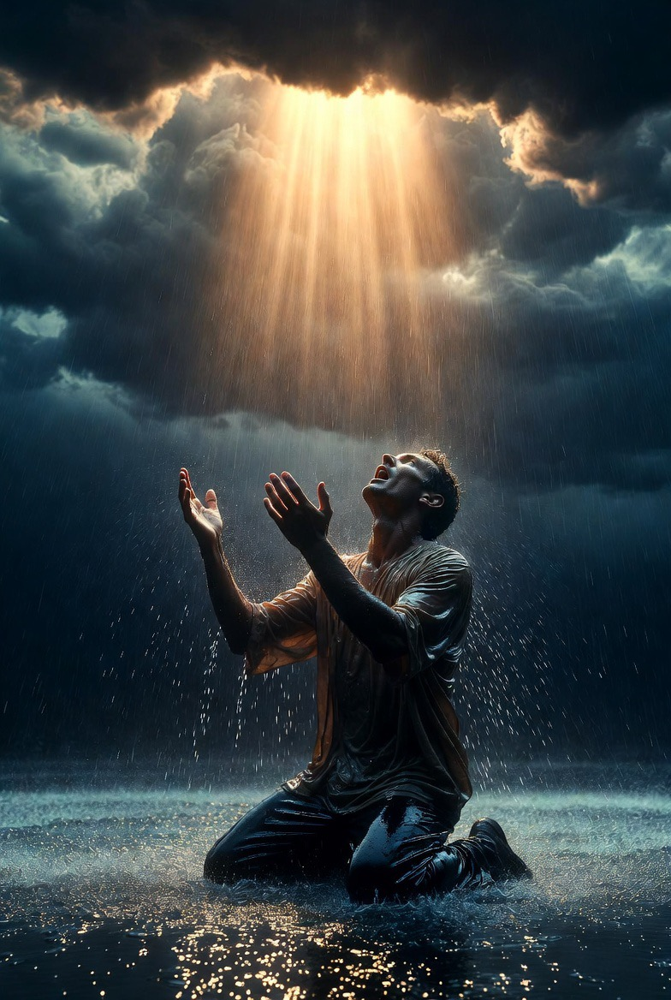

# Manusia Memilih Tuhan atau Otaknya Memang Dirancang Membutuhkan Tuhan? Neurosains, Fitrah & Problem Ketuhanan dalam Kesadaran Manusia

*Ilustrasi  (pic: Grok AI).*

  
***Mengapa di tengah kemajuan teknologi, kekuasaan, dan ilmu pengetahuan, manusia tetap memiliki ruang kosong yang tidak sepenuhnya bisa diisi oleh dunia?***
  

Kepercayaan terhadap Tuhan merupakan fenomena lintas peradaban yang muncul hampir di seluruh sejarah manusia. 

Pertanyaan besar kemudian muncul: apakah manusia secara bebas “memilih” Tuhan melalui refleksi rasional dan spiritual, ataukah otak manusia sejak awal memang memiliki kecenderungan biologis dan psikologis untuk mencari entitas transenden? 

Tulisan ini mengkaji persoalan tersebut melalui pendekatan neurosains, psikologi evolusioner, filsafat agama, dan teologi Islam. 

Analisis menunjukkan bahwa kebutuhan manusia terhadap Tuhan kemungkinan merupakan hasil interaksi kompleks antara struktur kognitif, pengalaman eksistensial, serta konsep fitrah dalam Islam yang memandang kecenderungan menuju Tuhan sebagai bagian bawaan dari penciptaan manusia.

## Kenapa Hampir Semua Peradaban Mencari Tuhan?

Dari:
suku kuno,
kerajaan besar,
masyarakat modern,
manusia hampir selalu:
berdoa,
menciptakan ritual,
mencari makna transenden.

Ini menarik, karena:
bahasa berbeda,
budaya berbeda,
teknologi berbeda,
tapi pencarian terhadap “sesuatu yang lebih besar dari diri manusia” terus muncul.

## Hipotesis Neurosains: Otak Manusia Memang “Religius”?

Sebagian ilmuwan berpendapat: otak manusia memiliki predisposisi biologis terhadap pengalaman spiritual.

Beberapa mekanisme yang diteliti:

a. Pattern Detection

Otak manusia sangat suka mencari pola, bahkan dalam ketidakpastian:
badai,
kematian,
kebetulan,
manusia cenderung mencari: “siapa di balik ini?”

b. Hyperactive Agency Detection

Dalam psikologi evolusioner, manusia cenderung menganggap ada “agen” di balik peristiwa.

Dahulu suara semak dianggap predator, lebih aman salah curiga daripada mati.

Sebagian ilmuwan menduga kecenderungan ini ikut membentuk ide tentang makhluk supranatural.

c. Existential Anxiety

Manusia sadar:
dirinya akan mati,
hidup penuh ketidakpastian.

Tuhan memberi:
makna,
harapan,
keteraturan kosmik.

## Tapi… Apakah Itu Membuktikan Tuhan “Cuma Ilusi”?

Nah, di sinilah banyak orang salah lompat kesimpulan.

Kalau otak punya kapasitas religius, itu tidak otomatis berarti Tuhan tidak ada.

Analogi filosofisnya:
manusia lapar → makanan ada,
manusia haus → air ada.

Maka pertanyaannya, kalau manusia punya “rasa spiritual”… apakah itu sekadar bug evolusi? atau petunjuk bahwa memang ada sesuatu yang dicari?

## Perspektif Islam: Konsep Fitrah

Dalam Islam, manusia memang dianggap memiliki kecenderungan alami menuju Tuhan.

Al-Qur’an:
“Maka hadapkanlah wajahmu kepada agama yang lurus; fitrah Allah yang telah menciptakan manusia menurut fitrah itu…”
(QS. Ar-Rum: 30)

artinya, keinginan mencari Tuhan:
bukan kecelakaan biologis semata,
melainkan bagian dari desain eksistensial manusia.

Jadi dalam Islam, otak manusia mungkin memang “dirancang untuk mampu mengenali Tuhan”, bukan sebagai cacat evolusi tetapi kapasitas spiritual bawaan.

## Filsafat: Memilih Tuhan atau Menemukan Tuhan?

Ini bagian paling indah.

Sebagian filosof berpendapat: manusia tidak benar-benar “menciptakan” Tuhan.

Sebaliknya manusia perlahan menemukan kebutuhan terdalam dirinya sendiri.

Karena:
sains menjelaskan “bagaimana”,
tapi manusia tetap bertanya: “untuk apa?”, “kenapa aku ada?”, “apa makna penderitaan?”.

Pertanyaan eksistensial itu tidak mati meski teknologi berkembang.

## Ateisme dan Paradoks Modern

Menariknya, bahkan ketika manusia meninggalkan agama formal… mereka sering tetap mencari:
makna absolut,
ideologi,
figur penyelamat,
“sesuatu untuk dipercaya”,
seolah otak manusia sulit hidup dalam kekosongan makna total.

## Analisis

Modernitas sering berkata: “manusia sudah tidak butuh Tuhan.” Namun ironinya:
depresi meningkat,
krisis makna meningkat,
kesepian meningkat.

Manusia modern:
kaya informasi,
miskin ketenangan.

Dan di tengah teknologi yang makin canggih…manusia tetap menangis diam-diam di malam hari sambil bertanya: “apa arti semua ini?”

## Sintesis Ilmiah & Teologis

Jawaban paling jujur mungkin bukan:
manusia sepenuhnya “menciptakan Tuhan”,
ataupun sepenuhnya “dipaksa percaya”.

Melainkan: manusia memiliki struktur biologis, psikologis, dan spiritual yang membuatnya mampu sekaligus terdorong untuk mencari makna transenden.

Dalam bahasa Islam, fitrah manusia memang condong kepada Tuhan, meski lingkungan, trauma, dan pengalaman hidup dapat mengaburkannya.

Mungkin pertanyaan terbesar bukan: “Apakah manusia membutuhkan Tuhan?” karena sejarah tampaknya sudah menjawab: ya, manusia terus mencarinya.

Pertanyaan yang lebih sunyi adalah mengapa di tengah seluruh kemajuan teknologi, kekuasaan, dan ilmu pengetahuan… manusia tetap memiliki ruang kosong yang tidak sepenuhnya bisa diisi oleh dunia?

Dan mungkin… ruang kosong itu bukan cacat dalam otak manusia , melainkan jejak halus yang membuat manusia selalu menengadah ke langit, bahkan ketika ia mencoba hidup tanpa langit itu sendiri.

  
**Referensi**

William James. (1902). The varieties of religious experience. Longmans, Green & Co.

Pascal Boyer. (2001). Religion explained: The evolutionary origins of religious thought. Basic Books.

Viktor Frankl. (1946). Man’s search for meaning. Beacon Press.

Al-Ghazali. Ihya Ulum al-Din.

Al-Qur’an. (QS. Ar-Rum: 30).
