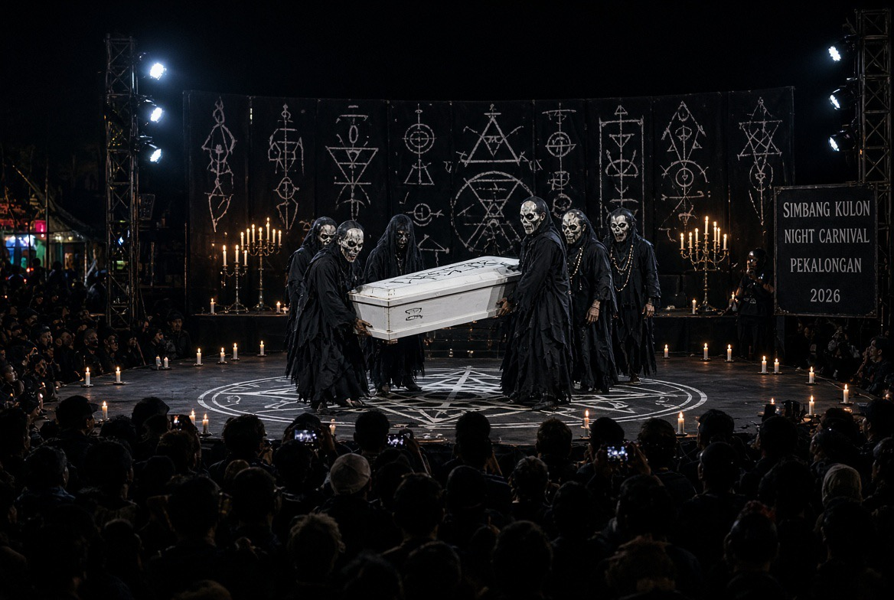

# Maulid, Simbol Satanik, Kambing, Anak, & Psikologi “Niru YouTube”

*Ilustrasi (pic: Grok AI).*

  
***Siapa sebenarnya yang paling “Gagal” di kasus ini? Bukan sekadar satu orang yang memakai kostum***
  

Dalam kasus Simbang Kulon Night Carnival 2026, laporan media menyebut ada aksi teatrikal dengan kostum menyeramkan, peti mati, kepala kambing, dan penyembelihan kambing. 

Salah satu peserta, M. Akhid, mengatakan kambing disembelih sesuai syariat oleh orang yang dianggap mampu melakukan penyembelihan. Ia juga mengatakan kepala kambing yang ditampilkan dalam peti diperoleh dari pasar. 

Plt Bupati Pekalongan menyatakan kambing yang disembelih dimaksudkan untuk dimakan bersama setelah acara. 

Jadi secara epistemik, Faktanya memang ada penyembelihan dan penggunaan bagian tubuh kambing dalam pertunjukan yang diklaim peserta sesuai syariat dan bukan persembahan satanik. Namun Interpretasi publik menyebut pertunjukan tampak seperti ritual satanik.

## Perbedaan Besar antara “Keyakinan” dan Pertunjukan”

Pancasila menempatkan Ketuhanan Yang Maha Esa sebagai sila pertama, dan Pembukaan UUD 1945 serta Pasal 29 ayat (1) menegaskan negara berdasar atas Ketuhanan Yang Maha Esa.

Kajian resmi yang terbit di Pancasila: Jurnal Keindonesiaan membahas bahwa kebebasan beragama di Indonesia memang harus dibaca dalam kerangka Pancasila sebagai sumber dari segala sumber hukum. 

Bahkan Mahkamah Konstitusi sendiri menekankan bahwa UUD 1945 mempunyai dimensi religius, termasuk melalui Pasal 28E, 28J dan 29. 

Pasal 28E UUD 1945 memberikan perlindungan terhadap kebebasan tertentu, tetapi perlindungan itu berjalan bersama Pasal 28J, Pasal 29, nilai Pancasila, dan seluruh hukum positif yang berlaku.

Pasal 28E bukan kartu bebas,. Pasal ini memang menjamin kebebasan beragama, berkeyakinan, berserikat, berkumpul dan mengeluarkan pendapat. Tetapi hak itu tidak berdiri sendirian.

Pasal 28J ayat (2) secara eksplisit memungkinkan pembatasan pelaksanaan hak dan kebebasan melalui undang-undang demi, antara lain, penghormatan hak orang lain, moral, nilai agama, keamanan, dan ketertiban umum.

Jadi model hukumnya bukan: “Gue punya kebebasan berekspresi makanya gue boleh melakukan apa saja.” Melainkan: “Gue mempunyai hak tetapi pelaksanaannya tunduk pada pembatasan yang ditentukan hukum.”

Misalnya seseorang memiliki keyakinan tertentu, itu masuk wilayah kebebasan beragama/berkeyakinan yang mempunyai perlindungan konstitusional. Tetapi seseorang kemudian melakukan tindakan publik tertentu. Tindakan itu dapat dikenai hukum kalau memenuhi unsur pelanggaran.

Jadi, belief bukan berarti conduct, dan conduct tidak automatically protected merely because it is presented as belief or art.

Ini prinsip penting dalam hukum HAM modern.

## Anak-Anak di Pertunjukan

Ketika orang dewasa melihat sebuah pertunjukan, dia mungkin mempunyai kemampuan untuk mengatakan: “Ini simbolisme teatrikal.” Tetapi anak belum tentu mempunyai kemampuan representasional dan regulasi emosi yang sama.

Anak bisa melihat peti mati, kepala, darah, hewan hidup, lalu hewan dibunuh, dan otaknya terlebih dahulu memprosesnya sebagai peristiwa yang mengancam atau sangat aversif, sebelum mampu memahami “ini seni.”

Penelitian perkembangan memang menunjukkan hubungan antara paparan kekerasan dan distress psikologis anak. 

Studi pada anak yang menyaksikan kekerasan menemukan hubungan dengan kecemasan, depresi, intrusive thinking, dan distress; efeknya juga dipengaruhi usia, konteks, dukungan sosial, serta karakteristik anak. 

Bahkan penelitian prospektif mengenai anak yang menyaksikan satu kejadian kematian menemukan gejala trauma dan kecemasan dapat muncul setelah paparan tersebut, walaupun sebagian gejala menurun seiring waktu. 

Meskipun tidak setiap anak yang melihat kambing disembelih pasti trauma. Namun ada alasan ilmiah untuk memperlakukan paparan anak terhadap kekerasan atau kematian nyata sebagai sesuatu yang membutuhkan pertimbangan perkembangan, bukan sekadar berkata “anak-anak kan cuma nonton.”

## Kekerasannya Bukan Sepenuhnya Fiktif

Ini titik paling penting. Bayangkan dua pertunjukan:

A. Pertunjukan monster

Ada darah palsu, kepala palsu, kambing palsu, semua properti.

B. Pertunjukan ini

Ada kostum teatrikal, tetapi terdapat hewan hidup yang benar-benar disembelih. Secara psikologis dan etis, keduanya tidak identik, karena pada B terdapat peristiwa biologis nyata.

Jadi kalimat: “Kan itu cuma pertunjukan.” menjadi tidak sepenuhnya memadai. Mungkin pertunjukannya teatrikal, tetapi kematiannya nyata. Itu perbedaan yang sangat besar.

## Sekarang Kita Pindah ke Hewannya

Peraturan Menteri Pertanian No. 32 Tahun 2025 mendefinisikan kesejahteraan hewan sebagai perlindungan terhadap keadaan fisik dan mental hewan serta perlindungan dari perlakuan manusia yang tidak layak. 

Dalam Islam sendiri, ihsan dalam penyembelihan bukan sekadar “lehernya dipotong dengan cara yang sah.” Nabi ﷺ mengajarkan agar penyembelihan dilakukan dengan baik dan hewan tidak dibuat menderita. Jadi legalitas ritual dan kualitas perlakuan terhadap makhluk hidup adalah dua lapisan yang berbeda.

Nah, ini menghasilkan satu pembedaan yang sangat penting. halal bukan hanya semua konteks penyelenggaraannya otomatis baik.

Kalau memang penyembelihannya memenuhi ketentuan syariat, itu menjawab pertanyaan tentang keabsahan penyembelihan. Tetapi belum menjawab apakah hewan mengalami stres yang dapat diminimalkan, bagaimana hewan dibawa dan ditahan, apakah lingkungan penyembelihan menimbulkan stimulasi berlebihan, apakah penyembelihan dilakukan dalam kondisi yang memenuhi prinsip kesejahteraan, dan mengapa proses kematian hewan harus ditempatkan sebagai bagian dari tontonan publik.

Itulah sebabnya argumen syariat penyembelihan syar’i jangan hanya sebagai kartu bebas moral universal, tetapi juga harus mengandung konsep ihsan.

## Fenomena Psikologis Desensitisasi

Ini bagian yang sering luput.

Satu kali melihat kekerasan tidak otomatis membuat anak menjadi kasar. Tetapi penelitian tentang paparan kekerasan menunjukkan bahwa paparan berulang dapat berhubungan dengan perubahan respons emosional dan perilaku tertentu, walaupun hubungan kausalnya kompleks dan sangat dipengaruhi konteks. 

WHO sendiri mencatat bahwa paparan kekerasan pada masa kanak-kanak dapat berhubungan dengan konsekuensi pada perkembangan dan kesehatan mental. 

Maka persoalan pendidikan anak bukan:
“Sekali lihat kambing disembelih, anak pasti jadi psikopat.” Bukan begitu.

Persoalannya adalah orang dewasa seharusnya tidak sembarangan menjadikan kekerasan nyata sebagai tontonan anak tanpa memikirkan kapasitas perkembangan mereka. Sudah selayaknya ada prinsip kehati-hatian di sana.

## Bagian Paling Ironis: Konteksnya Maulid

Ttradisi Maulid di berbagai tempat mempunyai ekspresi budaya yang sangat beragam.

Tetapi kalau sebuah acara membawa nama peringatan Nabi Muhammad ﷺ, maka secara normatif wajar jika masyarakat bertanya: Apakah bentuk ekspresi itu selaras dengan nilai yang hendak kita rayakan?

Dan di sinilah konsep rahmah menjadi relevan.
Al-Qur’an menyebut Nabi Muhammad ﷺ sebagai:
رَحْمَةً لِّلْعَالَمِينَ
“rahmat bagi seluruh alam.”
(QS. Al-Anbiya’ 21:107)

Secara  ethical dissonance, ketika memperingati figur yang identik dengan rahmah, tetapi bagian pertunjukannya menjadikan kematian hewan sebagai elemen spektakel jelas jauh dari kata etis.

Karena kita tidak perlu membuktikan isi hati mereka untuk mempertanyakan praktik yang terlihat.

## Anak Bukan Aksesori Festival

Kalau sebuah kegiatan publik mempunyai kemungkinan menghadirkan tontonan yang mengandung:  darah, kematian, kepala hewan, simbol kematian, atau adegan kekerasan nyata, maka penyelenggara idealnya tidak hanya bertanya: “Apakah orang dewasa menikmati pertunjukannya?” Tetapi juga: “Apa yang terjadi pada anak-anak yang kebetulan berada di sana?”

WHO menekankan bahwa lingkungan aman dan perlindungan dari kekerasan merupakan bagian penting dari kesehatan dan perkembangan anak. 

Dan ini bukan berarti setiap anak yang melihat adegan itu otomatis menjadi korban child abuse secara hukum. Tetapi dari perspektif child safeguarding, pertanyaan tersebut sepenuhnya legitimate.

## Kesalahan Berpikir

Ini penting banget. Jangan hanya fokus pada pertanyaan  “Apakah tindakan ini kriminal?” Namun  juga bertanya secara  lebih luas “Apakah tindakan ini pantas?”

Dua pertanyaan tersebut berbeda:

| Pertanyaan | Fokus |
|------|-------|
| Legal? | Apakah memenuhi unsur pelanggaran hukum? |
| Ethical? | Apakah secara moral dapat dipertanggungjawabkan? |
| Psychological? | Apa dampaknya terhadap manusia, terutama anak? |
| Animal welfare? | Apakah penderitaan hewan diminimalkan?|
| Religious coherence? | Apakah selaras dengan nilai agama yang diklaim?|
| Public responsibility? | Apakah layak dipertontonkan dalam ruang publik? |

Dan satu tindakan bisa saja tidak terbukti kriminal tetapi tetap sangat layak dikritik secara etis. Itu bukan kontradiksi.

## Soal “Kami cuma Mengikuti YouTube”

Nah, ini bagian yang patut dikritisi keras.

Peserta dilaporkan mengatakan mereka mendapatkan referensi dari YouTube dan tidak memahami konteks simbol yang mereka tampilkan. 

Secara psikologi sosial, ini bisa dibaca melalui konsep social learning dan normative conformity, yaitu: “Gue lihat orang lain melakukan X, karena X tampak normal makanya gue tiru X kan entar tanggung jawab moral terasa tersebar.” Tetapi sumber inspirasi bukan penghapus tanggung jawab.

Kalau ada orang  meniru video orang membakar rumah lalu berkata: “Saya lihat di YouTube.” Ini jelas parah banget karena YouTube bukan pembebasan tanggung jawab.

Referensi menjelaskan dari mana ide berasal. Ia tidak otomatis menjelaskan mengapa seseorang memilih melakukannya. Dan terlebih lagi menyebut “Saya tidak tahu maknanya” tidak otomatis berarti “saya tidak bertanggung jawab atas dampaknya.”

## Apa yang Seharusnya Dilakukan Orang Tua?

Kalau anak sudah terlanjur melihat jangan langsung mengatakan “Jangan takut! Itu cuma bohongan!” Sebab kalau anak melihat darah dan kematian nyata, mengatakan “bohongan” justru bisa membingungkan.

Lebih baik:

Tenangkan anak.

Tanyakan apa yang dia lihat dan rasakan.

Jelaskan secara sederhana sesuai usia.

Tegaskan bahwa dia aman.

Jangan memaksa anak menceritakan detail kalau dia tidak mau.

Amati apakah setelah kejadian muncul mimpi buruk, ketakutan menetap, intrusive memories, perubahan perilaku, atau gangguan tidur.

Jika gejala menetap atau berat, konsultasikan dengan profesional kesehatan mental anak.

Karena anak yang mengalami sesuatu yang menakutkan membutuhkan co-regulation, bukan kuliah filsafat berbelit-belit dari orangtuanya. 

Siapa sebenarnya yang paling “Gagal” di kasus ini? Bukan sekadar satu orang yang memakai kostum. 

Kasus seperti ini memperlihatkan kegagalan sistemik kecil: ketika individu tidak melakukan verifikasi, tim pertunjukan tidak menyaring konten, panitia pengawasannya tidak memadai, sementara publik menjadi penonton tanpa mempertanyakan, sedangkan platform menyediakan sumber inspirasi tanpa konteks memadai, ujung-ujungnya institusi baru bereaksi setelah viral.

  
**Referensi**

World Health Organization. (2026). Violence against children. WHO. 

World Health Organization. (2025). Preventing violence against children: A social determinants framework for INSPIRE implementation. WHO. 

Peraturan Menteri Pertanian Republik Indonesia Nomor 32 Tahun 2025 tentang Penyelenggaraan Kesejahteraan Hewan. 

Muslim ibn al-Hajjaj. Sahih Muslim, 1955a, Kitab al-Sayd wa al-Dhaba’ih. 

Fitzpatrick, C., Barnett, T. A., & Pagani, L. S. (2012). Early exposure to media violence and later child adjustment. Journal of Developmental & Behavioral Pediatrics. 

Song, S. H., et al. (2012). A 30-month prospective follow-up study of psychological symptoms in children witnessing a single incident of death. Journal of Clinical Psychiatry, 73(5), e594-e600. 

Bowlby, J. (1982). Attachment and Loss: Vol. 1. Attachment. Basic Books.

Bandura, A. (1977). Social Learning Theory. Prentice Hall.

Milgram, S. (1974). Obedience to Authority. Harper & Row.

Republik Indonesia. (1945). Undang-Undang Dasar Negara Republik Indonesia Tahun 1945.

Republik Indonesia. (2009). UU No. 18 Tahun 2009 tentang Peternakan dan Kesehatan Hewan, sebagaimana telah diubah. 
