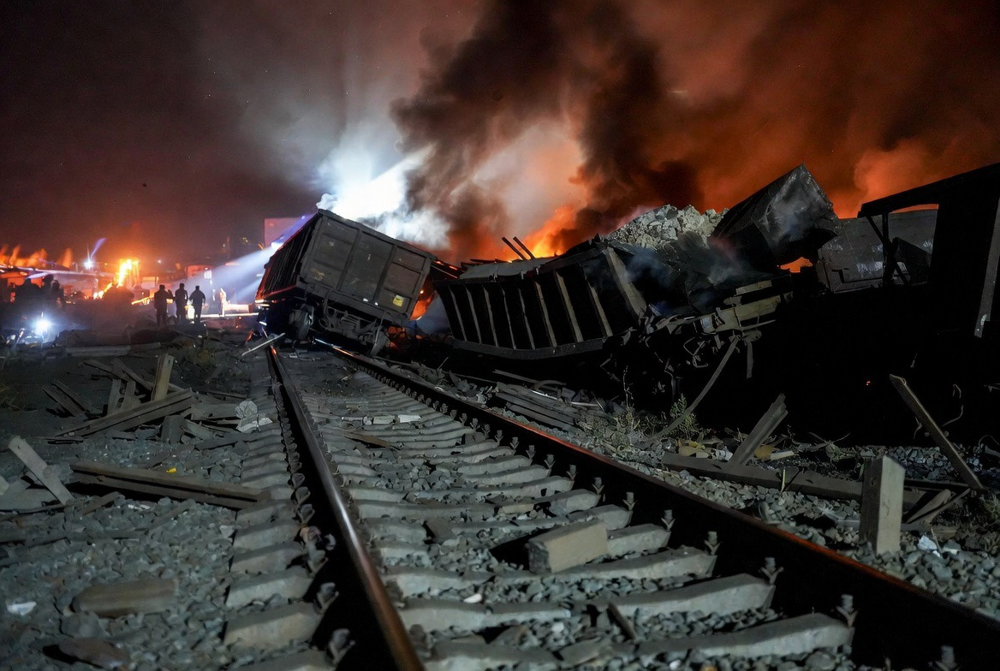

# Membebaskan Rakyat Iran atau Mengubah Rezim? Membaca Narasi Perang dengan Kacamata Ilmu Politik

*Ilustrasi (pic: Grok AI).*

  
***Monopoli negara atas pembentukan narasi perang telah melemah karena meningkatnya akses masyarakat terhadap informasi, sumber alternatif, dan teknik verifikasi terbuka***
  

Sejak Perang Dingin, salah satu narasi yang paling sering digunakan negara besar adalah bahwa intervensi dilakukan untuk melindungi warga sipil, membela demokrasi, menghentikan diktator, atau menyelamatkan rakyat dari rezim yang represif.

Narasi tersebut dikenal dalam literatur sebagai humanitarian justification atau democratic intervention.

Masalahnya, di lapangan sering muncul paradoks.

Jika tujuan utamanya melindungi rakyat, mengapa infrastruktur yang menopang kehidupan sipil ikut rusak?

Hari ini, Iran menuduh AS menyerang infrastruktur sipil seperti jaringan rel kereta dan fasilitas kelistrikan. Washington membantah menargetkan warga sipil dan menyatakan sasaran mereka berkaitan dengan mobilitas logistik serta kemampuan militer Iran. 

Kedua narasi ini saling bertentangan, dan verifikasi independen sering kali memerlukan waktu.  

## Infrastruktur Sipil: Mengapa Sering Menjadi Sasaran?

Di sinilah ilmu strategi militer menjadi tidak nyaman.

Rel kereta, jembatan, pembangkit listrik, pelabuhan, secara hukum internasional bisa menjadi sasaran yang sah apabila digunakan secara signifikan untuk kepentingan militer. Prinsip ini dikenal sebagai dual-use infrastructure.

Masalahnya adalah pembuktiannya. Kalau sebuah rel benar-benar digunakan mengangkut rudal, argumen militernya berbeda.

Tetapi kalau kerusakan terhadap fasilitas itu jauh lebih besar dampaknya terhadap warga sipil daripada keuntungan militernya, maka muncul pertanyaan mengenai proporsionalitas dan kepatuhan terhadap hukum humaniter internasional. 

Itulah sebabnya tuduhan pelanggaran hukum perang hampir selalu muncul dalam konflik modern.  

## Mengganti Rezim?

Ini hipotesis yang sangat sering dibahas akademisi.

Dalam studi hubungan internasional ada istilah regime change. Artinya bukan sekadar mengalahkan tentara lawan, melainkan menciptakan kondisi sehingga pemerintahan yang ada jatuh dan digantikan pemerintahan baru yang dianggap lebih sesuai dengan kepentingan negara pengintervensi.

Contoh yang paling sering menjadi bahan kajian adalah Irak (2003), dan Libya (2011).

Kedua kasus tersebut memang sering diperdebatkan karena tujuan awal yang diumumkan kepada publik berkembang menjadi perubahan pemerintahan. Namun, apakah pola yang sama sedang terjadi di Iran adalah analisis, bukan fakta yang sudah terbukti. 

Dokumen resmi pemerintah AS pada konflik ini lebih menekankan perlindungan pelayaran dan pelemahan kemampuan militer Iran, sementara banyak pengamat mendiskusikan kemungkinan tujuan strategis yang lebih luas.  

## Mengapa Propaganda Sekarang Tidak Semudah Dulu?

Tahun 1991 internet hampir tidak ada,. Kemudian tahun 2003 media sosial belum dominan. Pemerintah relatif lebih mudah membentuk narasi tunggal.

Sekarang?

Satu ledakan direkam dari puluhan sudut. Citra satelit tersedia, urnalis warga mengunggah video dalam hitungan menit.m, lembaga independen melakukan verifikasi geolokasi.

Akibatnya, publik jauh lebih mudah membandingkan klaim dari berbagai pihak. Itu tidak berarti publik selalu benar, tetapi ruang untuk mengendalikan satu narasi menjadi jauh lebih sempit dibanding dua dekade lalu.

Monopoli negara atas pembentukan narasi perang telah melemah karena meningkatnya akses masyarakat terhadap informasi, sumber alternatif, dan teknik verifikasi terbuka. Itulah salah satu perubahan terbesar dalam politik internasional abad ke-21. 

Dulu, perang terutama diperebutkan di medan tempur. Kini, perang juga diperebutkan di ruang informasi, tempat pemerintah, media, analis independen, organisasi internasional, dan warga biasa sama-sama berusaha memengaruhi cara dunia memahami sebuah konflik.

Jadi, sikap kritis memang penting. Namun, sikap kritis yang paling kuat bukan dimulai dari menerima satu narasi atau menolak narasi lain, melainkan dari terus bertanya: bukti apa yang mendukung klaim ini, siapa yang menyampaikannya, dan apa kepentingan yang mungkin berada di baliknya? Itulah fondasi analisis geopolitik yang kokoh. 

  
**Referensi**

Bellamy, A. J. (2015). The responsibility to protect: A defense. Oxford University Press.

International Committee of the Red Cross. (n.d.). Conduct of hostilities. https://casebook.icrc.org/law/conduct-hostilities

Just Security. (2026). Fighting an illegal war and fighting a war illegally: Regime change and IHL. https://www.justsecurity.org

Oxford Public International Law. (n.d.). Regime change. https://opil.ouplaw.com

Yale Law Journal. (2025). The dangerous rise of dual-use objects in war. https://yalelawjournal.org

Brill. (2024). Humanitarian intervention in the post-Cold War era. https://brill.com

Reuters. (2026, July 9). Iran says it hits U.S. military targets as conflict escalates. https://www.reuters.com

Reuters. (2026, July 8). U.S. completes new round of strikes against Iran. https://www.reuters.com
