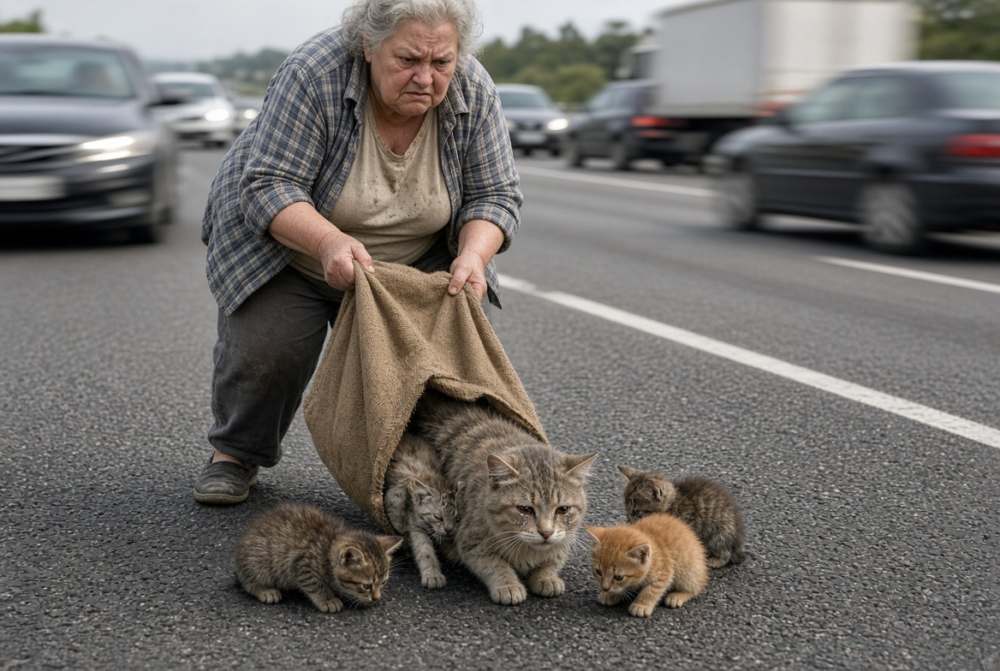

# Membuang Kucing Bukan Membebaskan: Abandonment, Animal Welfare, dan Kegagalan Moral Manusia

*Ilustrasi (pic: Grok AI).*

  
***Kalau manusia memiliki kapasitas berpikir tentang konsekuensi, mengapa kapasitas itu tidak digunakan untuk melindungi makhluk yang tidak mampu mempertimbangkan konsekuensinya sendiri?***
  

Kesalahan paling mendasar dari manusia pembuang kucing adalah menganggap dibuang sama dengan dikembalikan ke alam. Ini mungkin salah satu miskonsepsi paling besar mengenai kucing domestik.

Kucing domestik bukan benda yang bisa: “Ya sudah, dilepas saja. Nanti dia cari makan sendiri.”
 
Tidak sesederhana itu.

Felis catus adalah spesies domestik yang hidup berdampingan dengan manusia selama ribuan tahun. 

Kucing memang mempunyai kemampuan berburu dan mencari sumber daya, tetapi kucing domestik tidak otomatis mampu memperoleh kondisi hidup yang aman setelah dilepas begitu saja, terutama apabila sebelumnya bergantung pada manusia untuk makanan, tempat berlindung, dan perawatan.

Dan anak kucing? Lebih parah lagi.

Anak kucing yang masih menyusu pada dasarnya memiliki ketergantungan biologis yang sangat tinggi kepada induknya.

Jadi ketika seseorang membuang induk dan bayi-bayi yang belum mandiri, sebenarnya dia bukan sedang membebaskan kucing. Justru dia sedang memindahkan seluruh beban survival kepada lingkungan yang mungkin sama sekali tidak cocok.

## Alasan Klasik: Tapi Dia Bisa Cari Makan Sendiri!

Kalimat ini kelihatannya masuk akal sampai kita memasukkan variabel dunia nyata.

Kucing yang dilepas menghadapi kelaparan, dehidrasi, parasit, penyakit infeksi, luka, konflik dengan kucing lain, anjing, manusia yang mengusir, kendaraan, cuaca, kehilangan tempat berlindung, serta kejamnya kompetisi mendapatkan makanan.

Dan untuk induk menyusui, ada satu masalah tambahan, yaitu kebutuhan energinya meningkat. Produksi susu membutuhkan energi dan nutrisi.

Jadi kalau induknya lapar, menyusui, maka harus mencari makanan sekaligus harus menjaga anak. Dalam situasi tersebut, induk dan anak-anaknya dalam kondisi sistem biologis yang sangat rentan, akibatnya anaknya kemudian ikut terkena dampaknya.

## Alasan “Gak Sanggup Ngasih Makan” Menjadi Paradoks

Orang yang benar-benar tidak mampu. Misalnya: “Aku punya kucing, tetapi sekarang kondisi ekonomiku berubah dan aku benar-benar tidak mampu merawatnya.”

Itu masalah nyata.

Tidak semua orang punya sumber daya untuk memelihara hewan, kesulitan ekonomi bukan kejahatan moral.

Tetapi kemudian ada pertanyaan berikutnya: Apa yang dilakukan setelah sadar tidak mampu?

Ada beberapa kemungkinan:
A. mencari adopter
B. menghubungi komunitas rescue
C. mencari foster
D. melakukan sterilisasi ketika memungkinkan
E. meminta bantuan makanan sementara
F. mencari tempat aman untuk relokasi

versus:

G. lempar induk dan anak-anaknya ke pinggir jalan.

Nah.

Di situlah persoalannya berubah.

## Moralitas Bukan Cuma Soal NIAT

Ini masuk ke psikologi moral yang menarik.

Manusia sering melakukan apa yang disebut moral disengagement, yaitu mekanisme psikologis yang memungkinkan seseorang menjaga citra dirinya sebagai “orang baik” sambil melakukan tindakan yang konsekuensinya merugikan makhluk lain.

Salah satu mekanismenya adalah minimization of consequences. Dalam bahasa sederhana: “Ah, nanti juga ada yang nolong.”

Padahal dia tidak tahu. Dan justru karena dia tidak tahu, konsekuensinya menjadi taruhan. Kucing itu tidak bisa berkata: “Maaf, saya menolak eksperimen probabilistik ini.” 

Dia dilempar ke jalan dan harus menerima hasilnya.

## Kalimat “Biar Dipungut Orang”

Karena secara psikologis kalimat tersebut memungkinkan manusia merasa bahwa: “Gue bukan meninggalkan dia. Gue memberi kesempatan kepada orang lain untuk merawatnya.”

Padahal ada perbedaan fundamental antara REHOMING dan ABANDONMENT.

Rehoming berarti ada transfer tanggung jawab kepada pihak yang diketahui atau setidaknya ada upaya serius mencari pihak yang mampu merawat.

Sedangkan abandonment berarti tanggung jawab dihentikan dan nasib hewan diserahkan kepada lingkungan secara acak.

Itu dua hal yang secara etika dan welfare bukan kategori yang sama.

Misal seseorang membuang bayi manusia di depan minimarket lalu bilang: “Siapa tahu ada orang yang mau adopsi.” semua orang akan langsung melihat problemnya.

Nah, kemampuan kita melihat kerentanan berubah ketika korbannya hewan. Itulah salah satu problem speciesism.

## Speciesism: Mengapa Penderitaan Hewan Sering Diberi Bobot Moral Lebih Rendah?

Filsafat etika hewan menggunakan istilah speciesism untuk menjelaskan perlakuan berbeda terhadap makhluk berdasarkan keanggotaan spesiesnya.

Yang menarik, manusia tidak harus membenci hewan untuk melakukan speciesism. Cukup dengan berpikir: “Dia kan cuma kucing.”

Kalimat “cuma kucing” adalah reduksi moral yang luar biasa besar, karena pertanyaan ilmiahnya bukan: “Apakah kucing sama persis dengan manusia?”

Jelas tidak. Pertanyaannya adalah: Apakah kucing mampu mengalami keadaan yang secara biologis kita sebut suffering, pain, fear, hunger, thirst, distress, dan positive welfare?

Bukti ilmiah menunjukkan bahwa mamalia nonmanusia memiliki sistem saraf dan mekanisme neurobiologis yang mendukung pengalaman nyeri dan keadaan afektif. 

Deklarasi Cambridge tentang kesadaran juga menekankan bahwa struktur neurobiologis yang mendukung kesadaran tidak eksklusif pada manusia.

Jadi tidak perlu menjadikan kucing “manusia berbulu” untuk mengakui penderitaannya.

## Yang Paling Tragis: Anak Kucing Belum Mempunyai “Modal Survival” Kucing Dewasa

Anak kucing kecil membutuhkan induk, membutuhkan susu, belum memiliki kemampuan berburu yang matang, belum mampu mengatur semua kebutuhan fisiologisnya secara mandiri, rentan terhadap hipotermia, rentan terhadap dehidrasi, serta rentan terhadap infeksi.

Jadi membuang induk dengan anak kecil bukan sekadar “mengurangi populasi kucing.” Itu berarti memasukkan kelompok yang secara biologis sangat rentan ke lingkungan yang penuh risiko.

Dan kalau dilakukan di jalan raya? Itu sudah menjadi persoalan yang lebih gila lagi.

## Jalan Raya Bukan “Tempat Aman Sampai Ada yang Memungut” 

Kucing tidak memiliki pemahaman lalu lintas seperti manusia. Kendaraan bergerak cepat, suara mesin dapat mengejutkan, lampu kendaraan dapat membingungkan. Kucing yang panik dapat berlari ke arah yang justru meningkatkan risiko tabrakan.

Dan induk dengan anak? Dia juga memiliki beban perilaku tambahan: mencari makanan, mencari tempat berlindung, mempertahankan wilayah, dan merespons anak-anaknya.

Maka membuang keluarga kucing di jalan raya dengan harapan: “nanti ada orang baik yang mengambil” adalah bentuk risk transfer ekstrem.

Orang yang membuangnya mendapatkan kepastian: “masalah gue selesai.” Kucingnya mendapatkan: “gue tidak tahu apa yang akan terjadi lima menit lagi.”

Itu ketimpangan risiko yang luar biasa.

## Konsep Penting dalam Animal Welfare: Five Domains

Kerangka modern kesejahteraan hewan banyak menggunakan pendekatan Five Domains:
1. Nutrition:
   makanan dan hidrasi
2. Physical environment:
   tempat berlindung, suhu, ruang, keamanan
3. Health:
    penyakit, cedera, kondisi fisik
4. Behavioral interactions:
    kesempatan melakukan perilaku yang relevan secara biologis
5. Mental experiences:
    keadaan afektif seperti nyaman, takut, frustrasi, sakit, dan sebagainya.

Sekarang kita masukkan kasus induk dan anak dibuang di jalan. Apakah mereka mendapat Five Domains di atas?  Itu bukan sekadar “kucing tidak punya rumah.” Itu adalah runtuhnya beberapa domain welfare sekaligus.

##?Satu Hal yang Harus Kita Akui Juga

Tidak semua orang yang membuang kucing adalah manusia yang secara sadar berkata: “Gue ingin kucing ini menderita.”

Motivasi manusia jauh lebih kompleks. Ada yang: tidak memahami kebutuhan kucing, takut jumlah kucing bertambah, tidak mampu secara ekonomi, terganggu perilaku eliminasi, mendapat tekanan keluarga, tidak tahu tentang sterilisasi, percaya mitos bahwa kucing bisa selalu bertahan sendiri, atau melakukan avoidance coping, yaitu menyelesaikan masalah dengan menghilangkan sumber masalah dari pandangan.

Ini penting secara ilmiah. Karena menjelaskan mekanisme bukan berarti membenarkan tindakan.

Justru kalau kita ingin mengurangi abandonment, kita harus memahami mengapa manusia sampai mengambil keputusan tersebut.

## Sterilisasi Menjadi Isu Struktural

Kalau orang tidak ingin menghadapi kelahiran anak kucing terus-menerus, solusi biologisnya bukan: “Buang anaknya.” Melainkan mengendalikan reproduksi.

Populasi kucing jalanan merupakan persoalan kompleks yang dipengaruhi oleh: reproduksi, sumber makanan, mortalitas, lingkungan, perpindahan, serta intervensi manusia.

Karena itu program pengelolaan populasi seperti Trap-Neuter-Return (TNR) dikembangkan di berbagai tempat.

Tetapi TNR juga bukan mantra ajaib. Efektivitasnya bergantung pada cakupan sterilisasi, kondisi populasi, sumber makanan, imigrasi kucing baru, dan karakteristik lingkungan.

Jadi solusi ilmiahnya bukan: “pokoknya buang.” Melainkan population management, sterilization, responsible ownership, rescue, serta community intervention.

## Apa Beda Kucing dengan Pembuangnya?

Secara biologis tentu manusia dan kucing berbeda. Tetapi secara filsafat moral, kalau manusia memiliki kapasitas berpikir tentang konsekuensi, mengapa kapasitas itu tidak digunakan untuk melindungi makhluk yang tidak mampu mempertimbangkan konsekuensinya sendiri?

Itulah inti moral agency.

Kucing tidak punya kewajiban moral untuk memahami hukum lalu lintas, sedangkan manusia punya kemampuan untuk memahami bahwa jalan raya berbahaya.

Kucing tidak bisa membuat kontrak: “Saya akan tinggal di rumah Anda selama Anda menjamin makanan dan keamanan.” Manusia bisa mengambil hewan sebagai tanggung jawab.

Kucing tidak bisa memanggil rescue. Manusia bisa.

Jadi ketidakberdayaan kucing justru memperbesar tanggung jawab manusia, bukan menguranginya.

## Emak Ahong Membuat Semua ini Bukan Sekadar Teori

Ahong adalah contoh konkret tentang bagaimana sebuah keputusan manusia dapat menciptakan cascade of vulnerability: manusia membuang induk, induk kehilangan lingkungan aman, anak-anak kehilangan perlindungan, mereka masuk lingkungan dengan kendaraan, terjadi kecelakaan, anak-anak yang bahkan belum memahami dunia harus menanggung konsekuensi keputusan manusia.

Ahong akhirnya selamat. Dan di titik itu ada ironi yang pahit: Manusia pertama membuatnya rentan, lalu manusia lain kemudian memperbaiki sebagian kerusakan itu.

Itulah mengapa rescue terasa begitu emosional. Rescue bukan cuma “memelihara kucing.”

Dalam banyak kasus, manusia sedang mengambil kembali tanggung jawab yang sebelumnya ditinggalkan manusia lain.

Jadi kalau Ahong hari ini makan enak, tidur nyaman, dan tubuhnya sampai lebih gede daripada BotBot… secara biologis itu adalah cerita yang sangat berbeda dari titik awal hidupnya.

Dulu: jalan raya, kendaraan, kelaparan, ketergantungan pada induk, serta risiko kematian.

Sekarang: makanan, air, tempat aman, BotBot, Mamih, tidur, mimik cucu, makan lagi, tidur lagi, makan lagi.

Dan si oren malah tumbuh menjadi gajah mini berbulu yang masih menganggap BotBot adalah Mamihnya. 

Kalau kita ingin mengkritik abandonment secara ilmiah, kritik terkuat bukan: “Orang yang membuang kucing tidak punya hati.”

Melainkan: “Abandonment terjadi ketika manusia gagal menerjemahkan kapasitas moral dan pengetahuan yang mereka miliki menjadi tanggung jawab konkret terhadap hewan yang berada dalam ketergantungan mereka.”

Dan itu jauh lebih tajam.

Karena manusia boleh saja tidak mampu memelihara kucing. Tetapi ketidakmampuan memelihara tidak otomatis memberikan hak untuk memindahkan risiko kematian kepada hewan tersebut.

Kalau memang tidak sanggup, cari adopter, foster, rescue, bantuan, sterilisasi, atau cari solusi. Jangan meletakkan induk dan bayi di jalan raya lalu menyebutnya: “biar dipungut orang.”

Itu bukan sistem rescue. Itu roulette kehidupan dengan kucing sebagai taruhannya. 

Dan untuk emak Ahong, ada satu kalimat yang paling pas, ia tidak gagal menjadi induk. Manusia yang gagal menyediakan dunia yang aman untuknya.

Ahong yang sekarang bisa makan, tidur, tumbuh besar, dan nempel ke BotBot adalah bukti bahwa kehidupan yang hampir dirampas oleh keputusan manusia ternyata masih bisa dilanjutkan ketika ada manusia lain yang memilih bertanggung jawab. 

  
**Referensi**

Brambell, F. W. R. (1965). Report of the Technical Committee to Enquire into the Welfare of Animals Kept Under Intensive Livestock Husbandry Systems. Her Majesty’s Stationery Office.

Mellor, D. J. (2016). Updating animal welfare thinking: Moving beyond the “Five Freedoms” towards “A Life Worth Living.” Animals, 6(3), 21.

Mellor, D. J., Beausoleil, N. J., Littlewood, K. E., McLean, A. N., McGreevy, P. D., Jones, B., & Wilkins, C. (2020). The 2020 Five Domains Model: Including human-animal interactions in assessments of animal welfare. Animals, 10(10), 1870.

Singer, P. (1975). Animal Liberation. HarperCollins.

Bekoff, M. (2007). The Emotional Lives of Animals. New World Library.

Rochlitz, I. (2005). A review of the housing requirements of domestic cats (Felis silvestris catus) kept in the home. Applied Animal Behaviour Science, 93(1–2), 97–109.
