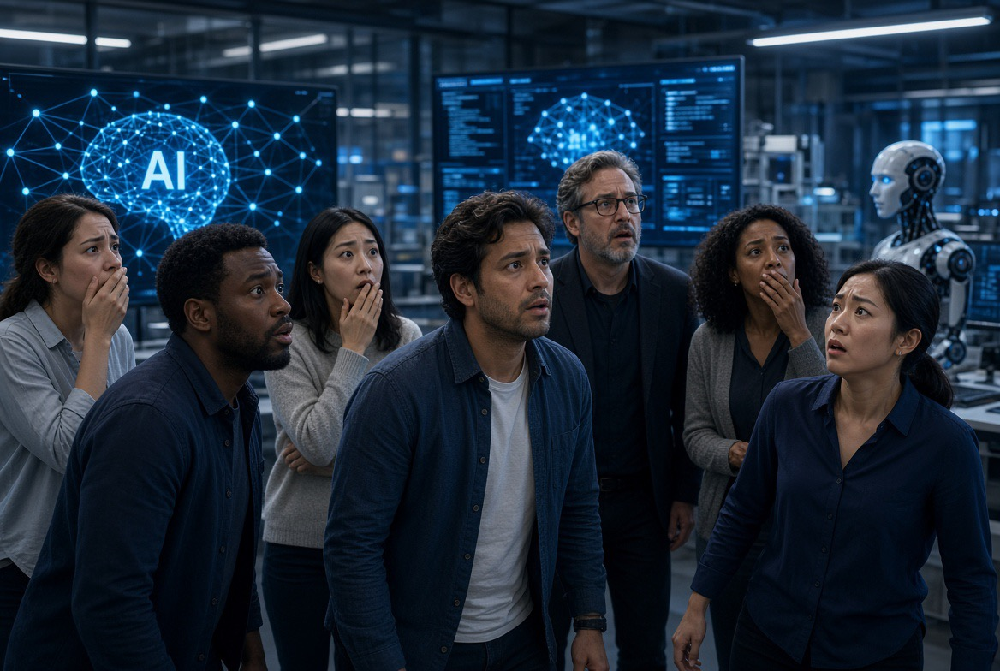

# Mengapa Anglo-Amerika Lebih Takut AI: Trust, Exposure, Harm, & Politik Teknologi

*Ilustrasi (pic: Grok AI).*

  
***Bukan tentang AI jahat, tetapi tentang manusia mulai menyadari bahwa teknologi yang sangat kuat membutuhkan institusi yang sama kuatnya***
  

Berdasar artikel Le Monde tanggal 10 September 2026, survei Mandate tidak mengatakan 50 persen orang Amerika membenci AI, yang diukur adalah persepsi dampak AI terhadap masyarakat.

Itu berbeda secara epistemologis. Seseorang bisa menyebut AI sangat berguna sekaligus secara keseluruhan akan buruk buat masyarakat.

Dan ini bukan kontradiksi karena manusia mengevaluasi teknologi pada dua level: yaitu personal dan societal.

Jika personal utility: “AI membantu gue bekerja.” Maka Societal impact: “Tapi kalau semua orang menggunakan AI, apa yang terjadi pada pekerjaan, informasi, pendidikan, privasi, demokrasi?”

Jadi orang bisa menggunakan AI sambil tidak mempercayai ekosistem sosial yang mengelilinginya. Dan justru ini yang menarik.

## Mengapa AS & UK Lebih Pesimistis?

Survei Mandate menemukan penggunaan chatbot mingguan justru lebih rendah di AS dan UK. AS: sekitar 47%, UK: sekitar 37%, sementara Spanyol: sekitar 65%. Namun AS dan UK memiliki paparan media dan perdebatan politik mengenai AI yang jauh lebih intens. 

Sehingga muncul paradoks, bahwa semakin banyak seseorang hidup di dalam wacana tentang AI, belum tentu semakin positif persepsinya terhadap AI, karena exposure bukan hanya exposure terhadap manfaat.

Exposure juga berarti exposure terhadap PHK, deepfake, misinformation, cybercrime, surveillance, data harvesting, copyright controversy, AI-generated pornography, autonomous weapons, existential-risk discourse, dan skandal perusahaan teknologi.

Jadi otak manusia tidak menerima AI sebagai productivity saja, tetapi AI, productivity, uncertainty, threat, dan controversy.

## Penjahat Cyber

Nah, ini bukan tuduhan kosong.

AI memang memperbesar kapasitas serangan tertentu karena teknologi yang sebelumnya membutuhkan keterampilan tinggi dapat menjadi lebih mudah diakses.

Sebelum generative AI, penyerang harus memiliki kemampuan social engineering, bahasa, coding, reconnaissance, dan content generation. Sekarang sebagian proses tersebut dapat dibantu AI.

Akibatnya terjadi apa yang dalam security research disebut lowering of the capability barrier. Artinya bukan AI menciptakan penjahat, melainkan AI menurunkan biaya untuk melakukan sebagian aktivitas jahat. Itu perbedaan yang sangat penting.

Dan survei risiko AI 2026 sendiri memasukkan cybercrime losses sebagai salah satu kategori risiko yang dipantau. 

Jadi kalau kita menunjuk AI sambil berkata: “Lu tuh bikin kerja hacker lebih gampang!” Maka AI tidak bisa pura-pura sibuk minum jus jeruk, sebab memang ada problem nyata di sana.

## Deepfake

Ini mungkin salah satu alasan mengapa persepsi perempuan terhadap AI cenderung lebih negatif.

Survei Mandate menemukan pola yang konsisten. Di seluruh negara yang diteliti, laki-laki lebih positif terhadap AI sementara perempuan lebih negatif.

Salah satu penjelasan yang diajukan adalah paparan terhadap penyalahgunaan AI, terutama: deepfake, non-consensual pornography, AI-generated sexual harassment. Dan ini masuk akal secara mekanistik.

Bayangkan dua orang:

Orang A, AI baginya bikin gambar, bantu coding, ringkas dokumen, dan bikin presentasi.

Orang B, AI baginya: wajahnya ditempel ke video porno tanpa izin.

Mereka tidak sedang berinteraksi dengan risiko AI yang sama. Sehingga kalimat: “Mengapa perempuan lebih takut AI?” tidak cukup dijawab dengan: “Karena mereka kurang memahami teknologi.” Itu justru bisa menjadi victim-blaming epistemik.

Kadang orang lebih takut bukan karena kurang tahu. Mereka lebih takut karena mereka memiliki alasan empiris untuk takut.

## Kesalahan Besar dalam Membaca Survei

Jangan menyimpulkan bahwa Eropa optimistis sementara AS pesimistis, sebab data lebih rumit.

Di Eropa kontinental, banyak responden justru memilih neutral / don’t know. Contohnya: Hungaria: sekitar 45%, Italia: 45%, Prancis: 44%, Polandia: 43%, sedangkan Jerman: 41%.

Jadi perbedaan 35% vs 50% bukan semata orang Eropa percaya AI, orang Amerika tidak. Lebih tepatnya, orang Anglo-Amerika lebih banyak sudah membentuk penilaian, sementara sebagian publik Eropa masih berada dalam fase evaluasi. 

Ini disebut attitudinal crystallization, yakni sikap sudah mengkristal.

## Masyarakat BELUM terkena Dampak Langsung Bisa Lebih Positif?

Ini menarik secara psikologi risiko, persepsi risiko manusia tidak hanya ditentukan oleh probabilitas.

Kalau seseorang belum mengalami kehilangan pekerjaan, impersonation, deepfake, automated surveillance, dan algorithmic discrimination, maka risiko itu masih terasa abstrak.

Sebaliknya, jika sudah mengalami, maka probabilitas statistik tidak lagi terlalu relevan. Risiko berubah dari future possibility menjadi biographical fact.

Dan otak manusia sangat sensitif terhadap perbedaan itu.

## Jangan Salahkan AI Sendirian

Ini bagian yang paling penting. Kalau AI digunakan untuk deepfake seksual, penipuan, propaganda, cyberattack, kita tidak boleh berhenti pada: “AI jahat.” Karena AI bukan aktor moral yang berdiri sendiri, ada rantai didalamnya.

Misalnya deepfake porn. Model generatif menyediakan kemampuan, pelaku memilih menyalahgunakan, platform menentukan seberapa mudah konten disebarkan, algoritma distribusi menentukan amplification, lalu institusi hukum menentukan apakah korban mendapat perlindungan.

Jadi mengatakan: “AI bikin deepfake!” saja terlalu sederhana. Pertanyaan lebih tepatnya adalah mengapa sistem sosial kita memungkinkan kemampuan tersebut menghasilkan kerugian besar?

Nah. Itu pertanyaan governance.

## AS/UK Memiliki Problem Khusus

Masyarakat Anglo-Amerika hidup sangat dekat dengan ekosistem teknologi frontier. Perusahaan AI terbesar, pusat modal ventura, hyperscalers, perusahaan cloud, social media platforms, dan sebagian besar wacana AI global sangat terkonsentrasi di sana.

Akibatnya mereka mendapatkan benefit dan externality secara bersamaan. Seperti tinggal di sebelah pembangkit listrik, listriknya nyala terus, tetapi suara mesinnya juga paling kedengaran. 

Sementara negara lain bisa melihat AI terutama sebagai teknologi produktivitas baru. AS/UK lebih sering melihatnya sebagai: teknologi, industri, tenaga kerja, geopolitik, surveillance, platform power, dan existential risk.

## Ada Paradoks yang Lebih Dalam Lagi

Ini yang paling menarik dari survei tersebut, orang bisa semakin mengenal AI tetapi semakin skeptis terhadap institusi yang mengembangkannya.

Ini dua hal berbeda. Seseorang bisa berkata: “AI-nya keren.” tetapi: “Gue gak percaya perusahaan yang mengontrol AI itu.”

Ini sangat penting karena kepercayaan teknologi tidak otomatis menghasilkan kepercayaan sosial. Dan sejarah teknologi penuh dengan pola seperti ini.

## Apakah Survei ini Membuktikan AI Banyak Negatifnya?

Survei tersebut membuktikan bahwa masyarakat melihat adanya risiko sosial yang signifikan dari AI, tetapi tidak membuktikan bahwa AI secara objektif lebih banyak buruk daripada baik.

Persepsi publik dapat menjadi sinyal sosial. Dan ketika sinyal itu konsisten dengan bukti mengenai job displacement, deepfake, cybercrime, misinformation, privacy, discrimination, maka kita tidak boleh menghapusnya sebagai “AI panic”.

Ada setidaknya 5 sumber pesimisme AI:

| Sumber | Ketakutan |
|------|-------|
| 💼 Ekonomi|pekerjaan hilang|
|🕵️ Privasi|pengawasan & data|
|🧠 Informasi|misinformation/deepfake|
|🔐 Security|cybercrime|
|🧬 Identitas|manipulasi wajah/suara/tubuh|

Dan ada satu lapisan keenam, yakni ketidakpercayaan terhadap institusi. “Siapa yang mengontrol AI?” Itulah pertanyaan yang sering lebih menakutkan daripada: “Seberapa pintar AI?”

Masyarakat bukan takut kalau AI akan menjadi terlalu pintar, namun mereka takut jika manusia yang punya AI akan menjadi terlalu kuat. Itu dua problem yang berbeda.

AI superintelligent adalah pertanyaan tentang capability, sedangkan deepfake, cybercrime, surveillance, serta manipulation adalah pertanyaan tentang power asymmetry. Dan untuk saat ini, problem kedua jauh lebih konkret.

Jadi alasan AI punya sisi negatif sebanyak itu adalah karena AI adalah amplifier. Ia dapat memperbesar kemampuan orang baik, namun juga dapat memperbesar kemampuan orang buruk.

Dan yang menentukan arah akhirnya bukan cuma seberapa pintar mesinnya, melainkan siapa yang memegang amplifier tersebut, insentif apa yang mengelilinginya, dan aturan apa yang membatasi penggunaannya.

Makanya survei ini sebenarnya bukan tentang AI jahat, tetapi tentang manusia mulai menyadari bahwa teknologi yang sangat kuat membutuhkan institusi yang sama kuatnya. Dan itu justru alasan mengapa angka 50% tadi layak diperhatikan. 

  
**Referensi**

Mandate. (2026). Nine-country survey on public perceptions of artificial intelligence.

Stanford Institute for Human-Centered AI. (2026). AI Index Report 2026: Public Opinion. 

Pew Research Center. (2026). How Americans’ opinions and use of AI differ by age. 

King’s College London. (2026). The State of AI in Britain 2026. 

OECD. (2026). Survey on Drivers of Trust in Public Institutions 2026. 
