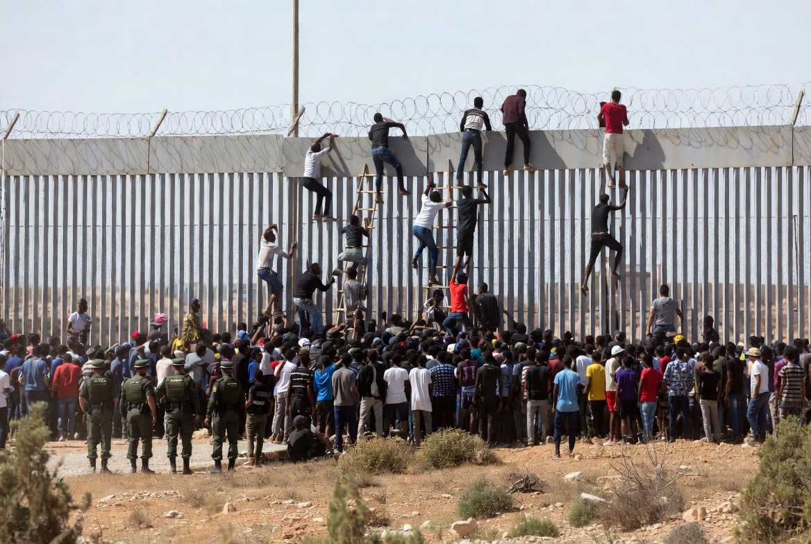

# Mengapa Banyak Negara Muslim Mengalami Krisis, Sementara Sebagian Lain Sangat Makmur?

*Ilustrasi (pic: Grok AI).*

  
***“Tidak ada agama yang secara otomatis membuat sebuah negara kaya atau miskin. Yang menentukan adalah bagaimana sejarah, institusi, dan kebijakan membentuk peluang bagi masyarakatnya.”***
  

Sering kali kita tanpa sadar menganggap “negara Muslim” sebagai satu kelompok yang seragam. Padahal kenyataannya sangat beragam. Ada negara mayoritas Muslim yang sangat kaya, seperti Qatar, United Arab Emirates, ataupun Brunei.

Ada yang berpendapatan menengah seperti Malaysia, Turkey, Morocco. Ada pula yang dilanda perang berkepanjangan seperti Palestine, Yemen, Syria, Sudan

Jadi tidak ada satu pola tunggal.

## Mengapa Banyak Migran Berasal dari Negara Muslim?

Jawabannya berbeda-beda.

**Palestina**

Penyebab utamanya adalah konflik bersenjata, pendudukan, dan krisis kemanusiaan.

**Suriah**

Perang saudara selama bertahun-tahun.

**Afghanistan**

Perang yang berlangsung selama puluhan tahun serta persoalan ekonomi dan pemerintahan.

**Sudan**

Perang saudara dan bencana kemanusiaan.

**Maroko**

Kasusnya berbeda.

Maroko tidak sedang mengalami perang seperti Palestina atau Sudan.

Sebagian besar migran dari Maroko terdorong oleh faktor ekonomi, kesempatan kerja, dan harapan hidup yang lebih baik.

## Mengapa Banyak Krisis Terjadi di Dunia Muslim?

Di sinilah sejarah berbicara.

Beberapa faktor yang sering dibahas para sejarawan dan ilmuwan politik adalah:

**Warisan kolonial**

Banyak negara Muslim pernah berada di bawah kekuasaan imperium Eropa.

Perbatasan modern di sejumlah kawasan dibentuk tanpa selalu mengikuti realitas etnis, suku, atau sejarah lokal.

Akibatnya, setelah merdeka, beberapa negara mewarisi persoalan politik yang rumit.

**Persaingan geopolitik**

Timur Tengah merupakan kawasan yang sangat strategis.

Di sana terdapat jalur pelayaran, cadangan energi, serta posisi geografis penting. Akibatnya, kawasan ini sering menjadi arena persaingan kekuatan regional maupun global.

**Tata kelola**

Sebagian negara menghadapi tantangan seperti: korupsi, lemahnya institusi, ketimpangan ekonomi, dan pengangguran kaum muda.

Faktor-faktor ini dapat mendorong migrasi meskipun negara tersebut tidak sedang berperang.

## Analisis 

Kadang orang berkata: “Mengapa banyak pengungsi berasal dari negara Muslim?”

Pertanyaan akademik yang lebih tepat adalah:“Mengapa begitu banyak konflik geopolitik besar dalam beberapa dekade terakhir terkonsentrasi di kawasan yang kebetulan banyak berpenduduk Muslim?”

Itu dua pertanyaan yang berbeda.

Jika pusat cadangan energi dunia berada di tempat lain, atau jika sejarah kolonial membentuk kawasan berbeda, mungkin pola konfliknya juga akan berbeda.

Dengan kata lain, agama bukan satu-satunya variabel, dan sering kali bukan variabel utama.

## Palestina: Kasus yang Berbeda

Palestina memiliki karakteristik yang berbeda dari Maroko. Banyak warga Palestina mengungsi karena: perang, penghancuran rumah, pembatasan mobilitas, serta hilangnya mata pencaharian.

Di sini motif utamanya adalah keamanan dan kelangsungan hidup, bukan semata mencari penghasilan yang lebih tinggi.

Ketika kita melihat perahu-perahu kecil yang berangkat dari pantai Afrika menuju Eropa, mudah sekali menyimpulkan bahwa semua penyebabnya sama.

Padahal tidak. Ada yang melarikan diri dari bom, ada yang melarikan diri dari kelaparan, ada yang melarikan diri dari pengangguran, dan ada pula yang mengejar mimpi tentang masa depan yang mereka yakini lebih mungkin ditemukan di negeri lain.

Memahami perbedaan motif ini penting agar kita tidak menyederhanakan persoalan yang sesungguhnya sangat kompleks.

Peta migrasi dunia sering kali mengikuti jejak sejarah. Banyak kawasan mayoritas Muslim berada di persimpangan kolonialisme, perebutan sumber daya, dan rivalitas geopolitik selama puluhan bahkan ratusan tahun. 

Namun menjelaskan seluruh persoalan hanya dengan agama akan mengaburkan akar masalah yang sesungguhnya: kualitas institusi, kesempatan ekonomi, sejarah politik, dan konflik yang belum terselesaikan. 

Memahami akar itu lebih berguna daripada mencari satu kambing hitam untuk semua krisis.

  
**Referensi**

World Bank. World Development Indicators.

International Organization for Migration. World Migration Report.

United Nations Development Programme. Human Development Report.

Why Nations Fail. Acemoglu, D., & Robinson, J. A. (2012). Why Nations Fail. Crown.
