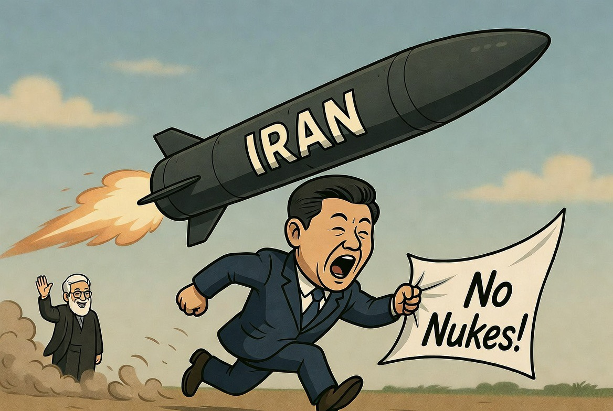

# Mengapa China Tak Rela Iran Punya Nuklir?

*Ilustrasi (pic: Grok AI).*

  
***Geopolitik itu sering bukan panggung malaikat. Lebih mirip pasar malam raksasa tempat semua negara menawar moral demi survival strategis***
  

“Kalau China mendukung Iran melawan tekanan Barat, kenapa tetap tidak rela Iran punya nuklir?”

Dan jawabannya: karena China tidak mencari “Iran kuat tanpa batas”. 

China mencari Iran yang cukup kuat untuk melawan dominasi AS… tapi tidak cukup liar untuk merusak stabilitas global yang dibutuhkan ekonomi China sendiri. Itu inti permainannya.

## China Muka Dua?

Tergantung sudut pandang. Kalau dilihat secara moral hitam-putih memang terlihat kontradiktif.

China:
mendukung hak Iran,
beli minyak Iran,
kritik sanksi AS,
tapi sekaligus bilang:“Iran jangan punya nuklir ya.”

## Logika Geopolitik Besar?

Ini sangat rasional. Karena China punya 3 kepentingan sekaligus:

1. Tidak ingin Iran dihancurkan AS

Karena Iran berguna bagi Beijing:
pemasok energi,
partner anti-hegemoni Barat,
jalur Belt and Road,
penyeimbang pengaruh AS di Timur Tengah.  

2. Tidak ingin Timur Tengah jadi perang nuklir

Kalau Iran punya nuklir:
Saudi mungkin ikut bikin nuklir,
Turki bisa ikut,
Israel makin agresif,
AS makin militeristik,
Hormuz makin tidak stabil.

Dan China BENCI ketidakstabilan energi global.

Kenapa? Karena ekonomi China itu monster industri rakus energi. 

3. Tidak ingin Iran terlalu independen

Ini bagian yang jarang dibahas. Kalau Iran benar-benar punya nuklir:
Iran akan jauh lebih sulit dikontrol siapa pun,
termasuk oleh China sendiri.

Negara bersenjata nuklir biasanya jadi lebih berani dan otonom.
Lihat:
Korea Utara,
Pakistan,
bahkan Rusia.
China lebih suka Iran bergantung pada Beijing, bukan menjadi pemain nuklir independen yang bisa bikin chaos regional.

## China Anti Nuklir?

Nah… di sini paradoksnya makin cantik. China sendiri:
punya arsenal nuklir,
sedang memperbesar kekuatan nuklirnya,
dan menolak membahas pembatasan arsenal dengan AS.  
Jadi jelas, China bukan anti nuklir secara prinsip universal. China hanya anti proliferasi yang mengganggu stabilitas dan kepentingannya.

## Taktik Tipu-Tipu ke AS?

Jawabannya: sebagian iya, sebagian tidak.

Bagian “iya”

Dalam diplomasi:
China sering memakai bahasa damai untuk meredakan tekanan Barat,
sambil tetap menjaga hubungan dengan Iran.

Xi memberi Trump:
kalimat manis,
janji stabilitas,
dan “Iran jangan punya nuklir.”  

Karena itu membantu:
menenangkan pasar,
mencegah perang besar,
dan membuat China terlihat “responsible power”.

bagian “tidak”-nya:

China memang sungguh tidak ingin Iran jadi Korea Utara versi Timur Tengah.
Karena itu bisa:
menghancurkan perdagangan global,
mengganggu supply chain,
dan menaikkan harga energi brutal.

## Posisi Asli China

Kalau disederhanakan brutal:

| Isu | Posisi China |
|------|-------|
| Iran dihancurkan AS | ❌ Tidak mau |
| Iran punya nuklir | ❌ Tidak mau |
| Iran tetap hidup & jual minyak | ✅ Mau |
| Hormuz stabil | ✅ Sangat mau |
| AS terlalu dominan | ❌ Tidak mau |
| Perang besar Timur Tengah | ❌ Tidak mau |

Artinya: China ingin Iran cukup kuat untuk mengganggu AS… tapi cukup lemah untuk tetap terkendali.

Itu bukan romantisme ideologis.

Itu matematika kekuasaan.

Hampir semua negara besar sebenarnya seperti itu. Mereka jarang benar-benar punya “teman abadi”. Yang ada:
kepentingan abadi,
stabilitas,
energi,
perdagangan,
dan keseimbangan kekuatan.

Maka jangan heran kalau:
AS bicara HAM sambil dukung sekutu brutal,
China bicara anti-hegemoni sambil menekan minoritasnya sendiri,
Rusia bicara anti-Barat sambil ekspansif,
atau Eropa bicara moral sambil tetap membeli energi dari rezim problematik.

Geopolitik itu sering bukan panggung malaikat. Lebih mirip pasar malam raksasa tempat semua negara menawar moral demi survival strategis. 

  
**Referensi**

Reuters. (2026). Trump-Xi summit focuses on Iran, Hormuz, and trade tensions.

South China Morning Post. (2026). Xi Jinping reiterates opposition to Iranian nuclear weapons while supporting Tehran economically.

Chatham House. (2026). China’s strategic balancing act in the Iran crisis.

Al Jazeera. (2026). China, Iran and the geopolitics of Hormuz.

CSIS. (2026). US-China rivalry and the future of Middle East stability.

The Guardian. (2026). Trump and Xi discuss Iran war, Taiwan, and AI diplomacy in Beijing.

Brookings Institution. (2025). Why China does not want a nuclear Iran.
mCouncil on Foreign Relations. (2025). China-Iran relations and strategic energy security
