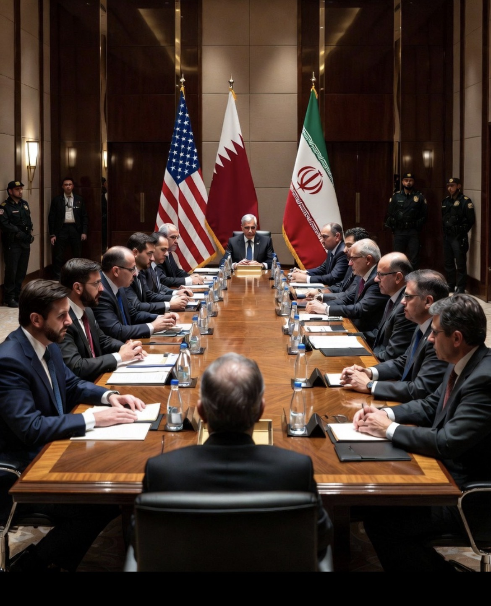

# Mengapa Doha Menjadi Arena Perebutan Masa Depan Timur Tengah?

*Ilustrasi (pic: Grok AI).*

  
***“Bukan karena Doha negara adidaya. Justru karena ia cukup dipercaya oleh hampir semua pihak untuk menjadi ruang bicara ketika ruang lain dipenuhi asap mesiu.”***
  

Pada pertengahan 2026, perhatian dunia kembali tertuju pada Doha, ibu kota Qatar. Kota kecil ini menjadi pusat berbagai upaya meredakan ketegangan antara Amerika Serikat dan Iran setelah serangkaian insiden di Selat Hormuz. 

Namun yang dipertaruhkan bukan sekadar hubungan Washington dan Teheran. Doha menjadi titik temu berbagai kepentingan: keamanan energi dunia, masa depan program nuklir Iran, stabilitas Teluk, hingga keseimbangan kekuatan di Timur Tengah.

## Mengapa Harus Doha?

Secara geografis, Qatar berada di Teluk Persia. Sedangkan secara politik, Qatar memiliki hubungan yang relatif baik dengan Amerika Serikat, Iran, negara-negara Teluk, dan berbagai aktor internasional.

Negara ini juga menjadi tuan rumah pangkalan militer AS yang besar, tetapi pada saat yang sama tetap menjaga saluran komunikasi dengan Iran.

Itulah kombinasi yang sangat langka.

## Doha Bukan Sekadar Tempat Pertemuan

Doha sebenarnya adalah arena negosiasi. Yang diperdebatkan bukan hanya program nuklir Iran dan keamanan Selat Hormuz, tetapi juga sanksi ekonomi, pelepasan aset Iran yang dibekukan, keamanan pelayaran, serta mekanisme agar bentrokan militer tidak kembali meluas.  

## Paradoks Diplomasi Doha

Yang menarik, hingga hari ini bahkan muncul dua narasi berbeda. Washington mengatakan: “Pertemuan akan berlangsung.” Sementara Tehran mengatakan: “Belum ada perundingan langsung yang dijadwalkan.”

Sekilas terdengar kontradiktif. Tetapi dalam diplomasi internasional, ini bukan hal yang aneh.

Kadang pembicaraan teknis melalui mediator tetap berjalan, sementara masing-masing pemerintah menyampaikan narasi publik yang berbeda untuk konsumsi politik dalam negerinya.  

## Mengapa Dunia Ikut Tegang?

Karena di balik Doha, ada Hormuz. Dan di balik Hormuz, ada sekitar seperlima perdagangan minyak dunia.

Setiap kali muncul kabar perundingan maju, harga minyak cenderung turun. Namun setiap kali muncul kabar perundingan macet, pasar langsung gelisah.

Bahkan pada 30 Juni, harga minyak bergerak turun karena investor berharap diplomasi dapat mengurangi risiko gangguan pasokan.  

## Mengapa Timur Tengah Dipertaruhkan?

Kalau Doha berhasil, maka kemungkinan yang muncul antara lain: stabilitas Hormuz membaik, risiko konflik langsung AS-Iran menurun, pasar energi lebih tenang, dan ruang diplomasi regional terbuka lebih lebar.

Tetapi kalau Doha gagal, efeknya bisa berantai, diantaranya adalah tekanan terhadap ekonomi global meningkat, negara-negara Teluk memperkuat kesiapan militernya, kelompok-kelompok sekutu di kawasan dapat kembali meningkatkan aktivitas; dan peluang salah perhitungan (miscalculation) ikut membesar.

Doha hari ini bukan sekadar ibu kota Qatar. Ia telah berubah menjadi barometer kepercayaan.

Bukan karena semua orang saling percaya, justru karena tidak ada yang benar-benar percaya, sehingga mereka membutuhkan tempat netral untuk menguji apakah lawan masih bersedia berbicara.

Ironinya, di abad ke-21, nasib jutaan orang, harga BBM, pasar saham, hingga ongkos logistik dunia, kadang ikut berayun mengikuti hasil pertemuan yang bahkan belum tentu benar-benar terjadi.

Dan ada satu ironi lagi. Semua pihak berkata: “Kami menginginkan perdamaian.” Tetapi setiap pihak juga berkata: “Perdamaian harus mengikuti syarat kami.”

Di situlah letak rumitnya diplomasi modern. Doha bukan sedang memperebutkan siapa yang menang. Doha sedang menguji apakah para aktor utama Timur Tengah masih lebih memilih meja perundingan daripada lingkaran konflik yang terus berulang.

  
**Referensi**

Reuters. (30 Juni 2026). Oil falls as investors focus on potential Iran-US talks in Doha.  

Reuters. (29-30 Juni 2026). Mediators set up de-escalation channels ahead of US-Iran talks.  

The Guardian. (30 Juni 2026). Trump claims Iran has agreed to hold peace talks in Doha after recent clashes.  

Reuters. (30 Juni 2026). US and Iran teams head to Doha, but Tehran says no talks scheduled.  
