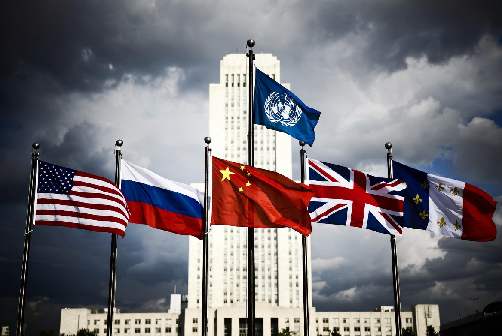

# Mengapa Hanya Lima Negara yang Punya Hak Veto?

*Ilustrasi negara-negara dengan hak veto (pic: Grok AI).*

  
***Bukan konspirasi rahasia. Ini kompromi politik pasca-perang yang dibekukan dalam hukum***
  

Mereka adalah pemenang utama Perang Dunia II dan dianggap sebagai kekuatan militer serta politik terbesar saat pembentukan United Nations pada 1945.

Lima negara itu adalah:

•	Amerika Serikat

•	Uni Soviet, sekarang Rusia

•	Inggris

•	Prancis

•	China.

Hak veto diatur dalam Pasal 27 Piagam PBB. Tanpa persetujuan mereka, tidak ada resolusi substantif yang bisa lolos di United Nations Security Council.

Kenapa begitu?

Karena logika pendirinya sederhana dan agak sinis: Jika negara-negara besar tidak diberi hak istimewa, mereka tidak akan bergabung.

Presiden AS saat itu, Franklin D. Roosevelt, secara eksplisit menginginkan sistem di mana “empat polisi dunia” menjaga stabilitas global. Gagasan ini berkembang menjadi lima permanen.

Tanpa veto, Uni Soviet mungkin tidak akan masuk.
Tanpa Uni Soviet, tidak ada legitimasi global.
Tanpa legitimasi, PBB akan bernasib seperti Liga Bangsa-Bangsa.

## Kenapa Disebut “Permanen”?

Karena kursi mereka tidak melalui pemilihan berkala seperti anggota tidak tetap.

Anggota tidak tetap:

•	dipilih setiap dua tahun,

•	tidak punya veto.

Anggota permanen:

•	tidak pernah dipilih ulang,

•	tidak bisa dicabut kecuali ada amandemen Piagam,

•	punya hak veto.

“Permanen” berarti statusnya melekat pada negara tersebut dalam struktur Piagam.

Untuk mengubahnya?

Perlu amandemen Piagam PBB yang harus diratifikasi oleh dua pertiga negara anggota termasuk semua lima anggota permanen itu sendiri.

Artinya: mereka harus setuju mengurangi kekuasaan mereka sendiri.

Secara politik, hampir mustahil.

## Mengapa Desainnya Asimetris?

Karena pembentuknya realistis.

Mereka tahu:

1.	Kekuatan besar akan tetap bertindak sepihak jika kepentingan vitalnya terancam.

2.	Lebih baik memasukkan mereka dalam sistem dengan hak istimewa daripada membiarkan mereka di luar sistem dan merusaknya.

Itu kompromi antara idealisme dan realpolitik.

Konsekuensi Jangka Panjang

1.	Stabilitas sistem

Negara besar tetap berada dalam kerangka PBB.

2.	Ketimpangan legitimasi

Negara kecil tidak punya suara setara.

3.	Politik veto

Konflik besar sering macet karena veto.

4.	Reformasi terhambat

Negara seperti India, Brasil, Jerman, Jepang sudah lama mendorong perluasan kursi permanen. Tapi veto membuat reformasi sangat sulit.

## Ironi Historis

Sistem ini dibangun untuk mencegah perang dunia ketiga.
Dan sejauh ini, tidak ada perang global antar kekuatan besar sejak 1945.

Tapi sistem yang sama juga membuat penegakan hukum internasional selektif.

Jadi jawabannya bukan konspirasi rahasia.
Ini kompromi politik pasca-perang yang dibekukan dalam hukum.

Dan selama distribusi kekuasaan global tidak berubah secara radikal, lima kursi permanen itu akan tetap permanen.

Sejarah kadang bukan adil.
Ia hanya stabil.

  
**Referensi**

United Nations Charter (1945)
United Nations Conference on International Organization (San Francisco, 1945). Official Records.

Hurd, Ian (2007) After Anarchy: Legitimacy and Power in the United Nations Security Council. Princeton University Press.

Luck, Edward C. (2006) UN Security Council: Practice and Promise. Routledge.

Bosco, David (2009) Five to Rule Them All: The UN Security Council and the Making of the Modern World.Oxford University Press.

Waltz, Kenneth (1979) Theory of International Politics.

Simpson, Gerry (2004) Great Powers and Outlaw States. Cambridge University Press.

Malone, David (2004, ed.) The UN Security Council: From the Cold War to the 21st Century. Lynne Rienner Publishers.

Johnstone, Ian (2008) Legislation and Adjudication in the UN Security Council. American Journal of International Law, 102(2), 275–308.
