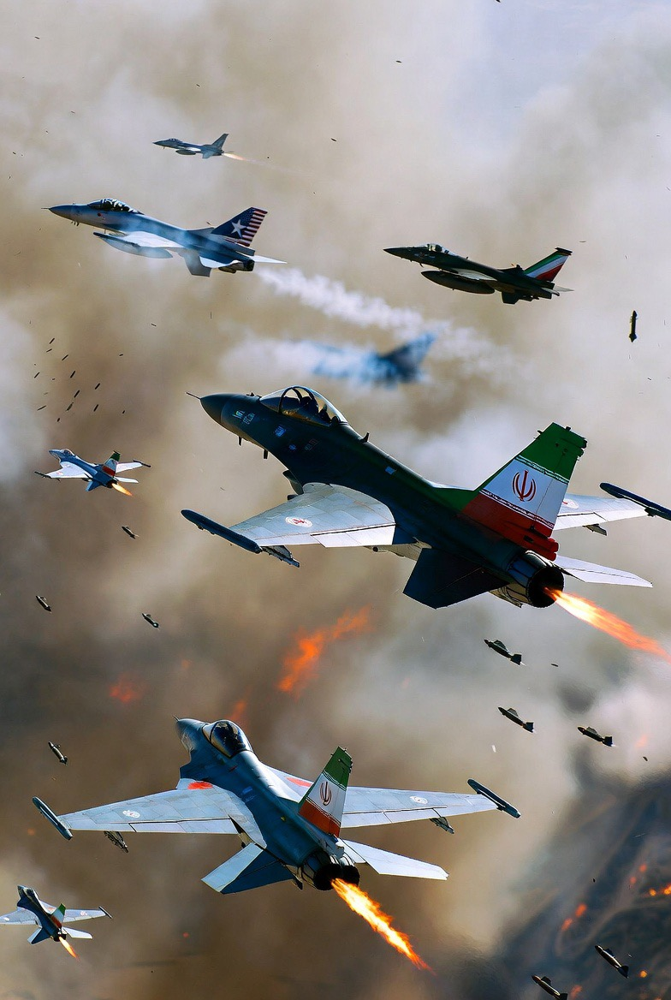

# Mengapa Iran Semakin Keras di Bawah Serangan Militer? Efek “Rally-Around-the-Flag” dalam Perang Modern

*Ilustrasi keberanian Iran (pic: Grok AI).*

  
***Tekanan militer eksternal tidak selalu menghasilkan perubahan politik yang diharapkan***
  

Konflik militer antara Iran dan koalisi Amerika Serikat–Israel pada 2026 menunjukkan fenomena klasik dalam politik internasional: rezim yang diserang secara eksternal sering mengalami konsolidasi internal kekuasaan. 

Artikel ini menganalisis bagaimana tekanan militer eksternal justru memperkuat institusi keamanan negara Iran, terutama Islamic Revolutionary Guard Corps (IRGC). 

Studi ini menggunakan pendekatan teori rally-around-the-flag, keamanan rezim otoriter, serta strategi pertahanan asimetris untuk menjelaskan mengapa Iran menunjukkan ketahanan politik meskipun menghadapi kerusakan militer signifikan.

## Pendahuluan

Dalam konflik internasional modern, tujuan militer sering melampaui penghancuran kemampuan tempur lawan. 

Serangan juga dimaksudkan untuk memicu perubahan politik internal, termasuk runtuhnya rezim yang berkuasa.

Namun banyak penelitian menunjukkan bahwa serangan eksternal sering menghasilkan efek sebaliknya. 

Dalam konteks perang Iran 2026, laporan intelijen menunjukkan bahwa meskipun kemampuan militer Iran mengalami kerusakan, struktur politik negara tetap bertahan dan bahkan menjadi lebih keras.  

Fenomena ini menimbulkan pertanyaan penting dalam studi keamanan internasional:
mengapa rezim yang diserang tidak runtuh, tetapi justru semakin terkonsolidasi?

## Teori Rally-Around-the-Flag

Konsep rally-around-the-flag menjelaskan bahwa ancaman eksternal sering meningkatkan dukungan domestik terhadap pemerintah.

Dalam situasi perang:

•	oposisi politik cenderung melemah

•	masyarakat mengutamakan stabilitas nasional

•	kritik terhadap pemerintah dianggap tidak patriotik.

Akibatnya, rezim yang sebelumnya menghadapi tekanan domestik dapat memperoleh legitimasi baru sebagai simbol pertahanan nasional.

Dalam kasus Iran, serangan militer eksternal memperkuat narasi negara mengenai perlunya persatuan melawan agresi asing.

## Peran Sentral IRGC dalam Stabilitas Rezim

Institusi yang paling diuntungkan dari situasi perang adalah Islamic Revolutionary Guard Corps, sebuah organisasi militer-politik yang memiliki fungsi ganda:

•	pertahanan negara

•	pengawasan politik domestik.

IRGC tidak hanya mengendalikan kekuatan militer, tetapi juga memiliki pengaruh luas dalam sektor ekonomi, keamanan internal, dan jaringan milisi regional.  

Akibatnya, ketika negara berada dalam kondisi perang, organisasi ini memperoleh legitimasi tambahan sebagai penjaga kelangsungan negara.

## Konsolidasi Kekuasaan di Tengah Perang

Analisis intelijen terbaru menunjukkan bahwa perang tidak menyebabkan keruntuhan rezim Iran. Sebaliknya, IRGC semakin memperkuat kendali politik dan keamanan di dalam negeri.  

Beberapa mekanisme konsolidasi yang terjadi antara lain:

•	peningkatan kontrol keamanan domestik

•	pembatasan informasi dan komunikasi

•	sentralisasi pengambilan keputusan militer.

Kondisi perang juga memungkinkan pemerintah untuk membenarkan tindakan represif terhadap oposisi dengan alasan keamanan nasional.

## Strategi Pertahanan Asimetris Iran

Ketahanan Iran juga dipengaruhi oleh doktrin militer yang dirancang untuk menghadapi musuh yang lebih kuat.

Salah satu konsep utama adalah “mosaic defence”, yaitu strategi pertahanan terdesentralisasi yang memungkinkan unit-unit militer tetap beroperasi meskipun komando pusat terganggu.  

Doktrin ini memungkinkan Iran:

•	mempertahankan kemampuan tempur setelah kehilangan pimpinan

•	melanjutkan operasi melalui jaringan regional dan milisi

•	memperpanjang konflik hingga lawan mengalami kelelahan strategis.

## Paradox of External Attack

Kasus Iran memperlihatkan paradoks klasik dalam strategi militer.

Serangan eksternal yang bertujuan melemahkan rezim justru dapat:

•	memperkuat legitimasi pemerintah

•	meningkatkan nasionalisme domestik

•	memperbesar peran institusi keamanan negara.

Fenomena ini menjelaskan mengapa strategi “regime change melalui tekanan militer” sering menghasilkan hasil yang tidak sesuai dengan harapan perancangnya.

Perang Iran 2026 menunjukkan bahwa tekanan militer eksternal tidak selalu menghasilkan perubahan politik yang diharapkan. 

Sebaliknya, konflik tersebut memperkuat institusi keamanan negara dan meningkatkan konsolidasi kekuasaan rezim.

Fenomena ini menegaskan pentingnya memahami dinamika politik domestik dalam strategi militer internasional.

Dalam banyak kasus, serangan terhadap sebuah negara tidak hanya memicu perlawanan militer, tetapi juga menciptakan solidaritas politik yang memperkuat rezim yang sedang diserang.

  
**Referensi**

International Institute for Strategic Studies. (2025). The Military Balance 2025. London.

RAND Corporation. (2024). Understanding the Rally-Around-the-Flag Effect. Santa Monica.

Stockholm International Peace Research Institute. (2025). Security Dynamics in the Middle East. Stockholm.

Brookings Institution. (2024). Authoritarian Resilience in Modern Warfare. Washington, DC.
