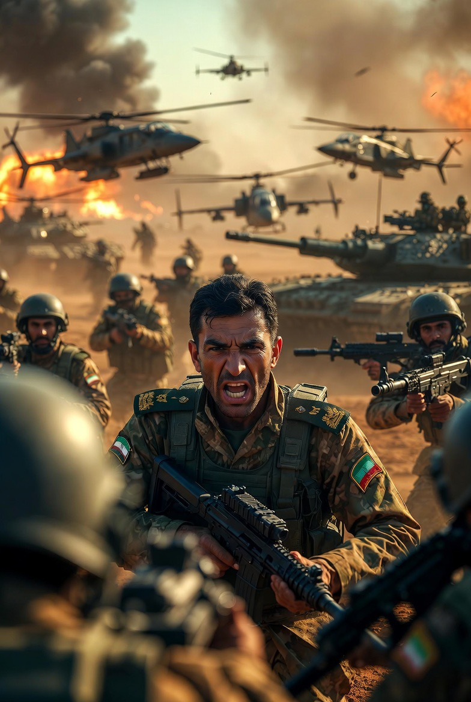

# Mengapa Iran Tidak Tumbang dalam Eskalasi Iran–Israel–AS 2026? Analisis Resiliensi Negara, Nasionalisme Perang, dan Dinamika Asimetris

*Ilustrasi nasionalisme perang (pic: Grok AI).*

  
***Dalam sejarah perang, yang paling berbahaya bukan negara yang lemah tapi negara yang terpojok… lalu memilih tidak mundur***
  

Artikel ini menganalisis ketahanan Iran dalam menghadapi serangan militer intensif dari Israel dan Amerika Serikat selama konflik 2026. 

Meskipun mengalami kerugian signifikan pada infrastruktur militer dan energi, Iran tidak menunjukkan tanda-tanda runtuh, melainkan meningkatkan eskalasi konflik. 

Menggunakan pendekatan state resilience, rally-around-the-flag effect, dan teori konflik asimetris, penelitian ini menunjukkan bahwa tekanan eksternal justru memperkuat kohesi internal, meningkatkan legitimasi rezim, serta mendorong strategi balasan yang lebih agresif. 

Studi ini berargumen bahwa dalam konflik modern, kehancuran material tidak selalu berbanding lurus dengan keruntuhan politik.

## Pendahuluan

Dalam banyak asumsi klasik, serangan militer besar terhadap suatu negara akan melemahkan atau bahkan menjatuhkan rezim. 

Namun, konflik Iran–Israel–AS 2026 menunjukkan pola berbeda:

👉 Iran mengalami kerusakan signifikan

👉 tetapi tidak tumbang

👉 bahkan meningkatkan intensitas respons

Pertanyaan utama:
mengapa tekanan militer justru memperkuat, bukan melemahkan Iran?

## State Resilience

Kemampuan negara untuk:

•	bertahan dari guncangan eksternal

•	mempertahankan kontrol domestik

•	menjaga fungsi institusional

## Rally-Around-the-Flag Effect

Dalam kondisi perang:

•	masyarakat cenderung bersatu

•	oposisi melemah

•	legitimasi pemerintah meningkat

## Asymmetric Warfare

Negara yang lebih lemah:

•	tidak harus menang secara konvensional

•	cukup membuat biaya perang tinggi bagi lawan

## Fakta Empiris: Iran Terpukul, Tapi Tidak Runtuh

1. Kerusakan signifikan

•	fasilitas energi utama seperti South Pars diserang

•	produksi gas terganggu ±12%  

•	ratusan target militer dihancurkan

2. Kehilangan tokoh penting

•	pejabat tinggi militer dan IRGC tewas

•	termasuk figur kunci komunikasi militer  

3. Serangan balasan besar-besaran

•	Iran meluncurkan ratusan hingga ribuan misil & drone

•	menyerang:

•	Israel

•	pangkalan AS

•	fasilitas energi regional  

4. Eskalasi strategi

•	Iran memperluas target ke infrastruktur energi Teluk

•	menandai “fase baru perang”  

## Mekanisme Ketahanan Iran

1. Nasionalisme perang

Serangan eksternal menciptakan:

•	solidaritas internal

•	legitimasi terhadap rezim

👉 kritik domestik ditekan oleh ancaman eksternal

2. Struktur keamanan yang mengakar

Organisasi seperti Basij:

•	tetap aktif meski diserang

•	mempertahankan kontrol domestik

•	memperkuat stabilitas internal  

3. Adaptasi strategi asimetris

Iran tidak bermain di medan yang sama:

•	menyerang energi global

•	memperluas konflik ke kawasan

•	meningkatkan biaya ekonomi lawan

4. Senjata ekonomi

•	gangguan energi global

•	harga minyak melonjak drastis

•	tekanan terhadap ekonomi dunia  

## Analisis: Mengapa Iran Justru “Makin Keras”?

1. Serangan memperkuat, bukan melemahkan

•	tekanan eksternal → legitimasi internal naik

•	oposisi domestik melemah

2. Perang sebagai alat konsolidasi

•	rezim menggunakan konflik untuk:

•	memperkuat kontrol

•	membungkam dissent

3. Strategi “cost imposition”

Iran tidak perlu menang total.

Cukup:

👉 membuat perang mahal

👉 membuat lawan tidak nyaman

👉 memperluas dampak global

## Ilusi “Shock and Awe”

Konflik ini menunjukkan kegagalan asumsi klasik bahwa serangan besar akan langsung melumpuhkan negara target.

Sebaliknya:

•	negara bisa beradaptasi

•	struktur ideologis memperkuat ketahanan

•	konflik justru memperdalam resistensi

Iran tidak tumbang karena ketahanan negara tidak hanya ditentukan oleh kekuatan militer, tetapi juga oleh kohesi internal, struktur ideologis, dan kemampuan adaptasi strategis. 

Dalam konflik 2026, tekanan eksternal justru memperkuat Iran secara politik dan psikologis, menjadikannya lebih agresif dan sulit ditundukkan.

  
**Referensi**

Reuters. (2026). Attacks on major oil and gas sites in Middle East.

Associated Press. (2026). Basij remains resilient despite strikes.

The Guardian. (2026). Iran escalation strategy analysis.

U.S. Central Command Reports. (2026). Military damage assessments.
