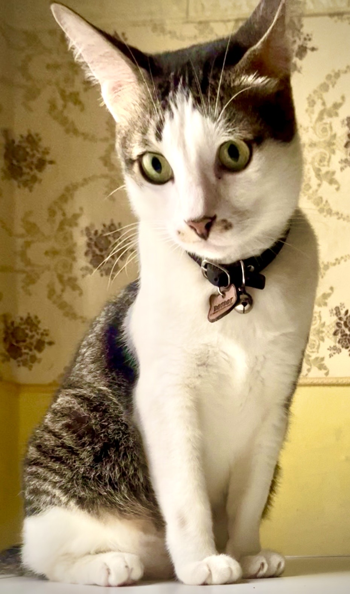

# Mengapa Kucing Menatap Dinding Kosong? Kajian Etologi, Neurosains, & Persepsi Sensorik Kucing Domestik

*Ilustrasi (pic: kokeksi pribadi).*

  
***kucing menatap dinding kosong, kemungkinan besar yang kosong… hanya menurut manusia***
  

Perilaku kucing yang menatap dinding kosong sering dikaitkan dengan hal-hal mistis dalam budaya populer. 

Namun, penelitian etologi dan fisiologi sensorik menunjukkan bahwa sebagian besar kasus dapat dijelaskan melalui kemampuan sensorik kucing yang jauh melampaui manusia. 

Penglihatan, pendengaran, penciuman, serta perhatian terhadap rangsangan kecil membuat kucing tampak “melihat sesuatu” yang sebenarnya tidak disadari manusia.

## BotBot Benar-Benar Melihat Sesuatu

Hanya saja, bukan sesuatu yang kita lihat. Misalnya: seekor semut kecil, laba-laba mungil, nyamuk yang diam, bayangan tipis, ataupun pantulan cahaya.

Bagi kita, ia melihat “Tembok.” Tapi bagi BotBot: “Ada target bergerak pukul 08.13.42.” 

## Pendengaran Super

Ini yang paling sering terjadi.

Kucing mampu mendengar frekuensi hingga sekitar 64 kHz, jauh lebih tinggi daripada manusia yang umumnya hanya sampai sekitar 20 kHz.

Artinya BotBot mungkin mendengar cicak di balik plafon, tikus di dalam dinding, serangga berjalan, atau pipa yang bergetar.

Sementara kita menganggap “BotBot ngelamun.” Padahal BotBot sedang menjadi operator radar. 

## Mata Kucing Sangat Peka terhadap Gerakan

Retina kucing dirancang untuk mendeteksi gerakan kecil, terutama saat cahaya redup. Mereka jauh lebih tertarik pada gerakan daripada warna.

Jadi bayangan daun yang bergoyang sedikit saja, sudah cukup membuat BotBot fokus lima menit.

## Kumis Juga “Melihat”

Ini yang sering dilupakan.

Kumis (vibrissae) adalah organ sensorik yang luar biasa sensitif. Ia mampu mendeteksi perubahan tekanan udara, aliran angin kecil, serta benda yang bahkan belum tersentuh.

Kadang sebelum mata menyadari, kumis sudah memberi sinyal.

## BotBot Bisa Sedang Berpikir?

Agak mengejutkan, jawabannya: mungkin.

Penelitian perilaku menunjukkan bahwa kucing memiliki periode quiet wakefulness, yaitu kondisi diam, tidak tidur, tetapi tetap memproses informasi.

Mirip manusia yang duduk… melihat jendela…sambil memikirkan hidup.

## Apakah Kucing Melihat Makhluk Gaib?

Secara ilmiah, belum ada bukti bahwa kucing dapat melihat makhluk supranatural. Yang ada justru bukti kuat bahwa mereka mendengar lebih baik, melihat lebih baik, mencium lebih tajam, serta mendeteksi getaran lebih sensitif.

Jadi sebelum menyimpulkan: “BotBot lihat hantu.” Lebih mungkin: “Ada cicak olahraga di plafon.”

## Tapi Kenapa Bengong Lama Banget?

Ada beberapa kemungkinan.

A. Mode Berburu

Otak predator bekerja dengan diam, mengamati, menghitung, baru bergerak.

B. Stimulasi Mental

Kadang mereka menikmati mengamati lingkungan. Ini seperti manusia menikmati melihat hujan.

Tidak ada tujuan khusus. Hanya… menikmati.

C. Istirahat Otak

Kucing tidur 12 sampai 16 jam sehari. Saat bangun, mereka juga punya fase “setengah santai”.

Bengong adalah bagian normal dari siklus aktivitas.

## Bagaimana Kalau BotBot Sangat Sering Menatap Dinding?

Kalau disertai mengeong terus, tampak ketakutan, kehilangan keseimbangan, kejang, atau perubahan perilaku drastis, barulah perlu diperiksa dokter hewan karena bisa berkaitan dengan gangguan neurologis, gangguan penglihatan, atau pendengaran.

Tetapi kalau BotBot makan lahap, masih nonjok Ahong, masih patroli rumah, serta masih tidur nyenyak, kemungkinan besar… dia memang sedang menjadi satpam profesional.

Saat BotBot menatap dinding kosong, kemungkinan besar yang kosong… hanya menurut manusia.

Bagi BotBot, dinding itu adalah layar penuh informasi suara, getaran, aroma, cahaya, dan gerakan mikro. Dunia sensoriknya jauh lebih kaya daripada dunia kita.

Jadi lain kali kalau kita melihat BotBot bengong menghadap tembok… jangan buru-buru bilang: “BotBot ngelamun.”

Bisa jadi dalam kepalanya sedang berlangsung: “Target terdeteksi. Cicak bergerak 17 sentimeter ke kiri. Ahong jangan ganggu operasi.” 

  
**Referensi**

Bradshaw, J. W. S. (2013). Cat sense: How the new feline science can make you a better friend to your pet. Basic Books.

Crowell-Davis, S. L., Curtis, T. M., & Knowles, R. J. (2004). Social organization in the cat. Journal of Feline Medicine and Surgery, 6(1), 19-28.

Overall, K. L. (2013). Manual of clinical behavioral medicine for dogs and cats. Elsevier.

Turner, D. C., & Bateson, P. (Eds.). (2014). The domestic cat: The biology of its behaviour (3rd ed.). Cambridge University Press.

Vitale Shreve, K. R., & Udell, M. A. R. (2015). What’s inside your cat’s head? A review of cat cognition research. Animal Cognition, 18(6), 1195-1206. 
