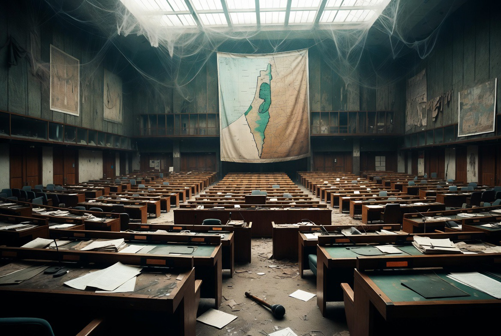

# Mengapa Organisasi Internasional Semakin Sulit Mengendalikan Krisis? 

*Ilustrasi (pic: Grok AI).*

  
***“Lembaga internasional dibangun untuk mencegah perang antarnegara. Dunia abad ke-21 menghadapi perang yang melibatkan negara, aktor nonnegara, siber, ekonomi, dan informasi sekaligus.”***
  

Setelah Perang Dunia II, dunia berusaha memastikan tragedi serupa tidak terulang.

Sehingga lahir berbagai organisasi internasional dengan tujuan besar yaitu menjaga perdamaian, menyelesaikan sengketa, melindungi hak asasi manusia, mengatur perdagangan, serta meningkatkan kerja sama global.

Optimismenya sederhana. Jika negara memiliki tempat untuk berdialog, maka peluang perang akan berkurang.

Namun delapan dekade kemudian, pertanyaan mulai bermunculan: Mengapa perang tetap terjadi? Mengapa krisis kemanusiaan terus berulang? Mengapa lembaga internasional sering tampak terlambat bereaksi?

# Organisasi Internasional Tidak Memiliki “Pemerintahan Dunia”

Kesalahpahaman yang sering muncul adalah menganggap organisasi internasional seperti pemerintah global. Padahal tidak.

Misalnya, PBB bukan negara. Ia tidak memiliki tentara permanen, tidak memiliki polisi internasional, serta tidak memiliki kewenangan memaksa negara besar menaati semua keputusannya.

Kekuatannya bergantung pada kemauan negara-negara anggotanya. Inilah paradoks pertama.

Organisasi internasional dibentuk oleh negara, tetapi keberhasilannya juga bergantung pada negara.

# Politik Kekuatan Belum Pernah Hilang

Dalam teori realisme, negara tetap menjadi aktor utama. Ketika kepentingan strategis dipandang lebih penting daripada keputusan organisasi internasional, negara sering memilih jalannya sendiri.

Akibatnya, organisasi internasional menghadapi dilema. Mereka memiliki legitimasi normatif, namun kapasitas koersifnya terbatas.

# Hak Veto: Penjaga Stabilitas atau Penghambat?

Salah satu contoh paling sering diperdebatkan adalah hak veto di Dewan Keamanan PBB.

Pendukung veto berpendapat bahwa hak veto mencegah konfrontasi langsung antarnegara besar.

Sebaliknya, pengkritiknya mengatakan bahwa hak veto justru membuat banyak keputusan penting tidak dapat diambil ketika kepentingan negara besar saling bertabrakan.

Ironisnya, mekanisme yang dirancang untuk menjaga stabilitas kadang dipersepsikan menghambat respons terhadap krisis tertentu.

# Krisis Abad ke-21 Semakin Kompleks

Konflik modern jarang berdiri sendiri. Satu krisis dapat melibatkan perang konvensional, serangan siber, disinformasi, migrasi, energi, pangan, perubahan iklim, hingga kecerdasan buatan.

Sementara itu, banyak organisasi internasional dibangun ketika ancaman utamanya masih berupa perang antarnegara.

Artinya, tantangan berkembang lebih cepat daripada institusi.

# Analisis

Mungkin masalah terbesar bukan karena organisasi internasional kehilangan legitimasi. Melainkan karena politik global semakin terfragmentasi.

Pada 1990-an terdapat optimisme mengenai kerja sama multilateral. Tapi kini dunia bergerak menuju kompetisi multipolar. Semakin banyak kekuatan besar, maka semakin banyak kepentingan yang saling bertabrakan.

Akibatnya, mencapai konsensus menjadi jauh lebih sulit. Bukan karena diplomat kehilangan kemampuan berbicara, melainkan karena para pemimpin membawa kepentingan nasional yang semakin berbeda.

# Apakah Organisasi Internasional Gagal?

Jawabannya tidak sesederhana “ya” atau “tidak”.

Jika ukuran keberhasilannya adalah mencegah seluruh konflik, maka jawabannya jelas belum berhasil.

Namun jika ukurannya adalah membuka jalur komunikasi, menyalurkan bantuan kemanusiaan, mengurangi risiko eskalasi, serta menyediakan forum negosiasi, maka banyak organisasi internasional masih memainkan peran penting.

Sering kali keberhasilan diplomasi tidak terlihat karena yang berhasil dicegah tidak pernah menjadi berita utama.

# Reformasi atau Relevansi?

Perdebatan besar saat ini bukan lagi “Apakah organisasi internasional dibutuhkan Melainkan“Bagaimana membuatnya tetap relevan di dunia multipolar?”

Usulan yang sering muncul meliputi: reformasi Dewan Keamanan PBB, peningkatan representasi negara berkembang, mekanisme respons krisis yang lebih cepat, serta kerja sama lebih erat dengan organisasi regional.

Namun reformasi itu sendiri memerlukan persetujuan negara-negara yang memiliki kepentingan berbeda. Di sinilah letak paradoks berikutnya.

Organisasi internasional tidak lahir untuk menciptakan dunia yang sempurna. Mereka lahir untuk membuat dunia yang berbahaya menjadi sedikit lebih dapat dikelola.

Masalahnya, dunia kini berubah lebih cepat daripada kemampuan lembaga-lembaga tersebut untuk beradaptasi.

Jika reformasi terus tertunda sementara tantangan terus berkembang, maka kesenjangan antara harapan dan kemampuan akan semakin besar.

Dan ketika masyarakat kehilangan kepercayaan terhadap lembaga internasional, yang dipertaruhkan bukan hanya efektivitas organisasi itu sendiri.

Yang dipertaruhkan adalah keyakinan bahwa sengketa masih dapat diselesaikan melalui aturan, bukan semata melalui kekuatan.

Kesulitan organisasi internasional dalam mengendalikan krisis bukan semata-mata karena kelemahan internal, melainkan karena perubahan struktur politik global. 

Dunia telah bergeser dari dominasi satu kekuatan menuju sistem multipolar yang lebih kompleks, sementara banyak institusi internasional masih beroperasi dengan rancangan pasca-1945.

Tantangan terbesar abad ke-21 bukan sekadar membangun organisasi baru, tetapi menyesuaikan tata kelola global dengan realitas geopolitik yang telah berubah. 

Tanpa adaptasi tersebut, organisasi internasional akan terus menghadapi paradoks: dibutuhkan ketika krisis terjadi, tetapi sering dinilai tidak cukup kuat untuk mengakhirinya.

Organisasi internasional bukan kehilangan arti karena Piagamnya melemah. Mereka kehilangan daya ketika negara-negara besar semakin memilih membawa kepentingannya ke medan persaingan daripada ke meja kompromi. 

Selama hukum membutuhkan persetujuan kekuasaan untuk ditegakkan, dunia akan terus bertanya: siapa yang sebenarnya mengatur tatanan internasional, aturan atau kekuatan?.

  
**Referensi**

After Victory. Ikenberry, G. J. (2001). After Victory. Princeton University Press.

The Tragedy of Great Power Politics. Mearsheimer, J. J. (2014). The Tragedy of Great Power Politics. W. W. Norton & Company.

Governing the Commons. Ostrom, E. (1990). Governing the Commons. Cambridge University Press.

United Nations. (1945). Charter of the United Nations.

International Crisis Group. (2025-2026). CrisisWatch.
