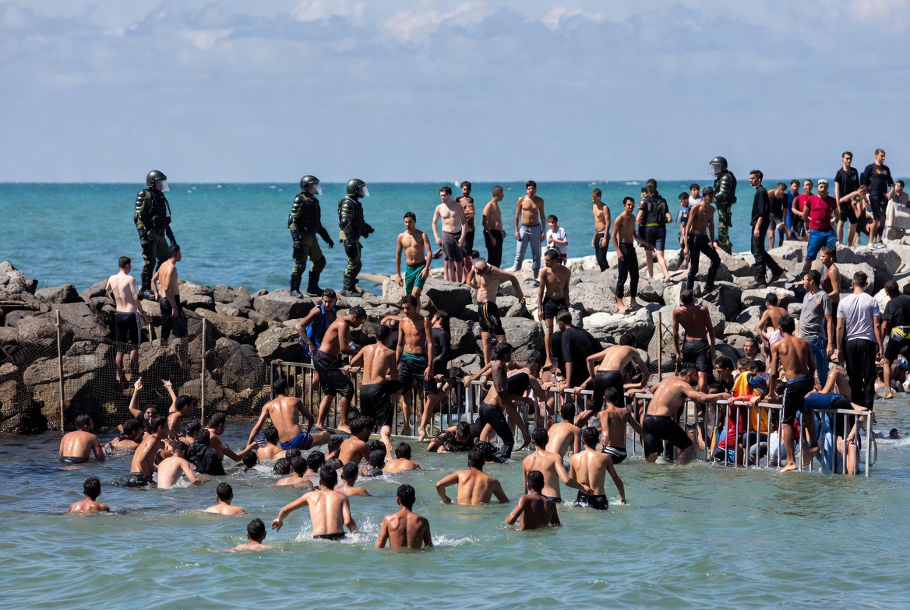

# Mengapa Puluhan Ribu Warga Maroko Nekat Menyeberang ke Spanyol?

*Ilustrasi (pic: Grok AI).*

  
***“Migrasi massal sering kali bukan hanya perpindahan manusia. Ia adalah referendum diam-diam terhadap masa depan yang mereka rasakan di tanah kelahirannya.”***
  

Beberapa hari terakhir dunia dikejutkan oleh pemandangan luar biasa.

Puluhan ribu orang dari Maroko berlari, berenang, bahkan mempertaruhkan nyawa untuk mencapai Ceuta, wilayah Spanyol yang berada di pesisir Afrika Utara. 

Banyak yang bersorak ketika berhasil menginjak daratan Spanyol, meski kemudian sebagian besar kembali ke Maroko setelah menyadari kenyataan yang jauh lebih rumit. Korban jiwa juga berjatuhan dalam penyeberangan berbahaya ini. 

Pertanyaannya: Mengapa mereka begitu nekat?

## Apakah Maroko Negara Miskin?

Tidak sepenuhnya. Morocco memiliki industri otomotif yang berkembang, sektor pariwisata yang besar, pelabuhan modern seperti Port of Tangier Med, dan pertumbuhan ekonomi yang relatif lebih baik dibanding beberapa negara Afrika.

Namun statistik nasional tidak selalu mencerminkan pengalaman sehari-hari masyarakat.

Banyak anak muda menghadapi pengangguran, pekerjaan informal, kenaikan biaya hidup, serta kesulitan memperoleh pekerjaan dengan pendapatan yang dianggap layak.

Bagi sebagian orang, masalah utamanya bukan sekadar bertahan hidup, tetapi kurangnya harapan akan mobilitas sosial. 

## Mengapa Tujuannya Spanyol?

Jawabannya sederhana secara geografis. Ceuta hanya dipisahkan beberapa kilometer dari pantai Maroko.

Secara hukum, Ceuta adalah bagian dari Spanyol, sehingga menjadi pintu menuju Uni Eropa.

Bagi banyak migran, mencapai Ceuta dipersepsikan sebagai langkah pertama menuju kehidupan yang lebih baik.

## Mengapa Mereka Berlari Gembira?

Adegan itu sangat emosional.

Bukan karena mereka yakin sudah menjadi warga Eropa. Melainkan karena mereka merasa telah melewati rintangan yang selama ini tampak mustahil.

Secara psikologis, itu adalah ledakan harapan. Namun harapan tersebut tidak selalu sejalan dengan kenyataan.

Banyak yang kemudian mengetahui bahwa status hukum mereka belum jelas, tidak otomatis memperoleh izin tinggal, dan banyak yang akhirnya kembali ke Maroko secara sukarela atau melalui mekanisme lain. 

## Peran Media Sosial

Salah satu aspek paling menarik dari peristiwa ini adalah dugaan bahwa pesan-pesan yang beredar di media sosial memberi kesan bahwa kesempatan masuk ke Ceuta sedang terbuka lebar.

Laporan media menyebut adanya informasi yang menyebar cepat mengenai peluang menyeberang, meskipun sebagian informasi tersebut ternyata tidak akurat atau menyesatkan. 

Di era digital, rumor dapat bergerak lebih cepat daripada kebijakan pemerintah.

## Analisis 

Migrasi besar seperti ini sering dipahami hanya sebagai persoalan perbatasan. Padahal ia juga merupakan cermin dari ketimpangan harapan.

Yang dicari banyak migran bukan sekadar gaji lebih tinggi. Mereka mencari peluang, kepastian, dan keyakinan bahwa kerja keras dapat mengubah hidup.

Jika seseorang rela berenang dengan risiko tenggelam, berarti dalam persepsinya, risiko tetap tinggal terasa sama beratnya, atau bahkan lebih berat.

## Pelajaran bagi Dunia

Gelombang migrasi menunjukkan bahwa membangun pagar yang lebih tinggi tidak otomatis menghapus dorongan untuk bermigrasi.

Selama terdapat kesenjangan besar dalam kesempatan kerja, pendapatan, akses pendidikan, dan prospek masa depan, maka arus migrasi akan terus muncul dalam berbagai bentuk.

Kebijakan perbatasan penting, tetapi penyebab migrasi sering kali berakar jauh di belakang garis pantai.

Pemandangan orang-orang berlari kegirangan setelah mencapai daratan Spanyol bukan hanya kisah tentang perpindahan manusia. Ia adalah gambaran betapa kuatnya harapan.

Namun tragedi korban jiwa juga mengingatkan bahwa harapan yang dibangun di atas informasi yang keliru atau perjalanan yang sangat berbahaya dapat berakhir tragis.

Karena itu, solusi jangka panjang tidak cukup hanya berupa pengawasan perbatasan. Ia juga memerlukan peningkatan kesempatan ekonomi, kerja sama regional, dan jalur migrasi yang aman serta legal.

Gelombang migrasi dari Maroko ke Ceuta tidak dapat dijelaskan oleh satu faktor tunggal. 

Ia merupakan hasil perpaduan antara tantangan ekonomi, persepsi mengenai peluang hidup yang lebih baik, kedekatan geografis, serta penyebaran informasi yang sangat cepat melalui media sosial.

Peristiwa ini juga menunjukkan bahwa migrasi modern adalah persoalan harapan. Ketika perbedaan harapan hidup antara dua wilayah terasa sangat besar, bahkan laut yang berbahaya pun tidak selalu menjadi penghalang.

Perbatasan memang dapat dijaga dengan pagar, patroli, dan hukum. Namun tidak ada pagar yang cukup tinggi untuk membendung manusia yang merasa masa depannya berada di seberang laut. 

Selama harapan tumbuh lebih subur di satu sisi daripada di sisi lainnya, ombak akan terus membawa orang-orang yang bersedia mempertaruhkan segalanya demi kesempatan yang mereka yakini ada di balik cakrawala.

  
**Referensi**

Associated Press. (1 Agustus 2026). Reports on the Ceuta migration surge. 

International Organization for Migration. World Migration Report (edisi terbaru).

United Nations High Commissioner for Refugees. Global Trends Reports.

Organisation for Economic Co-operation and Development. Reports on migration and labour mobility.
