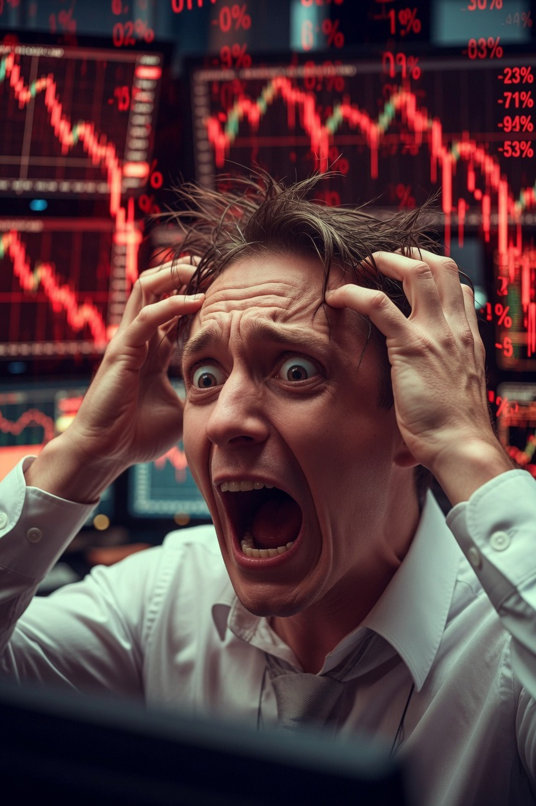

# Mengapa Trader Bisa “Mata Kabur, Jantung Deg-degan, dan Tangan Keriting”?

*Ilustrasi (pic: Grok AI).*

  
***Neurosains Pengambilan Keputusan Cepat, Adrenalin Pasar, dan Psikologi Eksekusi dalam Trading Saham***
  

Aktivitas perdagangan saham, terutama pada saat volatilitas tinggi, merupakan salah satu bentuk pengambilan keputusan tercepat yang dilakukan manusia dalam kehidupan sehari-hari. 

Fenomena seperti “mata kabur”, “jantung berdebar”, hingga kesulitan mengetik harga bukan sekadar ekspresi emosional, melainkan manifestasi aktivasi sistem saraf simpatis, peningkatan beban kognitif (cognitive load), dan dinamika perhatian visual. 

Artikel ini membahas bagaimana otak, mata, dan sistem kardiovaskular berinteraksi ketika seorang investor harus membuat keputusan dalam hitungan detik.

# Bursa Saham sebagai Arena Respons Evolusioner

Secara biologis, otak manusia tidak berevolusi untuk membaca order book, grafik candlestick, atau antrean bid-offer.

Otak kita berevolusi untuk merespons ancaman, peluang, dan kompetisi. Menariknya, pasar saham “membajak” sistem yang sama.

Bagi otak, peluang memperoleh keuntungan dan ancaman kehilangan uang sama-sama diproses sebagai sesuatu yang sangat penting.

# Mengapa Mata Terasa Kabur?

Fenomena “Harga yang mau kuketik tiba-tiba sudah terbang.” melibatkan beberapa proses sekaligus, diantaranya adalah:

a. Cognitive Load

Otak harus memproses secara bersamaan tentang harga yang terus berubah, volume transaksi, jumlah lot, waktu eksekusi, serta risiko salah input.

Memori kerja (working memory) memiliki kapasitas terbatas. Ketika beban informasi melonjak, perhatian menjadi tersebar dan muncul sensasi “mata kabur”, padahal mata secara fisik mungkin tetap sehat.

b. Visual Tracking

Harga yang berubah cepat memaksa mata melakukan saccadic eye movements, yaitu gerakan cepat dari satu titik ke titik lain, dan smooth pursuit, mengikuti objek yang bergerak.

Semakin cepat perubahan, semakin besar kerja sistem visual.

# Mengapa Jantung Deg-degan?

Ketika peluang keuntungan atau risiko kerugian meningkat, tubuh mengaktifkan sistem saraf simpatis.

Hormon seperti adrenalin dan noradrenalin meningkatkan denyut jantung, kewaspadaan, serta aliran darah ke otot.

Secara evolusioner, tubuh memperlakukan situasi ini seperti menghadapi tantangan yang membutuhkan respons cepat.

# “Tangan Keriting”: Bukan Istilah Medis, tetapi Sangat Nyata

“Tangan keriting.” secara ilmiah bisa dijelaskan sebagai kombinasi ketegangan otot halus, peningkatan aktivitas motorik, dan tekanan psikologis.

Akibatnya jari terasa kaku, gerakan mengetik menjadi kurang mulus, kemudian muncul rasa takut salah memasukkan angka.

# Paradoks Trader Berpengalaman

Lalu datang bagian yang paling menarik: “Tapi tenang… kalau masalah duit tetap jeli.” Secara psikologi kognitif, ini menunjukkan peran expertise.

Penelitian menunjukkan bahwa individu yang telah berulang kali menghadapi situasi serupa membangun pola pengenalan (pattern recognition).

Mereka tidak lagi menghitung setiap informasi dari nol. Mereka mengenali pola secara cepat.

# Mengapa Pengalaman Mengalahkan Kepanikan?

Trader berpengalaman sering terlihat tenang bukan karena tidak gugup. Melainkan karena perhatian mereka lebih terarah, keputusan lebih otomatis, dan energi mental tidak habis untuk hal-hal dasar.

Dengan kata lain, pengalaman mengubah kekacauan menjadi pola.

# Bursa Saham sebagai “Gym Otak”

Trading adalah salah satu bentuk gym otak yang sangat intens.

Ia melatih secara bersamaan terhadap  perhatian, memori kerja, kontrol emosi, pengambilan keputusan, pengenalan pola, serta disiplin.

Tentu saja, latihan ini juga bisa sangat melelahkan jika dilakukan tanpa jeda.

# Pelajaran dari Pengalaman

Ada satu ironi yang menarik. Saat harga bergerak sangat cepat, trader berkata “Mataku kabur.” Namun beberapa detik kemudian berucap “Berhasil kubeli dengan harga yang tepat.”

Ini menunjukkan bahwa keputusan akhir tidak hanya bergantung pada kecepatan mata, tetapi juga pada pengalaman, strategi, dan kemampuan tetap fokus di tengah tekanan.

Perasaan “mata kabur, jantung deg-degan, tangan keriting” saat membeli saham bukanlah tanda kelemahan.

Fenomena tersebut merupakan hasil interaksi kompleks antara sistem visual, sistem saraf otonom, memori kerja, perhatian, dan pengalaman investasi.

Dalam kondisi volatilitas tinggi, tubuh bereaksi seolah sedang menghadapi tantangan besar. Namun seiring pengalaman, investor belajar mengubah respons emosional menjadi keputusan yang lebih terukur.

Adrenalin boleh melonjak, grafik boleh menari, tetapi mata investor berpengalaman tetap mencari harga yang masuk akal.

  
**Referensi**

Daniel Kahneman. (2011). Thinking, Fast and Slow. Farrar, Straus and Giroux.

Antonio Damasio. (1994). Descartes’ Error: Emotion, Reason, and the Human Brain. Putnam.

Daniel Goleman. (1995). Emotional Intelligence. Bantam Books.

Gary Klein. (1998). Sources of Power: How People Make Decisions. MIT Press.

Herbert A. Simon. (1997). Administrative Behavior (4th ed.). Free Press.
