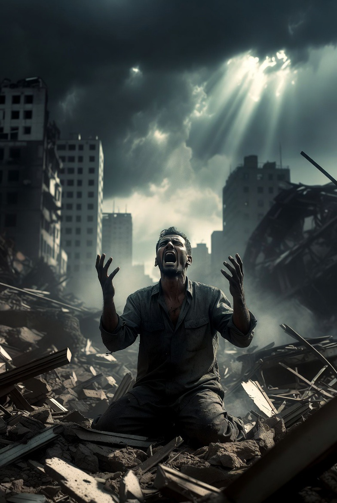

# Mengapa Tuhan Membiarkan Kejahatan? Problem of Evil dalam Filsafat, Teologi Islam, dan Krisis Makna Manusia

*Ilustrasi (pic: Grok AI).*

  
***Iman bukan berarti memahami seluruh rahasia Tuhan. Kadang iman berarti tetap mencari cahaya meski berdiri di tengah dunia yang sering terasa gelap***
  

Keberadaan kejahatan dan penderitaan merupakan salah satu problem tertua dalam sejarah pemikiran manusia. 

Jika Tuhan Maha Kuasa, Maha Mengetahui, dan Maha Baik, mengapa perang, penyakit, pemerkosaan, kelaparan, dan kematian anak-anak tetap terjadi?  Pertanyaan ini dikenal dalam filsafat sebagai Problem of Evil. 

Tulisan ini mengkaji persoalan tersebut melalui pendekatan filsafat agama, psikologi eksistensial, dan teologi Islam. 

Analisis menunjukkan bahwa problem kejahatan bukan hanya persoalan logika tentang Tuhan, tetapi juga persoalan makna, kebebasan, dan keterbatasan manusia dalam memahami realitas.

## Problem yang Mengguncang Langit

Pertanyaan ini sederhana… tapi brutal. Kalau Tuhan:
Maha Kuasa,
Maha Baik,
Maha Mengetahui,
lalu kenapa ada:
perang,
genosida,
anak kelaparan,
penyakit mematikan,
pengkhianatan,
pemerkosaan.

Secara filosofis, jika Tuhan mampu mencegah kejahatan tapi tidak melakukannya, apakah Ia benar-benar baik?

Dan jika Ia ingin mencegah tapi tidak mampu… apakah Ia benar-benar Maha Kuasa?

Inilah yang selama ribuan tahun membuat:
filosof,
teolog,
ateis,
orang beriman,
sama-sama gelisah.

## Jenis Kejahatan

Filsafat membedakan dua bentuk utama:

a. Moral Evil

Kejahatan akibat tindakan manusia:
pembunuhan,
perang,
korupsi,
kekerasan,
terkait kehendak bebas manusia (free will).

b. Natural Evil

Penderitaan yang tampak “alami”:
gempa bumi,
kanker,
tsunami,
bayi lahir cacat,
ini lebih sulit dijelaskan. Karena bukan manusia penyebab langsungnya.

## Jawaban Klasik: Kehendak Bebas (Free Will Defense)

Salah satu jawaban paling terkenal: Tuhan memberi manusia kebebasan memilih. Karena tanpa kebebasan, manusia hanya robot moral.

Jadi:
cinta bermakna karena bisa ditolak,
kebaikan bermakna karena kejahatan mungkin dilakukan.

Maka sebagian kejahatan muncul sebagai konsekuensi kebebasan manusia.

Tapi kritiknya, Kalau begitu…
kenapa Tuhan tidak membatasi kejahatan ekstrem?
kenapa anak kecil harus jadi korban?
Dan debat kembali memanas.

## Perspektif Islam: Dunia sebagai Ujian

Dalam Islam, dunia bukan surga.

Al-Qur’an:

“Dia menciptakan mati dan hidup untuk menguji siapa yang terbaik amalnya.”
(QS. Al-Mulk: 2)

Penderitaan dipahami sebagai:
ujian,
konsekuensi pilihan manusia,
bagian dari keterbatasan dunia fana.

Namun Islam juga tidak menyuruh pasrah pasif. Justru:
melawan kezaliman,
membantu korban,
mencari keadilan,
adalah bagian dari iman.

## Tapi Kenapa Ujiannya Begitu Kejam?

Nah, ini titik paling sunyi.

Secara manusiawi:
kita bisa menerima ujian kecil,
tapi penderitaan ekstrem mengguncang seluruh konsep keadilan.

Misalnya:
bayi meninggal,
perang menghancurkan keluarga,
korban kekerasan seksual trauma seumur hidup.

Manusia bertanya: “apa hikmah dari ini?”

Dan jujur… tidak semua penderitaan punya jawaban emosional yang memuaskan.

## Al-Ghazali dan Keterbatasan Perspektif Manusia

Al-Ghazali berargumen manusia melihat realitas secara terbatas.

Analogi sederhananya, anak kecil mengira operasi dokter itu kejam padahal justru menyelamatkan hidupnya.

Dalam teologi, mungkin ada dimensi hikmah yang belum mampu dipahami manusia sepenuhnya.

Tapi ini juga berbahaya kalau disalahgunakan. Karena “ada hikmah” tidak boleh dipakai untuk:
membenarkan penindasan,
membiarkan kejahatan sosial.

Islam tetap memerintahkan melawan keburukan semampunya.

## Ateisme Modern dan Kritik terhadap Tuhan

Sebagian pemikir modern menyimpulkan bahwa penderitaan besar justru bukti Tuhan tidak ada. Karena mereka menganggap dunia terlalu brutal untuk diciptakan oleh Tuhan Maha Baik.

Namun paradoks menarik muncul. Bahkan saat menolak Tuhan… mereka tetap memakai konsep:
“keadilan”
“kebaikan”
“kejahatan”

Pertanyaannya: kalau semua hanya materi dan evolusi buta… dari mana konsep moral absolut itu berasal?

## Mungkin Problem Terbesarnya Bukan Kejahatan… 

Tapi manusia ingin dunia yang bebas penderitaan, namun juga ingin:
kebebasan,
cinta sejati,
pilihan moral.

Padahal:
kebebasan membuka kemungkinan kejahatan,
cinta membuka kemungkinan kehilangan,
kehidupan membuka kemungkinan kematian.

Mungkin dunia tanpa risiko penderitaan juga berarti dunia tanpa makna mendalam.

## Analisis

Kadang manusia berkata: “Kalau Tuhan ada, kenapa dunia seburuk ini?”

Namun manusia sendiri:
menciptakan perang,
rakus kekuasaan,
menyiksa sesama,
merusak bumi.

Lalu saat dunia terbakar… manusia menunjuk langit.

Mungkin pertanyaan “Kenapa Tuhan membiarkan kejahatan?” tidak akan pernah selesai sepenuhnya di dunia. Namun justru karena adanya:
penderitaan,
kematian,
kehilangan,
manusia dipaksa bertanya:
tentang moralitas,
makna,
belas kasih,
dan tujuan keberadaannya sendiri.

Dalam Islam, iman bukan berarti memahami seluruh rahasia Tuhan. Kadang iman berarti tetap mencari cahaya meski berdiri di tengah dunia yang sering terasa gelap.

Dan mungkin…
bukan hanya manusia yang bertanya: “di mana Tuhan saat kejahatan terjadi?”
Tapi Tuhan juga diam-diam bertanya: “di mana manusia saat sesamanya disakiti?” 

  
**Referensi**

Al-Ghazali. Ihya Ulum al-Din.

Augustine of Hippo. (2003). Confessions. Penguin Classics.

John Hick. (1966). Evil and the God of Love. Harper & Row.

Viktor Frankl. (1946). Man’s search for meaning. Beacon Press.

Al-Qur’an. (QS. Al-Mulk: 2).
