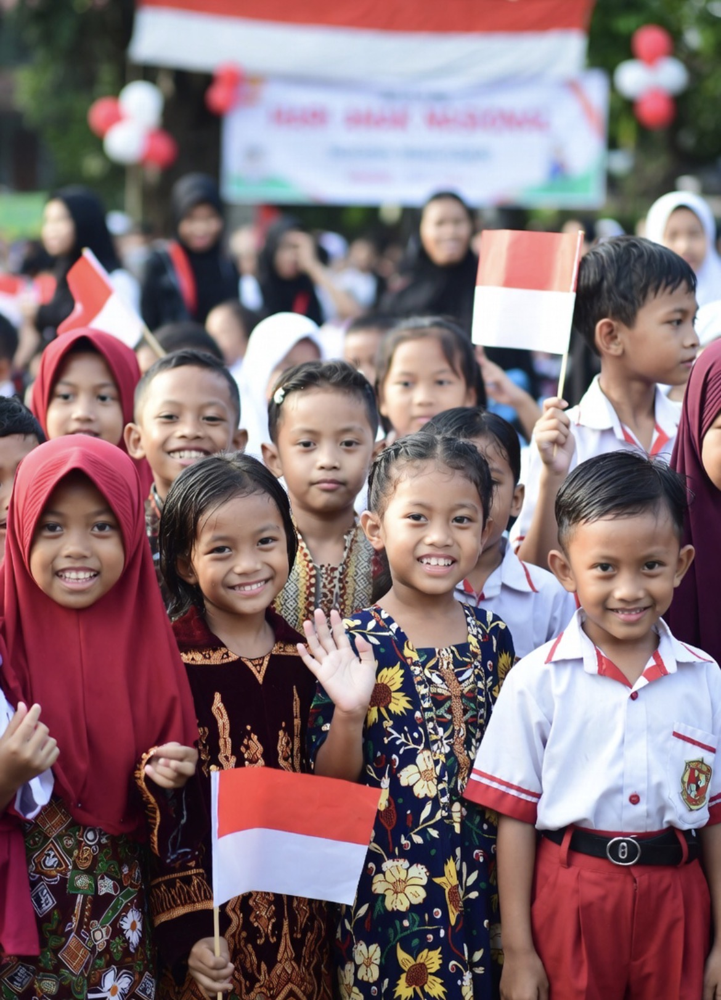

# Menyelamatkan Masa Kanak-Kanak: Hari Anak Nasional, Krisis Moral, dan Masa Depan Generasi Indonesia

*Ilustrasi (pic: Grok AI).*

  
***Investasi terbesar bukan hanya pada infrastruktur atau kecerdasan buatan, melainkan pada pembentukan manusia yang berilmu, berakhlak, tangguh, dan mampu menggunakan kebebasan dengan kebijaksanaan***
  

Setiap peringatan Hari Anak Nasional seharusnya tidak hanya menjadi seremoni penuh balon, panggung hiburan, atau slogan “anak adalah masa depan bangsa”. 

Pertanyaan yang jauh lebih penting adalah: masa depan seperti apa yang sedang kita wariskan kepada anak-anak?

Anak Indonesia hari ini tumbuh dalam dunia yang belum pernah dialami generasi sebelumnya. Mereka tidak hanya berhadapan dengan tantangan di sekolah atau lingkungan sekitar, tetapi juga dengan algoritma media sosial yang bekerja selama 24 jam sehari, membentuk cara berpikir, standar kecantikan, identitas, hubungan sosial, bahkan pandangan mereka tentang seksualitas, agama, keluarga, dan makna hidup. 

Dunia digital telah menjadi “pendidik kedua”, bahkan bagi sebagian anak, lebih berpengaruh daripada orang tua dan guru.

Pertanyaannya bukan lagi apakah dunia berubah. Pertanyaannya adalah: siapa yang sedang mendidik anak-anak kita, dan nilai apa yang sedang ditanamkan kepada mereka?

# Anak-Anak yang Tumbuh Terlalu Cepat

Psikologi perkembangan menunjukkan bahwa masa kanak-kanak idealnya adalah fase bermain, belajar, membangun empati, dan membentuk karakter.

Namun teknologi digital mempercepat paparan terhadap dunia orang dewasa.

Anak-anak kini dapat mengakses, dalam hitungan detik: kekerasan, pornografi, perjudian, penipuan, eksploitasi seksual, gaya hidup konsumtif, ujaran kebencian, hingga propaganda ekstrem.

Akibatnya, sebagian anak mengenal isu-isu orang dewasa jauh sebelum memiliki kematangan emosional untuk memahaminya.

Fenomena ini sering disebut sebagai adultification, yaitu ketika anak terdorong memasuki dunia orang dewasa lebih cepat daripada kesiapan psikologisnya.

# Media Sosial: Guru Baru yang Tidak Pernah Tidur

Media sosial bukan hanya alat komunikasi, ia adalah mesin rekomendasi.

Algoritma tidak bertanya: “Apakah ini baik untuk perkembangan anak?”, yang ditanyakan algoritma adalah: “Apa yang membuat pengguna bertahan lebih lama?”

Akibatnya, konten yang memancing emosi, sensasi, atau kontroversi sering memperoleh perhatian lebih besar dibandingkan konten pendidikan.

Ini bukan persoalan satu ideologi tertentu, melainkan cara kerja ekonomi perhatian (attention economy).

# Hak Anak dan Kewajiban Anak

Dalam negara hukum modern, hak anak harus dilindungi. Hak atas pendidikan, kesehatan, perlindungan dari kekerasan, identitas, dan tumbuh kembang.

Namun pendidikan karakter juga mengajarkan bahwa kehidupan sosial selalu memuat hubungan antara hak dan tanggung jawab.

Menghormati orang tua, guru, dan sesama bukan berarti menghilangkan hak anak. Sebaliknya, penghormatan itu menjadi bagian dari pembentukan karakter, selama tidak dijadikan alasan untuk membenarkan kekerasan atau penyalahgunaan wewenang.

Dalam Islam, ketaatan kepada orang tua adalah nilai luhur, tetapi tidak bersifat mutlak. Ada hadis yang sangat terkenal: “Tidak ada ketaatan kepada makhluk dalam bermaksiat kepada Allah.”

Artinya, adab dan penghormatan tidak identik dengan menerima setiap perintah tanpa berpikir.

# Krisis Identitas di Era Digital

Masa remaja memang merupakan fase pencarian jati diri. Yang berbeda hari ini adalah pencarian itu berlangsung di bawah sorotan jutaan layar.

Remaja menerima berbagai pesan yang sering saling bertentangan tentang tubuh, relasi, maskulinitas, feminitas, kesuksesan, dan kebahagiaan.

Sebagian pesan tersebut dapat membantu mereka memahami diri, namun sebagian lainnya justru membingungkan atau memberi tekanan sosial yang berat.

Karena itu, pendampingan orang tua, guru, dan komunitas menjadi semakin penting.

# Ancaman Nyata terhadap Anak

Di luar perdebatan budaya dan nilai, ada ancaman yang hampir semua pihak sepakati sebagai masalah serius, yaitu eksploitasi seksual anak, perdagangan manusia, perundungan, penipuan daring, pemerasan digital, perekrutan kriminal melalui internet, dan predator seksual.

Masalah-masalah ini memerlukan penegakan hukum, literasi digital, serta pendidikan yang membuat anak berani mencari pertolongan ketika menghadapi situasi berbahaya.

# Perspektif Islam

Islam memandang anak sebagai amanah.

Pendidikan tidak hanya bertujuan menghasilkan anak yang cerdas, tetapi juga berakhlak.

Nabi Muhammad ﷺ menekankan pentingnya kasih sayang kepada anak, keteladanan, dan pendidikan moral.

Dalam Islam, keluarga adalah sekolah pertama. Namun pada era digital, keluarga tidak lagi menjadi satu-satunya sumber nilai. Karena itu, teladan orang tua menjadi semakin penting daripada sekadar nasihat.

# Analisis

Ada satu ironi besar. Kita memasang parental control di telepon genggam anak, tetapi lupa memasang parental presence dalam kehidupan mereka.

Anak lebih mudah mengetahui pendapat seorang influencer daripada isi hati ayahnya. Lebih sering membaca komentar orang asing daripada berbicara dengan ibunya.

Teknologi bukan musuh. Yang menjadi persoalan adalah ketika hubungan manusia digantikan oleh algoritma.

# Masa Depan Indonesia

Bonus demografi Indonesia hanya akan menjadi bonus jika generasi mudanya sehat, terdidik, berkarakter, mampu berpikir kritis, dan memiliki empati. Jika tidak, bonus itu dapat berubah menjadi beban sosial.

Karena itu, pembangunan anak tidak cukup diukur dari nilai ujian atau kemampuan menggunakan teknologi.

Ia juga harus diukur dari integritas, tanggung jawab, dan kemampuan hidup berdampingan dengan orang lain.

Hari Anak Nasional seharusnya mengingatkan kita bahwa anak bukan sekadar “masa depan”, melainkan manusia yang sedang bertumbuh hari ini. 

Mereka membutuhkan ruang untuk bermain, belajar, bertanya, dan membangun karakter tanpa dieksploitasi oleh kepentingan ekonomi, politik, maupun algoritma.

Kekhawatiran terhadap perubahan budaya, nilai, atau pengaruh media adalah hal yang wajar untuk didiskusikan. Namun solusi yang paling kuat bukanlah kepanikan moral atau saling menyalahkan antargenerasi, melainkan membangun keluarga yang hangat, sekolah yang mendidik, masyarakat yang melindungi, dan ruang digital yang lebih aman.

Anak-anak tidak hanya membutuhkan kebebasan, tetapi juga bimbingan. Mereka tidak hanya membutuhkan hak, tetapi juga pembelajaran tentang tanggung jawab. Dan mereka tidak hanya membutuhkan teknologi, tetapi juga orang dewasa yang hadir, mendengarkan, dan memberi teladan.

Jika Indonesia ingin memiliki masa depan yang kuat, maka investasi terbesar bukan hanya pada infrastruktur atau kecerdasan buatan, melainkan pada pembentukan manusia yang berilmu, berakhlak, tangguh, dan mampu menggunakan kebebasan dengan kebijaksanaan.

  
**Referensi**

UNICEF. (2024). The State of the World’s Children.

World Health Organization. (2023). Guidelines on Digital Health and Child Well-being.

Kementerian Pemberdayaan Perempuan dan Perlindungan Anak Republik Indonesia. Pedoman Hari Anak Nasional.

Al-Qur’an. (QS. At-Tahrim: 6; QS. Luqman: 13-19).

Muhammad. Sahih al-Bukhari dan Sahih Muslim (riwayat tentang kasih sayang dan pendidikan anak).
