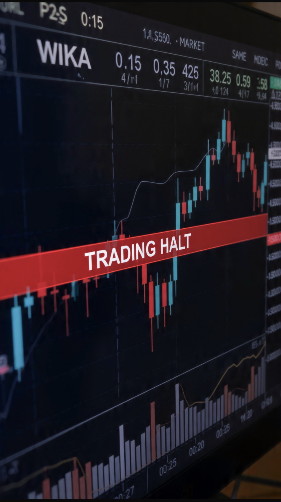

# Menyelamatkan WIKA atau Menyelamatkan Kepercayaan? Ketika Negara Diuji oleh Nasib Perusahaannya Sendiri 

*Ilustrasi (pic: Grok AI).*

  
***Dalam ekonomi modern, kepercayaan adalah mata uang yang nilainya sering lebih besar daripada triliunan rupiah di neraca mana pun***
  

Ada satu kalimat yang terdengar sederhana, tetapi sesungguhnya sangat berbahaya bagi sebuah negara: “Biarkan saja, nanti pasar yang menyelesaikan.”

Kalimat itu mungkin masuk akal jika yang bermasalah adalah perusahaan swasta biasa. Tetapi ketika yang dibicarakan adalah BUMN strategis seperti Wijaya Karya, persoalannya tidak lagi semata tentang satu saham.

Yang dipertaruhkan adalah sesuatu yang jauh lebih mahal, yaitu kepercayaan terhadap kemampuan negara mengelola aset publik.

## WIKA Bukan Sekadar Kode Saham

Dalam teori keuangan, saham hanyalah instrumen investasi. Tetapi dalam praktik politik ekonomi, BUMN adalah simbol.

Ketika investor membeli saham BUMN, mereka tidak hanya membeli perusahaan. Mereka juga membeli sebagian kepercayaan terhadap tata kelola negara, kualitas kebijakan, konsistensi regulasi, dan kemampuan pemerintah mengelola aset strategis.

Karena itulah krisis BUMN selalu memiliki dampak psikologis yang lebih besar dibanding perusahaan biasa.

Jika perusahaan swasta jatuh, pasar berkata: “Itu risiko bisnis.” Namun ketika BUMN jatuh dan berlarut-larut tanpa kepastian, pasar mulai bertanya: “Negara sedang mengerjakan apa?”

## Yang Dicari Investor Bukan Bailout, Tetapi Kepastian

Di sinilah sering terjadi kesalahpahaman. Tidak semua investor meminta negara menggelontorkan triliunan rupiah. 

Banyak investor sebenarnya hanya meminta tiga hal:

1. Kejelasan

Apa rencana pemerintah terhadap WIKA?

2. Transparansi

Bagaimana kondisi sebenarnya?

3. Timeline

Kapan restrukturisasi selesai?

Pasar bisa menerima kabar buruk. Yang sulit diterima pasar adalah ketidakpastian tanpa ujung.

Dalam dunia investasi, ketidakpastian sering lebih menakutkan daripada kerugian itu sendiri.

## Bahaya Terbesar Bukan Kerugian, Melainkan Hilangnya Kredibilitas

Mari kita bicara terus terang. Jika investor melihat BUMN besar kesulitan, saham disuspend lama, komunikasi minim, dan penyelesaian tidak jelas, maka pesan yang diterima pasar bukan hanya tentang WIKA.

Pesannya adalah: “Kalau aset negara sendiri tidak jelas masa depannya, bagaimana dengan aset lain?”

Inilah yang disebut contagion of confidence.

Krisis kepercayaan jarang berhenti pada satu perusahaan. Ia menyebar, pelan, diam-diam. Seperti retakan rambut pada bendungan.

Awalnya kecil. Lalu suatu hari seluruh struktur ikut dipertanyakan.

## Negara Tidak Boleh Menyelamatkan Harga Saham

Ini penting. Negara tidak punya kewajiban menjaga harga saham, sebab harga saham harus ditentukan pasar. Tetapi negara memiliki kewajiban yang jauh lebih penting, yakni memastikan perusahaan miliknya dikelola secara profesional dan memiliki arah yang jelas.

“Negara tidak boleh memanipulasi harga saham secara artifisial. Tetapi negara boleh dan bahkan sering perlu mengambil langkah untuk menjaga stabilitas pasar serta melindungi nilai aset publik yang dimilikinya.”

Perbedaan ini sangat besar, menyelamatkan harga saham adalah manipulasi, sedangkan menyelamatkan perusahaan adalah tata kelola.

Yang dibutuhkan investor bukan saham hijau palsu., yang dibutuhkan adalah perusahaan sehat.

## Mengapa Respons Cepat Penting?

Pasar memiliki memori. Dan memori pasar sering lebih panjang daripada masa jabatan politik.

Jika suatu generasi investor mengalami suspend panjang, ketidakjelasan, serta komunikasi buruk, maka pengalaman itu akan diwariskan menjadi reputasi.

Akibatnya bisa muncul persepsi “Saham BUMN terlalu berisiko.”

Kalimat ini sangat mahal, karena begitu investor mulai menghindari BUMN secara struktural, maka biaya pendanaan naik, minat investasi turun, valuasi melemah, dan negara kehilangan salah satu sumber pembiayaan pembangunan.

Kerugiannya tidak berhenti pada pemerintah tetapi juga menyentuh masyarakat luas melalui ekonomi yang kurang efisien.

## Kritik yang Seharusnya Disampaikan kepada Pemerintah

Pemerintah bukan hanya harus menyellamatkan semua investor, namun juga memberi kepastian mengenai masa depan aset negara.

Investor dewasa memahami risiko. Tetapi mereka berhak menuntut tata kelola yang baik.

BUMN bukan warung keluarga, ia adalah perusahaan publik yang sebagian kepemilikannya berasal dari rakyat.

Karena itu publik berhak mengetahui apa masalahnya, bagaimana solusinya, dan kapan target penyelesaiannya.

## Paradoks yang Harus Dihindari

Bayangkan sebuah negara yang mampu membangun bandara, jalan tol, bendungan, kota baru, tetapi tidak mampu menjelaskan secara meyakinkan arah salah satu BUMN strategisnya.

Itu menciptakan paradoks. Karena pada akhirnya pembangunan fisik dan kepercayaan investor sama-sama membutuhkan fondasi.

Jika Beton mampu membangun jembatan, maka kepercayaan mampu membangun pasar modal. Dan yang kedua sering lebih sulit daripada yang pertama.

## WIKA Adalah Ujian Reputasi

Pada akhirnya, isu WIKA bukan hanya tentang satu emiten. Ia telah berubah menjadi ujian reputasi.

Bukan ujian apakah negara mampu membuat harga saham naik. Bukan pula ujian apakah semua investor harus untung. Melainkan ujian yang lebih mendasar: Apakah negara mampu menunjukkan bahwa aset strategis yang dimilikinya memiliki arah, tata kelola, dan masa depan yang dapat dipercaya?

Sebuah negara tidak kehilangan kredibilitas ketika menghadapi masalah sebab semua negara pasti menghadapi masalah. Tetapi negara kehilangan kredibilitas ketika masalah itu dibiarkan berlarut-larut tanpa penjelasan yang memadai.

Dan dalam ekonomi modern, kepercayaan adalah mata uang yang nilainya sering lebih besar daripada triliunan rupiah di neraca mana pun. 

  
**Referensi**

Organisation for Economic Co-operation and Development. (2024). OECD Guidelines on Corporate Governance of State-Owned Enterprises.

World Bank. (2014). Corporate Governance of State-Owned Enterprises: A Toolkit.

Damodaran, A. (2012). Investment valuation (3rd ed.). Wiley.

Minsky, H. P. (1986). Stabilizing an unstable economy. Yale University Press.

North, D. C. (1990). Institutions, institutional change and economic performance. Cambridge University Press.

Stiglitz, J. E. (2010). Freefall: America, free markets, and the sinking of the world economy. W. W. Norton & Company.
