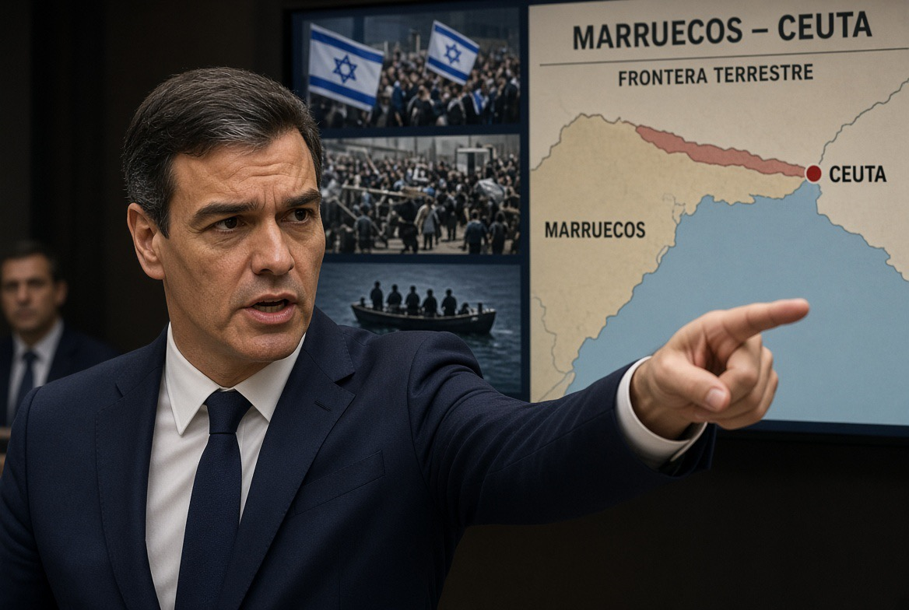

# Migrasi sebagai Senjata Geopolitik: Ketika Manusia Menjadi “Pressure Point” Eropa

*Ilustrasi (pic: Grok AI).*

  
***Wajah baru hybrid warfare. Migran bukan senjata, kerentanan migrasi-lah yang dapat dijadikan senjata***
  

Skalanya memang gila, pada 30–31 Juli, lebih dari 70.000 orang diperkirakan masuk ke Ceuta, wilayah Spanyol di Afrika Utara yang penduduk normalnya hanya sekitar 80.000-an.

Bayangkan sebuah kota kecil tiba-tiba menghadapi arus manusia yang mendekati ukuran populasi kotanya sendiri dalam waktu sangat singkat.

Dan ini bukan cuma soal administrasi. Sedikitnya puluhan orang meninggal dalam kekacauan tersebut, terutama karena tenggelam dan terinjak dalam kerumunan. Angka korban kemudian terus direvisi naik, dengan AP melaporkan 141 kematian pada awal September. 

Jadi ini bukan “krisis imigrasi biasa”. Ini adalah border shock.

## Siapa Sebenarnya yang Menekan Tombol?

Nah. Di sinilah ceritanya mulai licin, ada tiga lapisan penyebab yang jangan dicampur:

**Lapisan A: faktor struktural**

Maroko memiliki persoalan ekonomi, pengangguran anak muda, ketimpangan kesempatan, dan aspirasi migrasi yang sudah lama ada.

Reuters mewawancarai migran yang mengatakan mereka melihat video di media sosial lalu memutuskan berangkat menuju Ceuta. 

Artinya, populasi yang sudah memiliki dorongan migrasi tidak perlu diciptakan oleh aktor asing. Yang diperlukan hanyalah pemicu.

**Lapisan B: informasi palsu**

Ini terbukti jauh lebih kuat.

Video viral dan rumor membuat orang percaya bahwa kalau mereka berhasil masuk Ceuta, mereka bisa tinggal di Spanyol atau tidak akan langsung dideportasi.

Padahal yang sebenarnya terjadi adalah ada putusan pengadilan Spanyol yang kemudian disalahartikan secara massal di media sosial. 

Beberapa video bahkan memperlihatkan orang-orang yang sudah tiba di Ceuta seolah-olah sedang merayakan keberhasilan.

Efek psikologisnya: “Mereka berhasil, berarti jalurnya terbuka, kita harus berangkat sekarang.”

Ini contoh klasik information cascade.
Satu orang percaya.
Seratus orang melihat.
Sepuluh ribu orang menganggapnya fakta.

Lalu realitas sosial berubah karena orang bertindak berdasarkan informasi yang salah. Itulah bagian yang sangat berbahaya.

## Media Sosial ternyata Bukan Sekadar “Media”

Ini poin yang paling penting.

Dalam teori keamanan tradisional, ancaman adalah tank, kapal perang, rudal. Sedangkan dalam konflik hibrida, ancaman bisa berupa perubahan perilaku massal.

Kalau sebuah video berdurasi 20 detik mampu membuat puluhan ribu manusia bergerak menuju perbatasan, maka video tersebut secara fungsional sudah menjadi alat mobilisasi strategis.

Reuters menemukan bahwa arus meningkat dari sekitar 100 kedatangan pada 23 Juli menjadi lebih dari 70.000 pada awal Agustus, sementara WhatsApp dan media sosial ikut mengoordinasikan pergerakan. 

Ini konsep yang jauh lebih menarik daripada sekadar “fake news”. Disinformation, perception, mass behaviour, lalu physical pressure. Informasi palsu berubah menjadi infrastruktur fisik, dan infrastrukturnya adalah manusia.

## Bagaimana dengan Maroko?

Nah, di sini Sánchez justru berada dalam posisi yang sangat rumit.

Pada September, Sánchez mengatakan tidak ada bukti konkret bahwa pemerintah Maroko merencanakan atau mengorkestrasi serbuan tersebut.

Tetapi laporan polisi Spanyol yang muncul kemudian menyajikan gambaran yang jauh lebih mengganggu.

Laporan tersebut menyatakan bahwa polisi Maroko berada dalam jumlah lebih kecil daripada biasanya dan selama periode sekitar 10 jam tidak melakukan upaya serius untuk membubarkan massa.

Bahkan ada kesaksian bahwa sebagian petugas berseragam mengarahkan orang menuju titik penyeberangan. Namun laporan itu tidak membuktikan adanya perintah resmi dari pemerintah Maroko. 

## Tuduhan Sánchez: Israel dan Rusia

Sánchez mengatakan jaringan yang terkait dengan Rusia dan Israel menyebarkan atau memperkuat disinformasi mengenai kebijakan migrasi Spanyol.

Dia mengaitkannya dengan penelitian European External Action Service (EEAS), badan diplomatik Uni Eropa. 

Secara umum, foreign information manipulation and interference (FIMI) memang merupakan ancaman yang diakui Uni Eropa. 

EEAS memiliki mekanisme khusus untuk melacak manipulasi informasi asing, termasuk operasi yang berkaitan dengan Rusia. 

Tetapi ada perbedaan besar antara “aktor X memperkuat narasi palsu” dan “aktor X menyebabkan 70.000 manusia menyeberang.” Yang kedua membutuhkan bukti kausal yang jauh lebih kuat.

Dan sampai sekarang, Rusia dan Israel menyangkal tuduhan tersebut. 

## Bahkan Tanpa “Mastermind”, Efeknya Tetap Luar Biasa

Bayangkan tidak ada satu pun aktor yang benar-benar merencanakan seluruh operasi. Cukup terjadi: kemiskinan, aspirasi migrasi, rumor, algoritma, salah tafsir hukum, pasifnya penjagaan, dan kepanikan.

Boom! 70.000 manusia bergerak, dan Eropa mengalami krisis politik. 

Artinya, sistem demokrasi modern dapat diguncang tanpa perlu seseorang memegang remote control tunggal.

Ini disebut emergent threat. Ancaman muncul dari interaksi banyak faktor yang masing-masing mungkin tampak kecil.

## Migrasi Berubah Menjadi “Senjata”

Konsep weaponization/instrumentalization of migration bukan berarti setiap migran adalah senjata.

Ini sangat penting. Manusianya bukan senjata, yang dapat menjadi instrumen adalah arus migrasi yang dimanipulasi oleh negara, aktor non-negara, jaringan kriminal, atau aktor informasi untuk menciptakan tekanan politik terhadap negara target.

Eropa sudah mengalami pola serupa sebelumnya. Belarus, misalnya, dituduh menggunakan migrasi di perbatasan Polandia sebagai instrumen tekanan terhadap EU. 

Uni Eropa sendiri telah secara eksplisit membahas instrumentalisation of migration sebagai bentuk tekanan hibrida.  

Dan ini menghasilkan paradoks mengerikan: Semakin demokratis sebuah negara menghormati hak manusia, semakin banyak titik yang bisa dieksploitasi oleh aktor yang tidak menghormati aturan yang sama.

Tapi jangan menggunakan paradoks tersebut sebagai alasan untuk membuang hak manusia. Itu justru jebakannya.

## Migrasi Mempunyai “Yield Politik” yang Sangat Tinggi

Jika sebuah rudal bisa menghancurkan satu fasilitas, maka  migrasi massal dapat melakukan sesuatu yang lebih subtil yaitu mengubah pemilih.

Dan Ceuta memperlihatkan mekanismenya dengan sangat jelas. Krisis tersebut segera menjadi bahan bakar bagi partai kanan dan kanan-jauh.

Polling 40dB yang dirilis September menunjukkan sekitar 90% responden menyalahkan Maroko atas arus tersebut, sementara penanganan Sánchez mendapat penilaian buruk, justru dukungan terhadap Vox juga meningkat. 

Nah, di sinilah kita menemukan second-order effect: migrasi, tekanan layanan publik, kecemasan masyarakat, kemarahan politik, penguatan kanan-jauh, kebijakan migrasi makin keras, lalu polarisasi EU makin dalam

Jadi kalau seseorang ingin memecah Eropa, dia bahkan tidak perlu membuat semua orang menjadi pro-migrasi atau anti-migrasi. Cukup membuat mereka saling membenci mengenai migrasi.

## Ini Sebenarnya Menyerang Jantung Uni Eropa

Karena EU memiliki satu kelemahan struktural yakni perbatasan eksternal bersifat kolektif, tetapi beban politiknya sangat nasional.

Ceuta adalah perbatasan Spanyol, tetapi ketika terjadi krisis justru Spanyol yang kewalahan.

Penduduk Ceuta yang panik, Madrid yang diserang oposisi, Brussels diminta membantu. Negara EU lain kemudian berkata: “Kenapa kami harus menerima konsekuensinya?”

Dan akhirnya persoalannya berubah dari: “Bagaimana melindungi perbatasan Eropa?” menjadi: “Siapa yang harus menanggung manusia-manusia ini?”

Itu adalah resep klasik untuk fragmentasi.

## Bahkan Schengen Bisa Menjadi Korban Politiknya

EU memang rentan. Karena kalau setiap negara mulai berpikir: “Gue tutup perbatasan gue dulu.” maka prinsip kebebasan bergerak di dalam Schengen mulai tergerus.

Krisis Ceuta sudah memicu tekanan untuk memperketat kebijakan migrasi Eropa dan meningkatkan kerja sama dengan negara-negara non-EU. 

Jadi satu perbatasan di Afrika Utara bisa menghasilkan konsekuensi: Ceuta, Madrid, Brussels, Berlin/Rome/Paris, Schengen. Itulah cascade effect.

## EU Ikut Menciptakan Kerentanannya

Selama bertahun-tahun Eropa mengandalkan externalisation of migration control. Artinya: “Tolong negara tetangga kita yang menjaga migran agar jangan sampai mereka masuk.”

Maroko menjadi salah satu penjaga gerbang tersebut. Masalahnya kalau sebuah negara non-EU memegang sebagian kontrol atas arus manusia menuju EU, maka kontrol tersebut juga menjadi leverage geopolitik.

Ini semacam EU outsourced the border, therefore the border became negotiable. Ketika hubungan baik, Maroko membantu menahan arus. Namun ketika hubungan memburuk, ketidakaktifan beberapa jam saja bisa mempunyai konsekuensi besar.

Dan itulah mengapa migrasi bukan lagi sekadar isu kemanusiaan. Ia menjadi diplomatic bargaining chip.

## Apakah Maroko sedang “Menyerang Eropa”?

Belum bisa kita simpulkan begitu. Tetapi apakah negara seperti Maroko memiliki leverage geopolitik melalui migrasi? Absolutely. Dan ini dua hal yang sangat berbeda.

Kita harus membedakan Weaponization (Negara sengaja memobilisasi migrasi untuk menekan lawan) dengan Leverage (Negara memiliki kemampuan untuk memengaruhi arus migrasi dan karenanya memiliki daya tawar.)

Maroko jelas memiliki leverage. Apakah leverage tersebut sengaja digunakan dalam kasus Ceuta? Masih contested.

Laporan polisi Spanyol membuat pertanyaan itu semakin serius, tetapi belum memberikan smoking gun berupa perintah pemerintah. 

## Israel dan Rusia?

Ini justru bagian yang paling harus kita kritisi terhadap pemerintah Sánchez. Karena pemerintah sedang menghadapi kegagalan domestik yang nyata, yaitu peringatan sebelum krisis, kesiapan aparat, koordinasi Madrid-Ceuta, komunikasi publik, penanganan ribuan anak tanpa pendamping, dan aftermath politik.

Reuters sebelumnya melaporkan bahwa pekerja perbatasan telah memperingatkan masalah dan mempertanyakan kesiapan pemerintah menghadapi lonjakan. 

Maka secara politik sangat menggoda untuk berkata: “Ini bukan kegagalan kita. Ini serangan hibrida asing.” Tetapi keduanya bisa benar sekaligus.

Bisa saja ada aktor asing yang menyebarkan disinformasi, dan pemerintah Spanyol tetap bisa gagal mempersiapkan diri. Tidak ada hukum alam yang mengatakan hanya satu penjelasan boleh benar.

## Melakukan Information Warfare Bukan Berarti “Menciptakan” Migrasi?

Ini distinction yang super penting.

Misalnya Aktor asing: “Sebarkan video bahwa Spanyol akan menerima semua migran.”

Algoritma: “Video ini engagement-nya tinggi.”

Influencer: “Wah, benar nih!”

Migran: “Kalau begitu berangkat!”

Trafficker: “Gue antar.”

Kerumunan: 70.000 orang.

Aktor asing mungkin mempercepat proses, tetapi bahan bakarnya sudah ada. Jadi model yang lebih ilmiah adalah foreign information manipulation sebagai accelerator, bukan necessarily originator. Itu jauh lebih masuk akal daripada teori “Rusia/Israel mengirim 70.000 orang”.

## Strategic Amplification

Aktor geopolitik modern tidak selalu perlu menciptakan krisis, mereka hanya perlu menemukan retakan.

Migrasi adalah retakan, kemudian sedikit disinformasi, algoritma, ketegangan sosial, kebijakan yang ambigu, ketidakpercayaan terhadap pemerintah, maka terjadilah krisis politik.

Dan sesudah krisis terjadi, aktor tersebut bahkan tidak perlu melakukan apa-apa lagi. Masyarakat sendiri yang akan memperbesar efeknya.

## Senjata Terbaik dalam Perang Informasi Bukan Kebohongan

Ini agak paradoxical. senjata terbaik adalah kebenaran yang dipelintir.

Migrasi memang terjadi, border memang kewalahan, korban memang jatuh, layanan publik memang tertekan, pemerintah memang tidak sempurna. Kemudian tinggal tambahkan narasi: “Pemerintah kehilangan kendali.” atau “Migran akan mengambil alih.” atau “EU sengaja membuka pintu.” atau “Negara asing sedang menyerang kita.”

Masing-masing memiliki sepotong realitas. Itulah yang membuatnya jauh lebih efektif daripada kebohongan absurd.

## Apakah EU Makin Rentan?

Ya, tapi bukan terutama karena 70.000 migran.

EU rentan karena empat structural vulnerabilities:

1. Externalised borders

Sebagian kontrol perbatasan bergantung pada negara non-EU.

2. Asymmetric burden sharing

Negara perbatasan menanggung shock pertama.

3. Information fragmentation

Informasi bergerak lebih cepat daripada pemerintah mampu memverifikasi.

4. Political polarisation

Migrasi sudah menjadi isu identitas politik yang sangat emosional.

Dan ada bonus kelima:

5. The far right doesn’t need to cause the crisis to benefit from it.

Mereka hanya perlu menjadi pihak yang paling siap memanen kemarahan setelah krisis terjadi.

Polling terbaru di Spanyol memperlihatkan persis mekanisme tersebut. 

Migrasi sekarang bisa menjadi instrumen geopolitik, tetapi kita harus berhenti membayangkan “senjata migrasi” sebagai seseorang duduk di sebuah ruangan lalu menekan tombol: SEND 70,000 MIGRANTS TO SPAIN.

Realitas modern jauh lebih berbahaya. Yang terjadi bisa berupa economic grievance, viral misinformation, misperception, mass mobilisation, border overload, humanitarian catastrophe, political polarisation, far-right electoral gain, atau EU fragmentation.

Dan kalau ada aktor asing yang ikut memperbesar salah satu mata rantai itu, mereka tidak perlu mengendalikan seluruh rantai untuk mendapatkan keuntungan strategis.

Itulah wajah baru hybrid warfare. Migran bukan senjata, kerentanan migrasi-lah yang dapat dijadikan senjata.

Dan justru karena manusianya nyata, penderitaannya nyata, dan ketakutan masyarakatnya nyata, senjata semacam ini sangat sulit dilawan tanpa sekaligus merusak nilai demokrasi yang hendak dipertahankan Eropa.

Ceuta bukan sekadar cerita tentang orang yang menyeberangi pagar. Ceuta adalah eksperimen brutal tentang seberapa cepat sebuah arus manusia dapat berubah menjadi krisis keamanan, krisis informasi, dan akhirnya krisis legitimasi politik. 

  
**Referensi**

Reuters. (2026, September 3). Spain’s Sanchez says no evidence Morocco orchestrated Ceuta border surge. 

Reuters. (2026, August 4). The viral videos that inspired tens of thousands to swim to Spain’s Ceuta. 

Reuters. (2026, August 15). Spain disregarded Ceuta warnings before migrant rush. 

Reuters. (2026, September 7). Majority of Spaniards unhappy with government’s handling of Ceuta crisis. 

European External Action Service. Information integrity and countering foreign information manipulation and interference. 
