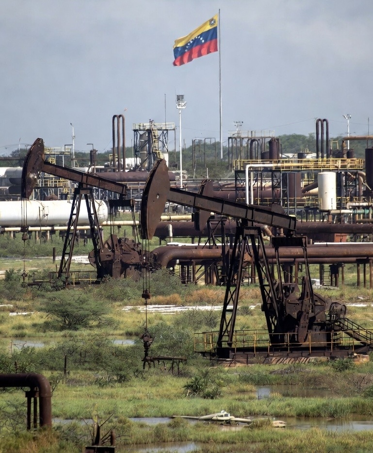

# Politics of Frozen Oil Assets: Siapa Mengontrol Minyak Venezuela di Era Sanksi?

*Ilustrasi ladang minyak Venezuela (pic: Grok AI).*

  
***Negara dengan minyak terbesar dunia justru memiliki kontrol terbatas atas uang dari minyaknya sendiri***
  

Sejak 2019, Amerika Serikat menjatuhkan sanksi pada perusahaan minyak negara Venezuela:

•	PDVSA

•	pembatasan ekspor minyak

•	pembekuan aset di AS

•	pembatasan transaksi dolar

Tujuannya jelas secara resmi: melemahkan pemerintahan Nicolás Maduro dengan memotong sumber pendapatan utama negara.

Karena Venezuela:

•	90% pendapatan ekspor berasal dari minyak

•	minyak = sumber utama devisa negara

Sanksi ini secara efektif mengubah minyak Venezuela dari komoditas ekonomi menjadi instrumen politik global.

## “Frozen Oil Assets” bukan Metafora

Istilah ini merujuk pada beberapa hal nyata: Aset minyak Venezuela di luar negeri.
Contoh paling terkenal:

•	CITGO (kilang di AS)

•	rekening bank PDVSA di luar negeri

•	pembayaran minyak yang ditahan

AS membekukan aset ini dan mengalihkan kontrol administratifnya ke oposisi Venezuela yang diakui Washington saat itu.

Ini menciptakan situasi unik: Negara memiliki minyak, tetapi tidak mengontrol uangnya.

## Siapa Sebenarnya Mengontrol Minyak Venezuela?

Jawaban akademik yang jujur: tidak ada satu aktor tunggal.

Kontrolnya terfragmentasi.

Kita bisa petakan seperti ini:

| Komponen | Pengontrol nyata |
|------|-------|
| Produksi minyak | PDVSA (Venezuela) |
| Ekspor legal | negara yang diberi lisensi sanksi |
| Aset luar negeri | AS & pengadilan internasional |
| Penjualan alternatif | jaringan trader global |
| Pembayaran minyak| rekening escrow / bank asing |

Dengan kata lain: minyak Venezuela diproduksi oleh Venezuela, tetapi sistem keuangannya dikendalikan oleh sanksi.

## Politik “Escrow Oil”

Dalam banyak kasus sanksi minyak global (Iran, Irak 1990-an, Venezuela), muncul mekanisme: rekening escrow.

Artinya:

•	minyak boleh dijual terbatas

•	uangnya tidak langsung ke pemerintah

•	dana disimpan atau diawasi pihak ketiga

Model ini dikenal dalam studi hubungan internasional sebagai: resource containment governance, atau dalam bahasa sederhana:
minyak boleh mengalir, tapi uangnya dijaga.

## Aktor global dalam minyak Venezuela

Karena sanksi Barat, pembeli minyak Venezuela berubah.

Pembeli utama:

•	China

•	India

•	jaringan trader independen

•	perusahaan bayangan

•	perantara Rusia dan Iran

Sanksi tidak menghentikan minyak sepenuhnya, tetapi: mengubah jalur perdagangan menjadi lebih mahal, lebih gelap, dan lebih politis.  

## Paradoks politik minyak Venezuela

Ada tiga paradoks utama:

Paradoks kedaulatan
Venezuela memiliki cadangan minyak terbesar dunia, tetapi tidak bebas menjualnya.

Paradoks legitimasi
AS mengklaim membekukan aset untuk demokrasi Venezuela,tetapi efeknya juga:

•	memperdalam krisis ekonomi

•	melemahkan negara

Paradoks kontrol
Minyak tetap diproduksi, tetapi:

•	uangnya tidak sepenuhnya di Caracas

•	distribusinya dipolitisasi

Dalam literatur ekonomi politik internasional, ini disebut: financial sovereignty fragmentation.

## Jadi siapa mengontrol minyak Venezuela?

Jawaban ilmiah yang paling akurat:

Kontrolnya terbagi antara:

•	negara Venezuela (produksi)

•	rezim sanksi AS (akses pasar & uang)

•	trader global (distribusi)

•	pembeli Asia (permintaan)

Tidak ada aktor tunggal yang memegang semuanya.

Minyak Venezuela sekarang lebih mirip: ekosistem geopolitik daripada komoditas nasional.

Sanksi minyak Venezuela bukan sekadar kebijakan ekonomi.

Ia adalah:

•	alat tekanan politik

•	mekanisme kontrol finansial

•	instrumen negosiasi global

Dalam bahasa teori hubungan internasional: minyak Venezuela telah berubah dari resource sovereigntymenjadi sanction-managed commodity.

Dan di sinilah ironi geopolitik muncul: negara dengan minyak terbesar dunia justru memiliki kontrol terbatas atas uang dari minyaknya sendiri.

Seperti memiliki sumur emas di halaman rumah, tetapi kunci gerbangnya dipegang orang lain.

  
**Referensi**

Drezner, D. W. (2011).
Sanctions sometimes smart: Targeted sanctions in theory and practice.
International Studies Review, 13(1), 96–108. https://doi.org/10.1111/j.1468-2486.2010.01013.x

Farrell, H., & Newman, A. L. (2019).
Weaponized interdependence: How global economic networks shape state coercion.
International Security, 44(1), 42–79. https://doi.org/10.1162/isec_a_00351

Hufbauer, G. C., Schott, J. J., Elliott, K. A., & Oegg, B. (2007).
Economic sanctions reconsidered (3rd ed.). Peterson Institute for International Economics.

Monaldi, F. (2020).
The political economy of oil sanctions: Venezuela as a case study.
Energy Policy, 142, 111498. https://doi.org/10.1016/j.enpol.2020.111498

Tooze, A. (2018).
Crashed: How a decade of financial crises changed the world. Viking.

United Nations Conference on Trade and Development. (2022).
Commodities at a glance: Special issue on sanctions and energy markets. United Nations.

U.S. Department of the Treasury, Office of Foreign Assets Control. (2024).
Sanctions programs and country information: Venezuela. https://ofac.treasury.gov

Weisbrot, M., & Sachs, J. (2019).
Economic sanctions as collective punishment: The case of Venezuela.
Center for Economic and Policy Research.
