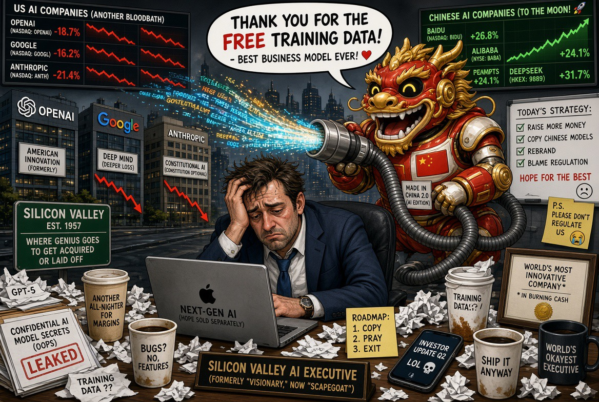

# Model Distillation: Mencuri AI atau Belajar dari AI?

*Ilustrasi (pic: Grok AI).*

  
***AS menuduh enam perusahaan China melakukan ekstraksi kemampuan model proprietary melalui distillation dalam skala industri***
  

Pada 8 September 2026, CISA, NSA, dan FBI Amerika Serikat mengeluarkan peringatan resmi bahwa enam perusahaan AI berbasis China diduga melakukan industrial-scale knowledge distillation terhadap model AI perusahaan AS. 

Enam yang disebut adalah: DeepSeek, Moonshot AI, Alibaba, MiniMax, StepFun, dan Z.AI (Zhipu AI).

Reuters juga melaporkan tuduhan tersebut dan menyebut targetnya mencakup teknologi/model dari perusahaan AS seperti Anthropic, OpenAI, Google, dan xAI. 

Washington menuduh China melakukan sesuatu yang jauh lebih subtil, yakni: Model AS → banyak query → output model → dikumpulkan → dipakai melatih model China. Ini disebut knowledge distillation.

Misalnya ada model guru:
Teacher = Claude
dan model murid:
Student = model perusahaan China
Student diberikan banyak contoh:
pertanyaan → jawaban Claude
Kemudian student belajar menghasilkan jawaban yang semakin mirip kemampuan teacher.
Secara matematis sederhananya:
Teacher(x) \rightarrow y
kemudian:
Student(x) \rightarrow y
Student tidak harus mempunyai parameter teacher.
Ia belajar dari perilaku yang keluar dari teacher.

## Kata “Mencuri” Menjadi Problematis

Distillation sendiri bukan teknologi ilegal. Ini teknik machine learning yang sah dan sangat umum.

Bahkan secara ilmiah, distillation merupakan metode klasik untuk mentransfer kemampuan model besar ke model yang lebih kecil/efisien.

Jadi, distillation tidak sama dengan pencurian. Yang dipersoalkan Amerika adalah bagaimana data distillation diperoleh dan dalam skala seperti apa.

Washington menuduh enam perusahaan tersebut menggunakan: akun dalam jumlah sangat besar, otomatisasi, jutaan atau bahkan miliaran interaksi, mekanisme untuk menghindari pembatasan akses, dan akun yang diduga palsu, untuk mengekstraksi kemampuan model AS secara sistematis. 

Jadi tuduhannya bukan: “Lo melakukan distillation.” Tetapi: “Lo menggunakan distillation sebagai operasi ekstraksi kemampuan dari model proprietary kami.”
Itu jauh lebih spesifik.

## Mengapa ini Berbahaya?

Perusahaan seperti OpenAI, Anthropic, Google, dan xAI mengeluarkan sumber daya besar untuk: GPU, data, researcher, training, reinforcement learning, evaluasi, safety, dan inference infrastructure.

Kemudian bayangkan:
Model A menghabiskan miliaran dolar untuk mencapai kemampuan tertentu.
Lalu Model B tidak harus mengulangi seluruh proses.
Ia cukup bertanya kepada A:
“Bagaimana menyelesaikan problem ini?”
berulang:
jutaan kali.
Kemudian:
output A → training data B
Secara ekonomi:
C_{replication} < C_{original\ development}
Kalau tekniknya efektif, jarak teknologi bisa dipangkas tanpa menanggung seluruh biaya R&D asli.
Itulah kenapa Washington menggunakan istilah “industrial-scale.”

## Tetapi Tuduhan AS Mempunyai Satu Lubang Epistemik Penting

Ini harus kita pisahkan dengan sangat tegas. Bukti bahwa sebuah model memiliki kemampuan mirip model lain bukan berarti bukti bahwa kemampuan itu diperoleh dengan mencuri output model tersebut.

Misalnya, Claude bisa mengerjakan matematika. Model China juga bisa mengerjakan matematika. Itu belum membuktikan “Claude dicopy.” Karena kedua model mungkin memperoleh kemampuan tersebut dari: data training yang overlap, paper ilmiah yang sama, benchmark publik, algoritme yang sama, teknik RL yang sama, atau perkembangan penelitian yang konvergen.

Untuk membuktikan distillation ilegal, diperlukan evidence of provenance, yakni dari mana training examples berasal? berapa banyak query? akun siapa? pola aksesnya bagaimana? apakah sistem sengaja menghindari kontrol? apakah output proprietary benar-benar masuk ke training pipeline?

Di sinilah tuduhan pemerintah menjadi persoalan forensik, bukan sekadar perbandingan performa.

## AS Mengatakan Skalanya Bukan Kecil

Menurut laporan Reuters, pemerintah AS menyatakan aktivitas tersebut berlangsung setidaknya sejak akhir 2024 dan menyebut penggunaan billions of tokens dalam proses ekstraksi kemampuan. 

Pemerintah AS juga mengatakan aktivitas tersebut kemungkinan berlangsung dengan awareness pemerintah China. 

Perhatikan kata “likely”. Itu berarti awareness pemerintah China adalah klaim intelijen AS, bukan fakta yang telah dibuktikan secara independen di ruang publik.

Ini penting banget. Karena ada tiga tingkat:
A. Diduga dilakukan perusahaan
B. Pemerintah China mengetahui
C. Pemerintah China mengarahkan/menyetujui 
Ketiganya bukan proposisi yang sama.

## China Membantah

Pemerintah China menolak tuduhan tersebut. Beijing berargumen bahwa distillation adalah teknik netral yang digunakan secara luas, dan menuduh Washington memakai tuduhan tersebut untuk menekan perusahaan AI China dan mempertahankan keunggulan teknologi AS. 

People’s Daily bahkan kembali mengangkat argumen bahwa AS sendiri menggunakan teknik distillation, sehingga terdapat persoalan double standard jika teknik yang sama dianggap sah ketika digunakan perusahaan AS tetapi dianggap serangan ketika dilakukan perusahaan China. 

Tetapi “AS juga melakukan distillation” tidak otomatis membuktikan tuduhan terhadap enam perusahaan China salah.

Begitu juga “CISA/FBI/NSA menuduhnya” tidak otomatis berarti seluruh tuduhan telah terbukti di pengadilan.

Kita harus menahan dua ekstrem itu sekaligus.

## Bagian Paling Menarik

Perang AI AS-China sekarang bukan cuma siapa punya GPU paling banyak? Melainkan siapa yang memiliki hak atas perilaku sebuah model? Karena model AI adalah sistem yang menghasilkan informasi, bukan hanya software tradisional.

Kalau kita memakai software: copy(binary) itu jelas. Tetapi kalau kita kepada software: “Bagaimana cara memecahkan problem X?” lalu mengumpulkan jawabannya jutaan kali, apakah jawaban tersebut data? knowledge? output? trade secret? copyright? hasil penggunaan layanan? Atau informasi yang bebas dipelajari?

Itu wilayah hukum dan epistemologi yang masih berkembang.

## Paradoks Luar Biasa

AI dibangun dari pengetahuan manusia yang tersedia sebelumnya. Lalu AI menghasilkan pengetahuan/kemampuan baru.

Kemudian AI lain belajar dari output AI pertama. Maka terbentuk:
Human\ Knowledge
\rightarrow AI_1
\rightarrow AI_2
\rightarrow AI_3
\rightarrow ...

Pertanyaannya: Pada titik mana “belajar” berubah menjadi “menyalin”?

Tidak ada garis matematis sederhana.

## Isu DeepSeek Sangat Panas

Karena DeepSeek dan perusahaan China lainnya telah menunjukkan bahwa frontier capability dapat dicapai dengan pendekatan yang berbeda dari resep Silicon Valley yang dominan.

AP mencatat bahwa perusahaan China seperti DeepSeek, Moonshot AI, Z.ai, dan Alibaba telah menghasilkan model yang bersaing dengan model perusahaan AS, sementara AS tetap unggul di sejumlah area penelitian dan model frontier. 

Jadi Washington menghadapi dua kemungkinan:

Hipotesis 1
China memang menemukan teknik yang sangat efisien.

Hipotesis 2
Sebagian kemajuan diperoleh dengan memanfaatkan output model AS secara tidak sah.

Hipotesis 3
Keduanya bisa benar sekaligus.

Sebuah perusahaan dapat melakukan inovasi genuine dan menggunakan distillation dari model lain. Tidak ada kontradiksi.

## Perang Pengetahuan

Ini sebenarnya bukan cuma perang teknologi. Ini perang terhadap epistemic moat.

Perusahaan frontier memiliki model, data, compute, engineering, feedback, dan user interactions yang menciptakan moat.

Kalau kompetitor dapat melakukan: API, millions of queries, synthetic training data, maka sebagian moat itu bisa terkikis.

Jadi yang sedang diperebutkan bukan cuma model weights, tetapi behavioral knowledge encoded in model outputs. Dan ini nyambung banget dengan tulisan saya sebelumnya tentang “AI yang Tidak Tahu Mengapa Ia Tahu.”

Karena sekarang muncul pertanyaan baru: Kalau sebuah model tidak memberikan parameter internalnya, tetapi memberikan jutaan jawaban yang mengungkap sebagian perilakunya, berapa banyak “pengetahuan internal” yang sebenarnya dapat diekstraksi dari perilakunya?

Nah, itu pertanyaan yang jauh lebih dalam daripada sekadar “China nyolong model Amerika”.

Verdict Ilmiahnya adalah AS menuduh enam perusahaan China melakukan ekstraksi kemampuan model proprietary melalui distillation dalam skala industri, dengan cara yang menurut pemerintah AS melanggar ketentuan akses dan merupakan pencurian teknologi.

Dan sampai sekarang, yang tersedia secara publik adalah tuduhan pemerintah AS dan bantahan China, bukan putusan hukum final yang menetapkan keenam perusahaan tersebut terbukti melakukan pencurian model. Reuters juga mencatat bahwa China menolak tuduhan tersebut. 

  
**Referensi**

CISA, NSA, & FBI. (2026, September 8). China-based artificial intelligence companies conducting industrial-scale knowledge distillation of U.S. AI models. 

Reuters. (2026, September 8). U.S. accuses Chinese AI firms of “malicious” copying of AI technology. 

Al Jazeera. (2026, September 9). China slams US claims of “industrial-scale” AI theft. 

Reuters. (2026, September 15). AI is not a “monopoly of great powers”, China’s top newspaper says. 
