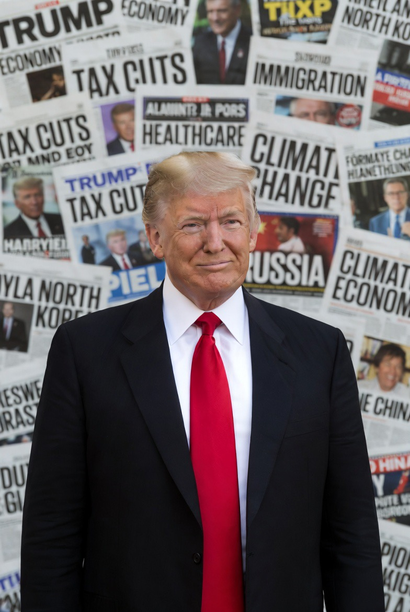

# Politik Berbasis Persepsi: Tarif, Retorika Rasial, dan Personalization of Power dalam Era Trump

*Ilustrasi Presiden AS Donald Trump (pic: Grok AI).*

  
***Masalahnya adalah sistem internasional sekarang memberi ruang besar bagi keputusan berbasis persepsi individu***
  

Politik global sekarang memang terasa seperti reality show mahal dengan nuklir sebagai properti panggung. 

Banyak pemimpin memainkan emosi publik seperti DJ memutar playlist. Bedanya, kalau DJ salah lagu, cuma dance floor yang kosong. Kalau pemimpin salah kalkulasi, dunia bisa ikut terbakar.

Periode awal pemerintahan kedua Donald Trump ditandai oleh gaya kepemimpinan yang sangat personal dalam kebijakan ekonomi dan komunikasi politik. 

Tulisan ini menganalisis fenomena tersebut melalui tiga aspek: kebijakan tarif sebagai instrumen tekanan politik, retorika publik yang kontroversial, dan implikasi terhadap tatanan politik global. 

Analisis menunjukkan bahwa personalisasi kekuasaan meningkatkan ketidakpastian diplomatik sekaligus memperkuat politik populis.

## Pendahuluan

Dalam teori politik modern, kebijakan ekonomi negara biasanya dibingkai sebagai hasil kalkulasi institusional dan kepentingan nasional. Namun, dalam beberapa kasus, kebijakan tersebut sangat dipengaruhi oleh preferensi pribadi pemimpin.

Era Trump sering dijadikan contoh fenomena ini, terutama dalam:

•	penggunaan tarif sebagai alat negosiasi politik,

•	komunikasi publik yang konfrontatif,

•	konflik diplomatik dengan sekutu.

Fenomena ini disebut dalam ilmu politik sebagai: personalized executive decision-making.

## Metodologi

Pendekatan analisis:

•	studi kebijakan perdagangan internasional

•	analisis wacana politik

•	studi hubungan internasional kontemporer

Sumber utama berasal dari laporan kebijakan perdagangan AS, pernyataan publik Trump, dan analisis geopolitik 2025–2026.

## Kajian Teoritik

1. Tarif sebagai Instrumen Politik, bukan Ekonomi

Trump secara konsisten menggunakan tarif sebagai alat tekanan diplomatik.

Contohnya:

•	ancaman tarif terhadap negara Eropa terkait konflik Greenland

•	tarif terhadap mitra dagang Iran

•	kebijakan “reciprocal tariffs”

Dalam teori hubungan internasional, ini dikenal sebagai: economic coercion diplomacy.

Tarif berubah fungsi dari instrumen proteksi industri menjadi alat negosiasi geopolitik.

Trump bahkan mengaitkan tarif dengan loyalitas politik sekutu, bukan sekadar neraca perdagangan.  

2. Politik Persepsi dan Retorika Kontroversial

Dalam politik populis, komunikasi simbolik sering lebih penting daripada kebijakan itu sendiri.

Kontroversi visual rasis di media sosial (Gambar Obama-Michelle sebagai kera di Truth Social) dan penolakan meminta maaf menunjukkan pola:

•	politik identitas

•	provokasi komunikasi

•	mobilisasi basis pendukung

Dalam teori populisme modern, ini disebut: performative polarization.

Pemimpin tidak hanya membuat kebijakan, tetapi menciptakan konflik simbolik untuk mempertahankan dukungan politik.

3. Dampak terhadap Tatanan Global

Gaya kepemimpinan yang sangat personal menciptakan ketidakpastian global.

Contoh kritik internasional muncul dalam forum ekonomi global, ketika pemimpin negara lain memperingatkan bahwa:

•	tarif digunakan sebagai senjata geopolitik

•	sistem internasional menjadi tidak stabil

•	aliansi tradisional mengalami tekanan  

Dalam teori sistem internasional, ini disebut: erosion of rules-based order.

Atau dalam bahasa sederhana:
aturan global mulai terasa seperti karet gelang yang ditarik terlalu jauh.

## Analisis

Ada tiga kesimpulan penting:

A. Kebijakan berbasis emosi bukan hal baru

Sejarah politik penuh dengan keputusan berbasis persepsi pribadi pemimpin.

Bedanya sekarang:
media sosial membuatnya terlihat langsung dan mentah.

B. Tarif menjadi alat simbol kekuasaan

Tarif di era Trump berfungsi sebagai:

•	alat ekonomi

•	alat diplomasi

•	alat politik domestik

Campuran tiga fungsi ini membuat kebijakan terlihat tidak konsisten.

C. Politik global memasuki fase personalisasi kekuasaan

Banyak pemimpin dunia kini menggunakan gaya serupa:

•	keputusan cepat

•	komunikasi provokatif

•	kebijakan transaksional

Dunia bergerak dari institusi → individu. Itu perubahan besar.

Fenomena “tarif berdasarkan perasaan” bukan sekadar kontroversi pribadi seorang presiden, tetapi gejala transformasi politik global menuju kepemimpinan yang lebih personal dan populis.

Masalahnya bukan hanya Trump.

Masalahnya adalah sistem internasional sekarang memberi ruang besar bagi keputusan berbasis persepsi individu.

Dan sejarah menunjukkan satu hal:
politik yang terlalu personal cenderung tidak stabil.

  
**Referensi**

China Briefing. (2026). US-China relations in the Trump 2.0 era.

Carney, M. (2026). Principled and pragmatic: Canada’s path. World Economic Forum.

Greenland crisis. (2026). Geopolitical developments during Trump administration.

Liberation Day tariffs. (2025). U.S. tariff policy announcement.
