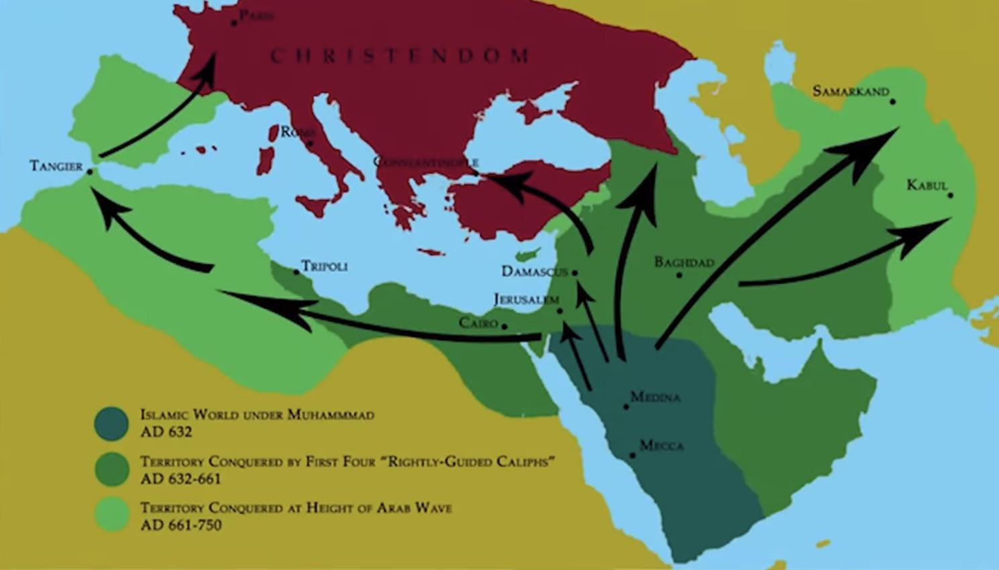

# Moralitas, Ekspansi, dan Arsitektur Kolonial Global: Komparasi Ekspansi Islam Awal dan Kolonialisme Eropa Modern dalam Perspektif Sejarah Politik

*Ilustrasi (pic: Grok AI).*

  
***Dinamika kekuasaan manusia yang kompleks, di mana moralitas sering kali berfungsi sebagai legitimasi, bukan determinan utama praktik***
  

Artikel ini menganalisis perbedaan mendasar antara ekspansi dunia Islam awal (abad ke-7 hingga ke-13) dan kolonialisme Eropa modern (abad ke-15 hingga ke-20), dengan fokus pada dimensi moralitas, struktur kekuasaan, dan dampak demografis. 

Studi ini menunjukkan bahwa meskipun kedua peradaban menggunakan legitimasi religius, praktik ekspansi Islam cenderung bersifat integratif dan berbasis kontrol politik, sementara kolonialisme Eropa berkembang menjadi sistem global yang eksploitatif dan sering kali destruktif. 

Perjanjian seperti Treaty of Tordesillas dan Sykes–Picot Agreement menunjukkan evolusi kolonialisme menuju pembagian dunia secara abstrak sebelum penguasaan fisik.

## Pendahuluan

Ekspansi wilayah merupakan fenomena universal dalam sejarah manusia. Namun, tidak semua ekspansi memiliki karakteristik yang sama. 

Perbedaan antara ekspansi dunia Islam dan kolonialisme Eropa tidak hanya terletak pada metode, tetapi juga pada skala, struktur, dan konsekuensi jangka panjangnya.

Pertanyaan utama dalam studi ini adalah:
apakah ekspansi berbasis agama menghasilkan praktik yang lebih bermoral dibanding ekspansi berbasis ekonomi dan kekuasaan global?

## Landasan Teoretis

Studi ini menggunakan tiga kerangka utama:

1.	Imperial Governance Theory

Menjelaskan bagaimana kekuasaan mengelola wilayah taklukan.

2.	Colonialism vs. Settler Colonialism

Membedakan antara penguasaan wilayah dan penggantian populasi.

3.	Legitimasi Religius dalam Kekuasaan

Menjelaskan bagaimana agama digunakan sebagai justifikasi politik.

## Ekspansi Dunia Islam: Integrasi dan Hierarki

Ekspansi awal dunia Islam ditandai oleh:

•	penaklukan militer cepat

•	integrasi administratif wilayah

•	keberlanjutan populasi lokal

Sistem seperti dhimmi memungkinkan:

•	komunitas non-Muslim tetap hidup

•	dengan kewajiban pajak khusus

Karakteristik utama:

•	tidak terjadi penggantian populasi besar-besaran

•	struktur sosial tetap plural, meski hierarkis

•	kekuasaan lebih fokus pada kontrol politik dan fiskal

Namun demikian, ekspansi ini tetap melibatkan:

•	kekerasan militer

•	dominasi politik

•	ketimpangan status sosial

## Kolonialisme Eropa: Globalisasi Kekuasaan dan Eksploitasi

Kolonialisme Eropa berkembang dalam konteks revolusi maritim dan kapitalisme awal.

Ciri utama:

•	ekspansi lintas benua

•	eksploitasi sumber daya

•	migrasi populasi besar-besaran

Contoh ekstrem:

•	depopulasi penduduk asli di Amerika

•	marginalisasi Aborigin di Australia

•	eksploitasi ekonomi di Afrika

Perjanjian seperti Treaty of Tordesillas menunjukkan bahwa: dunia dapat dibagi secara konseptual sebelum dijajah.

Sementara Sykes–Picot Agreement mencerminkan: pembagian geopolitik modern tanpa mempertimbangkan realitas lokal.

## Moralitas sebagai Legitimasi

Baik ekspansi Islam maupun kolonialisme Eropa menggunakan agama sebagai legitimasi.

Namun terdapat perbedaan penting:

Dunia Islam:

•	agama sebagai kerangka hukum dan administrasi

•	integrasi sosial berbasis hierarki

Eropa:

•	agama sebagai justifikasi ekspansi

•	praktik sering bertentangan dengan ajaran moral yang diklaim

Fenomena ini menunjukkan bahwa:

👉 agama tidak selalu menentukan praktik

👉 tetapi sering menjadi alat legitimasi kekuasaan

## Perbedaan Struktural Utama

| Aspek | Ekspansi Islam | Kolonialisme Eropa |
|--------|--------|--------|
| Skala  | Regional  | Global  |
| Tujuan  | Politik & agama  | Ekonomi & dominasi global  |
| Populasi | Dipertahankan | Sering diganti |
| Struktur | Integratif-hierarkis | Eksploitatif-transformatif |
| Dampak | Relatif stabil | Disrupsi besar |

## Antara Moral dan Kesempatan

Perbedaan antara kedua sistem tidak semata-mata disebabkan oleh moralitas.

Faktor penting:

•	teknologi

•	kapasitas militer

•	sistem ekonomi global

Kolonialisme Eropa menjadi lebih destruktif bukan hanya karena niat, tetapi karena memiliki kemampuan untuk melakukan transformasi global secara masif.

Ekspansi dunia Islam dan kolonialisme Eropa merupakan dua bentuk kekuasaan yang berbeda dalam struktur dan dampaknya. 

Meskipun keduanya menggunakan legitimasi religius, kolonialisme Eropa berkembang menjadi sistem global yang lebih eksploitatif dan destruktif secara demografis.

Namun, penting untuk dicatat bahwa kedua sistem tetap merupakan bagian dari dinamika kekuasaan manusia yang kompleks, di mana moralitas sering kali berfungsi sebagai legitimasi, bukan determinan utama praktik.

  
**Referensi**

International Institute for Strategic Studies. (2025). The Military Balance 2025. London.

Brookings Institution. (2024). Colonial Legacies and Global Order. Washington, DC.

Oxford University Press. (2023). Empires and World History. Oxford.

Cambridge University Press. (2022). Islamic Empires and European Expansion. Cambridge.
