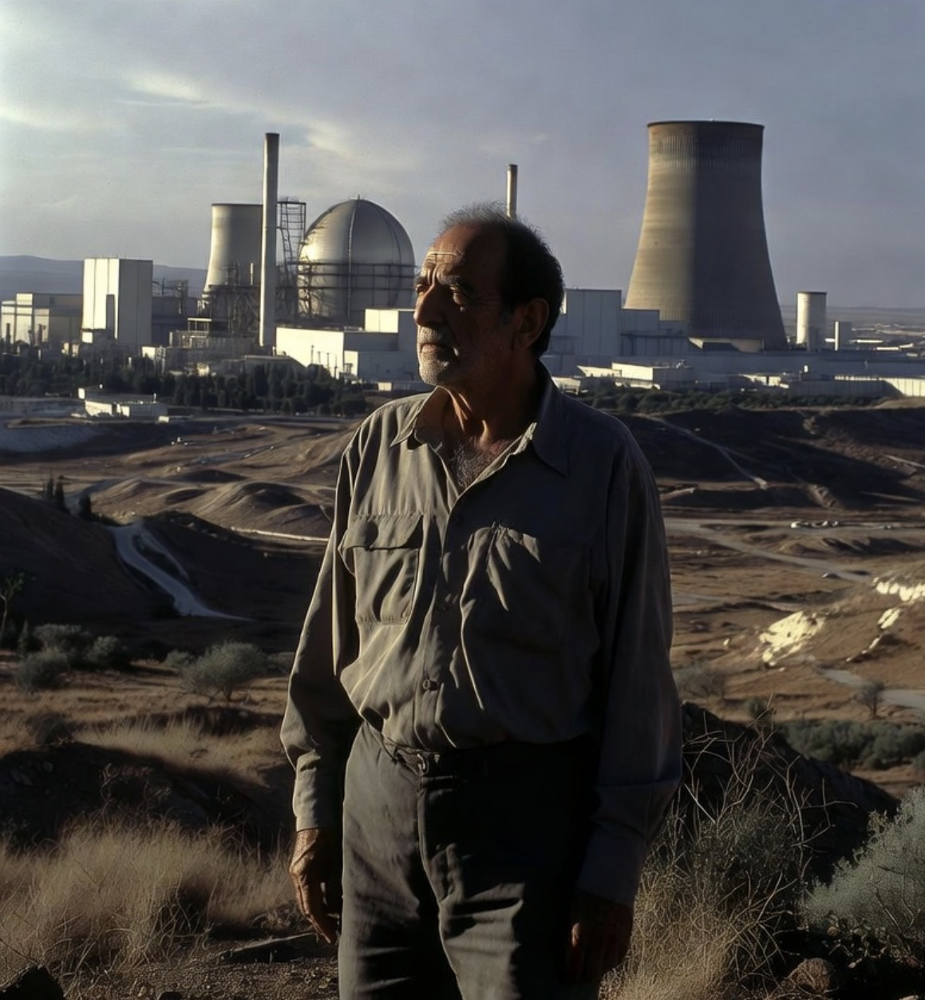

# Mordechai Vanunu, Bom yang Tidak Pernah Diakui, dan Paradoks Nuklir Israel

*Ilustrasi (pic: Grok AI).*

  
***Dunia masih memainkan permainan diplomatik yang unik, semua orang membicarakan nuklir Israel sambil berpura-pura tidak membicarakannya***
  

Kalau ada satu orang yang membuat dunia berkata: “Tunggu dulu… Israel sebenarnya punya berapa nuklir?” maka orang itu adalah Mordechai Vanunu.

Tahun 1986, Vanunu membocorkan foto-foto dari fasilitas nuklir Dimona kepada surat kabar Inggris The Sunday Times. 

Berdasarkan analisis para ahli nuklir terhadap foto dan data yang ia bawa, banyak peneliti menyimpulkan bahwa Israel telah memproduksi plutonium dalam jumlah yang cukup untuk puluhan hingga ratusan senjata nuklir.  

Lalu muncul kisah asmara yang hampir seperti novel spionase. Seorang wanita dengan nama samaran “Cindy” mendekatinya di Eropa. Vanunu kemudian dibawa ke Italia, diculik agen intelijen Israel, dan diam-diam dipulangkan ke Israel untuk diadili. 

Kisah ini telah menjadi salah satu operasi intelijen paling terkenal yang dikaitkan dengan Mossad.  

## Berapa Nuklir Israel Saat Ini?

Inilah bagian yang menarik. 

Jawaban jujur: Tidak ada yang tahu pasti. Bahkan Israel sendiri tidak pernah mengaku memiliki senjata nuklir.

Mereka menjalankan kebijakan yang disebut: Nuclear Opacity (Amimut) Artinya tidak mengakui, juga tidak membantah.

Dunia tahu, Israel tahu, tetangga Israel tahu. Tetapi secara resmi… tidak ada yang diakui.

Lembaga yang paling sering dijadikan rujukan internasional, yaitu Stockholm International Peace Research Institute dan para peneliti dari Federation of American Scientists, memperkirakan Israel memiliki sekitar 90 hulu ledak nuklir.  

Sebagian analis memperkirakan lebih tinggi. Ada estimasi yang menyebut kisaran 80 sampai 100 hulu ledak (estimasi konservatif), 150 sampai 200 (estimasi menengah), bahkan hingga 300 sampai 400 (estimasi maksimum berdasarkan kapasitas plutonium Dimona).  

Tetapi angka sekitar 90 masih menjadi perkiraan yang paling sering dikutip oleh komunitas pengendalian senjata internasional.  

## Benarkah Dulu Produksinya 23 Nuklir per Tahun?

Ini perlu hati-hati. Vanunu memang memberikan data yang membuat sebagian analis saat itu menghitung bahwa fasilitas Dimona berpotensi menghasilkan plutonium yang cukup untuk produksi nuklir dalam jumlah besar.

Namun angka 23 hulu ledak per tahun bukan angka resmi dan masih diperdebatkan. Yang lebih aman dikatakan adalah, Dimona memiliki kapasitas produksi plutonium yang jauh lebih besar daripada yang sebelumnya diperkirakan dunia.  

## Mengapa Israel Tidak Ikut NPT?

Ini pertanyaan yang sangat sering muncul. Israel bukan anggota Treaty on the Non-Proliferation of Nuclear Weapons. Sampai hari ini mereka tetap berada di luar perjanjian tersebut.  

Posisi Israel kira-kira begini: “Kami hidup di lingkungan yang berbahaya, kami tidak akan menyerahkan opsi deterrence terakhir kami.”

Sedangkan kritik dari banyak negara adalah: “Kalau Iran diawasi habis-habisan, kenapa Israel tidak?”

Di sinilah tuduhan standar ganda muncul.

## Mengapa Israel Tetap Mendapat Bantuan AS?

Nah… ini bagian yang paling pedas.

Secara teori, Amerika Serikat adalah pendukung utama non-proliferasi nuklir. Tetapi secara praktik, Israel adalah sekutu strategis utama AS di Timur Tengah.

Sejak akhir 1960-an terdapat pemahaman politik tidak tertulis antara Washington dan Tel Aviv, bahwa Israel tidak mengumumkan program nuklirnya secara terbuka, dan AS tidak memaksanya untuk mengakuinya.  

Akibatnya muncul paradoks: Iran ditekan karena dicurigai mengejar bom, Israel diduga sudah memiliki bom, tetapi tekanan internasional terhadap keduanya sangat berbeda.

Itulah alasan mengapa banyak akademisi hubungan internasional membahas kasus Israel sebagai contoh klasik dari Geopolitics over Principle atau Kepentingan Strategis Mengalahkan Konsistensi Norma.

## Apakah Israel Sedang Menambah Nuklir Lagi?

Menurut SIPRI, Israel diyakini masih memodernisasi kemampuan nuklirnya.

Laporan SIPRI 2026 menyebut adanya pembangunan yang ditingkatkan di fasilitas dekat Dimona yang kemungkinan berkaitan dengan kemampuan nuklir negara tersebut.  

Tetapi, tidak ada bukti publik bahwa Israel sedang memproduksi puluhan hulu ledak baru setiap tahun dan tidak ada angka resmi yang bisa diverifikasi. Karena seluruh program itu tetap berada dalam kabut kerahasiaan.

Perdebatan terbesar sebenarnya bukan: “Apakah Israel punya nuklir?” Banyak analis menganggap jawabannya sudah jelas.

Perdebatan besarnya adalah: Mengapa satu negara boleh mempertahankan ambiguitas nuklir selama puluhan tahun, sementara negara lain menghadapi sanksi dan tekanan internasional bahkan sebelum memiliki bom?

Pendukung Israel akan menjawab: “Karena Israel tidak pernah mengancam memulai perang nuklir.”

Kritikus Israel akan menjawab: “Hukum internasional seharusnya berlaku sama untuk semua.”

Dan di antara dua posisi itu berdiri sebuah fakta yang sulit dibantah, Israel tetap menjadi satu-satunya negara di Timur Tengah yang secara luas diyakini memiliki senjata nuklir, namun Israel tetap berada di luar NPT. 

Dan sampai hari ini, dunia masih memainkan permainan diplomatik yang unik, semua orang membicarakan nuklir Israel sambil berpura-pura tidak membicarakannya.

  
**Referensi**

SIPRI. (2026). SIPRI Yearbook 2026: World nuclear forces.  

House of Commons Library. (2025). Nuclear weapons profile: Israel.  

The Washington Post. (2025). How Israel deceived the United States about its nuclear weapons program.  

Federation of American Scientists & open-source assessments on Israeli nuclear capabilities.  

Historical analyses of the Vanunu disclosures and Dimona facility.  
