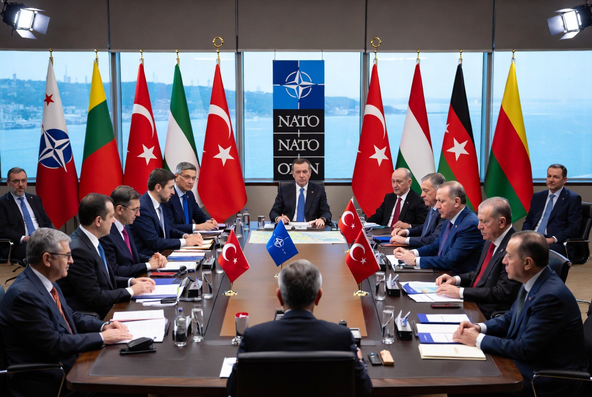

# NATO, Trump, dan Iran: Diplomasi Sekutu atau Politik Ketergantungan?

*Ilustrasi (pic: Grok AI).*

  
***“Dalam aliansi militer, pujian kadang merupakan bahasa diplomasi, bukan selalu bahasa kekaguman.”***
  

Jika muncul pertanyaan, mengapa banyak pemimpin NATO tampak ramah kepada Trump? Maka jawabannya sederhana, hal itu terjadi  karena Amerika Serikat adalah pilar utama NATO.

Secara kasar, AS menyumbang porsi terbesar kemampuan militer NATO, memiliki payung nuklir NATO, menyediakan intelijen strategis, logistik, transportasi militer, dan komando operasi.

Tanpa Amerika, NATO memang tetap ada. Tetapi kekuatan militernya akan jauh berkurang.

Maka secara diplomatik, menjaga hubungan baik dengan Washington merupakan kepentingan hampir semua anggota.

## Apakah Mereka Takut?

Kata “takut” mungkin terlalu sederhana. Sebab dalam hubungan internasional, yang lebih tepat adalah dependensi strategis.

Kalau sebuah negara sangat bergantung pada senjata, radar, satelit, sistem rudal, serta intelijen, maka ia akan berhitung sangat hati-hati terhadap negara pemasoknya.

Itulah logika aliansi.

## Mengapa NATO Tidak Langsung Ikut Melawan Iran?

Ini justru menarik. NATO bukan berarti: “Amerika berperang, semua anggota otomatis ikut.” Tidak demikian.

Perjanjian NATO melalui Pasal 5 berlaku jika salah satu anggota diserang, dan penerapannya tetap memerlukan keputusan politik.

Jika operasi AS terhadap Iran dipandang sebagai tindakan yang tidak termasuk kewajiban pertahanan kolektif NATO, negara-negara anggota dapat memilih tidak terlibat.

Artinya, kepentingan nasional masing-masing tetap berperan.

## Apakah Eropa Mulai Lebih Mandiri?

Dalam beberapa tahun terakhir memang muncul dorongan agar Eropa meningkatkan kemampuan pertahanannya sendiri.

Alasannya antara lain: ketidakpastian arah kebijakan AS, perang Ukraina, dan kebutuhan memiliki kapasitas strategis yang lebih besar.

Ini bukan berarti Eropa “melawan” Amerika, melainkan berusaha mengurangi ketergantungan yang terlalu besar.

Ada perubahan menarik dalam NATO abad ke-21. Dulu, musuh utama jelas: Uni Soviet. Sekarang, ancamannya jauh lebih beragam mulai dari Rusia, terorisme, serangan siber, keamanan energi, Laut Merah, Indo-Pasifik, hingga kecerdasan buatan.

Akibatnya, tidak semua anggota melihat Iran sebagai ancaman utama dengan tingkat urgensi yang sama.

Sebagian negara Eropa mungkin lebih fokus pada Rusia, sementara sebagian lagi lebih mengkhawatirkan stabilitas energi, sedangkan sebagian lainnya berusaha menghindari konflik baru di Timur Tengah.

Ini pertanda bahwa anggota NATO tidak gampang terprovokasi lagi, sebab mereka ingin menghindari perang regional yang lebih luas, memiliki penilaian intelijen yang berbeda,  menghadapi tekanan politik domestik dari masyarakat yang lelah dengan konflik, atau mereka menilai prioritas keamanan mereka tetap berada di Eropa Timur.

Dalam ilmu politik, beberapa penjelasan bisa sama-sama rasional tanpa harus saling meniadakan.

NATO hari ini bukan sedang meninggalkan Amerika Serikat, tetapi sedang belajar bahwa menjadi sekutu tidak selalu berarti mengikuti setiap langkah Washington.

Aliansi yang matang bukanlah aliansi yang selalu berkata “ya”, melainkan aliansi yang mampu mendukung kepentingan bersama sambil tetap mempertahankan ruang bagi penilaian politik masing-masing anggota.

Satu ironi klasik dalam politik internasional, bahwa negara besar sering berharap sekutunya loyal, sedangkan sekutu berharap negara besar tetap memberi perlindungan tanpa menyeret mereka ke setiap konflik. 

Menjaga keseimbangan dua harapan itu adalah salah satu pekerjaan diplomasi yang paling sulit.

  
**Referensi**

NATO. (2026). North Atlantic Treaty & Summit Communiqués.

Reuters. (2026). Coverage of the 2026 NATO Summit and allied defense commitments.

The Tragedy of Great Power Politics. (2014). W. W. Norton.

Alliance Politics. (1997). Cornell University Press.

The Origins of Alliances. (1987). Cornell University Press.
