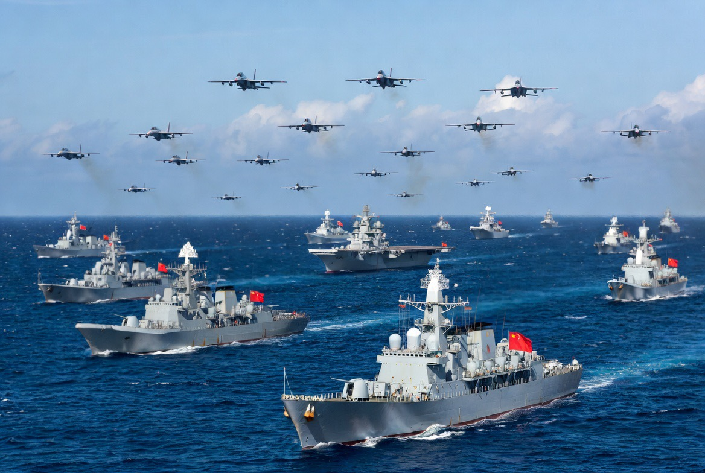

# Naga di Laut Selatan: Mengapa China Terus Memperlihatkan Otot Militernya?

*Ilustrasi (pic: Grok AI).*

  
***Sementara AS, Iran, dan Israel sibuk berdamai dan bertengkar di Timur Tengah, China sedang membentuk aturan main baru di Asia***
  

Banyak orang mengira Laut China Selatan hanya tentang sengketa pulau. Padahal lebih dari itu, di sana terdapat jalur perdagangan senilai triliunan dolar, jalur energi Asia Timur, wilayah kaya ikan, kemungkinan cadangan minyak dan gas, serta posisi strategis untuk kapal selam nuklir.

Karena itu, siapa yang dominan di Laut China Selatan, akan memiliki pengaruh besar di Asia Pasifik.  

## Mengapa China Makin Aktif Tahun 2026?

Karena Beijing melihat ada tiga tekanan besar: 

1. AS semakin aktif

AS memperkuat aliansi dengan Filipina, lalu latihan militer bersama Jepang dan Australia, kemudian mengirim kapal perang demi meningkatkan kerja sama keamanan dengan Taiwan.  

Bagi China, ini bukan pertahanan, tetapi upaya pengepungan strategis.

2. Taiwan semakin berani

Presiden Taiwan, Lai Ching-te, baru-baru ini mengatakan bahwa Taiwan tidak akan tunduk pada tekanan Beijing dan berharap paket senjata baru AS segera disetujui.  

China membalas dengan menyebut Lai adalah separatis. Jadi Laut China Selatan dan Taiwan kini saling terkait.

3. China ingin menunjukkan: “Aku tidak terdistraksi oleh Timur Tengah.”

Ini menarik, saat AS sibuk Ukraina, Timur Tengah, Iran, dan Israel. China mungkin ingin mengirim pesan:“Jangan kira aku kehilangan fokus di Indo-Pasifik.”

Bukan berarti waspada karena damai Iran. Tetapi justru memanfaatkan momen ketika perhatian AS terbagi.

## Apakah Ini Ancaman Perang?

Belum.

Namun ada konsep dalam ilmu hubungan internasional yang disebut Gray Zone Warfare, yaitu berkompetisi tanpa benar-benar perang.

Contohnya kapal coast guard, kapal riset, kapal nelayan, patroli udara, latihan militer, sanksi ekonomi, dan perang informasi.

China sangat ahli memainkan ini.  Tujuannya agar membuat kehadirannya menjadi “normal” sampai lawan terbiasa.

China sedang mengamati. Ia melihat AS berdamai dengan Iran, Israel kesal, Timur Tengah belum stabil. Lalu Beijing mungkin berpikir: Kalau AS terlalu sibuk di Timur Tengah… siapa yang menjaga Indo-Pasifik?

Makanya China meningkatkan patroli, memperlihatkan armada, menguji respons tetangga, dan mengukur seberapa jauh AS bisa membagi fokusnya.

Ini bukan perang ini seperti pertandingan catur. Bedanya, bidaknya adalah kapal perang, jet tempur, satelit, ekonomi, dan kesabaran.

## Jadi Apa Tujuan Sebenarnya?

Strategi China tahun 2026:

1. Mengusir dominasi AS secara perlahan

Bukan dengan perang besar, tetapi dengan “membuat AS terlalu mahal untuk mempertahankan pengaruhnya.”

2. Mengamankan Taiwan dan Laut China Selatan

Karena bagi Beijing, Taiwan bukan sekadar pulau. Melainkan ujian legitimasi nasional.

3. Menunjukkan bahwa China adalah kekuatan global, bahkan ketika dunia sibuk dengan Ukraina, Iran, Israel, dan NATO.

China memang sedang meningkatkan aktivitas militernya. Dan mungkin… tujuannya bukan untuk memulai perang. Melainkan untuk berkata kepada dunia: “Sementara kalian sibuk berdamai dan bertengkar di Timur Tengah, aku sedang membentuk aturan main baru di Asia.” 

  
**Referensi**

Reuters. (2026, June 6). Taiwan says Chinese coast guard, research ships near key South China Sea islands.  

Reuters. (2026, April 24). China holds live-fire drills in waters near Philippines’ Luzon Island.  

Reuters. (2026, June 18). Taiwan not provoking China, hopes US arms sale package can be approved soon, president says.  

Reuters. (2026, June 9). Philippines takes diplomatic action against China over floating structure in South China Sea.  

Reuters. (2026, April 13). US, Australia, Philippines hold second joint drills in South China Sea this year. 
