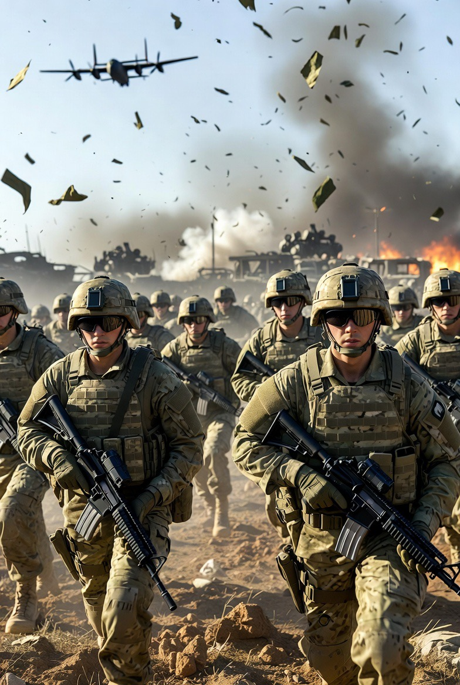

# Negara Kuat, Narasi Perang, dan Operasi Psikologis: Analisis Strategi Pembentukan Realitas dalam Konflik Modern

*Ilustrasi perang negara kuat (pic: Grok AI).*

  
***Bagian yang jarang diakui secara terbuka oleh negara mana pun: perang modern sering dimulai bukan dengan peluru pertama, tetapi dengan cerita pertama***
  

Dalam konflik modern, kekuatan militer tidak lagi menjadi satu-satunya instrumen dominasi. 

Negara kuat juga membangun narasi strategis melalui propaganda, operasi psikologis (psychological operations), disinformasi, dan teknik manipulasi persepsi seperti false flag operations. 

Studi ini menganalisis bagaimana negara menggunakan kontrol informasi untuk mempengaruhi opini publik domestik maupun internasional. 

Dengan pendekatan studi keamanan internasional dan teori konstruktivisme, penelitian ini menunjukkan bahwa kemampuan membentuk persepsi seringkali sama pentingnya dengan kemampuan militer itu sendiri. 

Narasi konflik dapat menentukan legitimasi perang, membentuk identitas musuh, dan mempengaruhi dukungan global terhadap suatu tindakan militer.

## Pendahuluan

Sejak abad ke-20, perang mengalami transformasi fundamental. Konflik tidak hanya berlangsung di medan tempur, tetapi juga di ruang informasi.

Ahli strategi militer sering mengutip prinsip sederhana:

“Perang dimenangkan bukan hanya dengan senjata, tetapi dengan siapa yang mengendalikan cerita tentang perang.”

Konsep ini tercermin dalam berbagai praktik seperti:

•	propaganda negara

•	psychological warfare

•	operasi disinformasi

•	framing media internasional

Fenomena ini semakin intens dalam era digital ketika informasi menyebar secara instan melalui media global dan media sosial.

## Strategic Narrative Theory

Teori strategic narrative menjelaskan bahwa negara berusaha membangun cerita koheren tentang konflik untuk mempengaruhi interpretasi publik terhadap peristiwa internasional.

Narasi ini biasanya berisi tiga elemen:

1.	Identitas aktor (siapa yang baik dan siapa yang jahat)

2.	legitimasi tindakan militer

3.	tujuan moral dari konflik

Dengan kata lain, perang bukan hanya perebutan wilayah, tetapi juga perebutan makna.

## Psychological Warfare

Operasi psikologis adalah upaya sistematis untuk mempengaruhi emosi, motivasi, dan persepsi lawan.

Tujuannya dapat berupa:

•	melemahkan moral musuh

•	memecah dukungan internal

•	mempengaruhi opini publik internasional

•	memperkuat legitimasi pemerintah sendiri

Selama Perang Dunia II dan Perang Dingin, operasi psikologis menjadi bagian integral dari strategi militer negara besar.

## False Flag Operations

False flag adalah operasi rahasia di mana pelaku sebenarnya menyamarkan identitasnya agar serangan tampak dilakukan oleh pihak lain.

Tujuan utama false flag meliputi:

•	menciptakan alasan untuk perang

•	mendiskreditkan lawan

•	memobilisasi dukungan publik

Dalam sejarah, beberapa operasi semacam ini kemudian terungkap melalui dokumen deklasifikasi atau penyelidikan historis.

## Propaganda dan Kontrol Narasi

Dalam sistem internasional, negara kuat memiliki keunggulan besar dalam membentuk narasi karena:

1. Dominasi media global

Negara dengan pengaruh media besar dapat membingkai konflik melalui:

•	jaringan berita internasional

•	produksi informasi resmi

•	diplomasi publik

Akibatnya, persepsi global sering terbentuk berdasarkan framing tertentu.

2. Infrastruktur intelijen

Badan intelijen modern tidak hanya mengumpulkan informasi, tetapi juga melakukan:

•	operasi disinformasi

•	propaganda digital

•	pengaruh terhadap opini publik

Ini membuat batas antara operasi militer dan operasi informasi menjadi semakin kabur.

3.Keunggulan teknologi komunikasi

Era digital memungkinkan negara untuk melakukan:

•	cyber propaganda

•	manipulasi algoritma media sosial

•	kampanye informasi berskala global

Perang informasi kini menjadi komponen utama konflik geopolitik.

## Dampak terhadap Politik Internasional

Dominasi narasi memiliki konsekuensi serius bagi sistem internasional.

1. Legitimasi perang

Jika sebuah negara berhasil membingkai tindakan militernya sebagai pertahanan diri, maka dukungan internasional lebih mudah diperoleh.

Sebaliknya, negara yang kalah dalam perang narasi sering kehilangan legitimasi global.

2. Polarisasi opini publik

Perang informasi menciptakan fragmentasi opini publik global.

Akibatnya:

•	fakta sering diperdebatkan

•	propaganda bercampur dengan berita

•	masyarakat sulit membedakan informasi yang valid

3. Erosi kepercayaan terhadap institusi internasional

Ketika narasi konflik saling bertentangan, institusi internasional seperti organisasi multilateral sering mengalami krisis legitimasi karena dianggap bias oleh pihak tertentu.

Konflik modern menunjukkan bahwa kekuatan negara tidak hanya diukur dari kemampuan militernya, tetapi juga dari kemampuannya membentuk persepsi global tentang konflik.

Dalam banyak kasus, negara yang mengendalikan narasi memiliki keuntungan strategis yang signifikan.

Dengan demikian, perang abad ke-21 dapat dipahami sebagai kombinasi antara perang kinetik dan perang informasi, di mana medan tempurnya mencakup tidak hanya wilayah geografis tetapi juga ruang kognitif masyarakat global.

  
**Referensi**

Arquilla, J., & Ronfeldt, D. (1999). The emergence of noopolitik: Toward an American information strategy. RAND Corporation.

Bennett, W. L., & Livingston, S. (2018). The disinformation order. European Journal of Communication, 33(2), 122–139.

Freedman, L. (2013). Strategy: A history. Oxford University Press.

Rid, T. (2020). Active measures: The secret history of disinformation and political warfare. Farrar, Straus and Giroux.

Robinson, P., Goddard, P., Parry, K., & Murray, C. (2018). Pockets of resistance: British news media, war and theory in the 2003 invasion of Iraq. Manchester University Press.

Taylor, P. M. (2003). Munitions of the mind: A history of propaganda. Manchester University Press.
