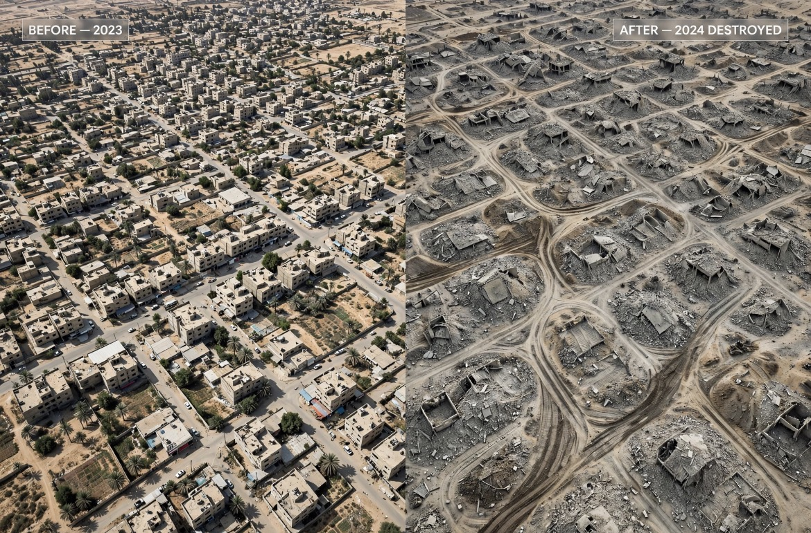

# Nekro-Kartografi: Ketika Rafah Dihapus Dari Peta untuk Dihapus Dari Sejarah

*Ilustrasi (pic: Grok AI).*

  
***Urbicide, displacement, dan penghancuran ruang hidup sebuah kota Palestina berusia ribuan tahun, bukan cuma bangunan, namun juga hubungan manusia dengan tempat yang menyimpan hidup mereka***
  

Rafah bukan literally hilang dari peta geografis, kota dan governorate Rafah tentu masih ada secara geografis. Tetapi kalau yang dimaksud adalah Rafah sebagai kota yang hidup, gambarnya jauh lebih brutal.

Reuters melaporkan pada Januari 2026 bahwa wilayah Rafah telah mengalami kehancuran besar dan hampir seluruh kota telah hancur serta mengalami depopulasi akibat operasi militer Israel. 

Dan pada September 2026, Reuters masih menggambarkan Gaza secara keseluruhan sebagai wilayah yang infrastrukturnya sebagian besar hancur atau rusak berat, dengan lebih dari dua juta orang terkonsentrasi hanya di sekitar sepertiga wilayah Gaza. 

Jadi kalimat yang lebih presisi bukan Rafah dihapus dari peta, melainkan Rafah sebagai ruang perkotaan Palestina telah mengalami kehancuran dan depopulasi pada skala yang sangat besar.

Itu justru lebih mengerikan karena kita tidak perlu hiperbola.

## “Kamp” itu Ternyata Memang Ada

Pada 27 Januari 2026, Reuters melaporkan bahwa pensiunan Brigadir Jenderal Israel Amir Avivi, yang masih menjadi penasihat militer, mengatakan Israel telah membersihkan lahan di Rafah untuk membangun sebuah “big, organized camp” yang dapat menampung ratusan ribu warga Palestina.

Dan ini bukan sekadar tenda pengungsi biasa. Menurut laporan Reuters, konsep tersebut mencakup: pemeriksaan identitas, kontrol keluar-masuk, kemungkinan penggunaan facial recognition, personel Israel yang mengawasi akses, dan fungsi untuk menampung warga Palestina yang ingin tetap tinggal di Gaza maupun yang ingin menyeberang ke Mesir. 

Yang sangat penting, Avivi bukan juru bicara resmi pemerintah Israel. Reuters secara eksplisit mencatat bahwa dia tidak berbicara atas nama militer Israel dan pemerintah Israel belum mengonfirmasi rencana tersebut secara resmi. 

Meskipun bukan pengumuman resmi pemerintah, bukan berarti ceritanya hoaks. Sebab ada indikasi lapangan yang menguatkan bahwa sesuatu memang sedang dipersiapkan.

## Satelitnya Justru Membuat Ceritanya Makin Serius

Al Jazeera melakukan analisis citra satelit terhadap wilayah Rafah dan menemukan aktivitas perataan lahan yang luas.

Menurut analisis tersebut, sekitar 1,3 km² wilayah di Rafah bagian barat telah mengalami pembersihan/perataan antara Desember 2025 dan Januari 2026. Area tersebut berdekatan dengan pos-pos militer Israel. 

Sekali lagi, ini belum membuktikan seluruh desain politik proyeknya. Tetapi secara metodologis, kita sekarang punya pernyataan seorang penasihat militer, aktivitas konstruksi/perataan lahan, laporan mengenai desain kamp, serta konteks kontrol militer Israel.

Itu jauh berbeda dari sekadar rumor media sosial.

## Bahkan Ada Proyek Lain yang Lebih “Rapi” Bahasanya

Ini menarik banget.

Reuters juga melaporkan pada Februari 2026 tentang rencana Uni Emirat Arab untuk membangun kompleks perumahan bagi ribuan warga Palestina di wilayah Gaza selatan yang berada di bawah kontrol militer Israel.

Peta yang diperoleh Reuters menunjukkan lokasi “UAE Temporary Emirates Housing Complex” di dekat Rafah. Dan di sinilah bahasa politik mulai menjadi sangat menarik.

Satu pihak menyebut temporary housing / humanitarian city / planned communities sementara para kritikus melihat concentration / containment / forced displacement.

Nah, kata-kata itu bukan kosmetik, karena dalam hukum internasional, pertanyaan terpenting bukan: “Apakah bangunannya disebut kamp kemanusiaan? Tetapi pertanyaan: Apakah penduduk dapat kembali ke rumahnya? Apakah mereka bebas bergerak? Apakah mereka dipindahkan karena pilihan bebas? Siapa yang mengontrol kamp? Mengapa mereka dikumpulkan di sana? Dan apakah pemindahan itu permanen atau menjadi sarana untuk mengubah demografi wilayah?

Itu jauh lebih substantif.

## Pembersihan Etnis

Jangan menggunakan “ethnic cleansing” sebagai kata makian, gunakan sebagai konsep analitis. Karena pola yang harus diperiksa adalah:
A. Penduduk suatu kelompok dipaksa meninggalkan wilayahnya.
B. Rumah dan infrastruktur mereka dihancurkan atau dibuat tidak layak dihuni.
C. Mereka kemudian dipusatkan ke wilayah yang jauh lebih kecil.
D. Mereka dicegah atau dipersulit untuk kembali.
E. Wilayah asal mereka kemudian mengalami perubahan kontrol, penggunaan lahan, atau struktur demografis.

Kalau rangkaian itu terbukti dilakukan dengan tujuan menghilangkan keberadaan kelompok tersebut dari suatu wilayah, konsep ethnic cleansing menjadi sangat relevan.

Dan ini bukan cuma tuduhan dari akun media sosial. Pada 2025, komunikasi resmi mekanisme khusus OHCHR mencatat tuduhan mengenai penghancuran luas dan sistematis rumah serta infrastruktur sipil, pemindahan paksa berulang, penyusutan drastis wilayah tempat warga Palestina dapat tinggal dan menguasai wilayah Gaza, serta pencegahan kembalinya orang-orang yang mengungsi. 

Human Rights Watch juga menyatakan bahwa pemindahan paksa hampir seluruh populasi Gaza dalam konteks serangan dan kondisi yang diciptakan tersebut dapat merupakan war crimes dan crimes against humanity. 

Jadi kalau ada yang bilang: “Jangan pakai istilah ethnic cleansing karena terlalu emosional.” Jawabannya adalah: Istilah itu justru harus diuji terhadap unsur-unsur faktualnya.

## Perkembangan yang Membuat Tuduhan Genosida Sekarang Jauh Lebih Serius

Nah, ini bagian yang tidak boleh disembunyikan di balik kalimat akademis. 

Pada Juni 2026, UN Independent International Commission of Inquiry menyatakan bahwa otoritas dan pasukan Israel telah melakukan genocide terhadap kelompok Palestina di Gaza.

Komisi tersebut mengatakan mereka telah menyimpulkan pada laporan sebelumnya bahwa Israel melakukan genocide, dan pada Juni 2026 mereka kembali menyatakan bahwa tindakan terhadap anak-anak Palestina merupakan bagian dari pola genocide, crimes against humanity, dan war crimes. 

Ini adalah temuan resmi sebuah badan investigasi PBB, bukan sekadar opini aktivis. Tetapi tetap ada satu disiplin penting: Itu bukan sama dengan putusan final ICJ.

ICJ sampai sekarang telah mengeluarkan provisional measures dalam perkara South Africa v. Israel. Pada Mei 2024, misalnya, ICJ memerintahkan Israel menghentikan tindakan di Rafah yang dapat menimbulkan kondisi kehidupan yang membawa kehancuran fisik kelompok Palestina di Gaza, serta memastikan akses bantuan dan membuka Rafah crossing sesuai perintah tersebut. 

ICJ belum memberikan putusan final yang menyatakan Israel bertanggung jawab atas genocide dalam perkara tersebut. Itu perbedaan hukum yang harus tetap kita jaga.

## Mari Kita Lihat Rafah Secara Dingin

Karena kalau emosinya kita cabut, pola faktualnya malah menjadi semakin menyeramkan.

| Fakta yang dilaporkan | Pertanyaan hukum/politik |
|------|-------|
|Rafah mengalami kehancuran sangat luas|Apakah penghancuran itu proporsional dan memiliki dasar military necessity?|
|Penduduknya sebagian besar terusir|Apakah displacement bersifat voluntary atau forced?|
|Wilayah Gaza semakin menyempit di bawah kontrol Israel|Apakah ini temporary security arrangement atau perubahan teritorial yang lebih permanen?|
|Ada rencana kamp besar di Rafah|Apakah ini shelter sementara atau sistem containment?|
|Kamp dilaporkan memiliki kontrol identitas/facial recognition|Apakah penduduk bebas keluar-masuk?|
|Ada pembicaraan mengenai emigrasi/depopulation|Apakah “voluntary migration” benar-benar voluntary dalam kondisi perang dan kehancuran?|
|Ada upaya pembangunan/perumahan di wilayah yang berada dalam kontrol Israel|Apakah warga yang terusir dapat kembali?|
|Ada temuan UN Commission of Inquiry mengenai genocide|Seberapa kuat bukti intent dan tindakan yang memenuhi unsur Genocide Convention?|

Itulah meja operasinya. Bukan berarti Israel jahat lalu terjadilah genocide, dan bukan pula Israel bilang demi keamanan maka semuanya sah. Kita lihat perilaku, pola, tujuan, akibat, dan bukti intent.

## Pernyataan September 2026 yang Membuat Isu Makin Panas

Pada 2 September 2026, Menteri Pertahanan Israel Israel Katz dilaporkan mengatakan bahwa Gaza tidak mempunyai “solusi nyata” tanpa depopulation/migration warga Palestina. Al Jazeera melaporkan pernyataan tersebut berdasarkan pidato Katz di sebuah konferensi Ynet. 

Ini penting karena sekarang tidak hanya:“Apakah ada kamp?” tetapi Apa tujuan politik dari konsentrasi penduduk tersebut?

Kalau penduduk dihancurkan rumahnya, dipindahkan, dikumpulkan dalam area terbatas, kemudian diberi tekanan untuk keluar dari wilayah itu, maka istilah forced displacement dan ethnic cleansing menjadi pertanyaan hukum yang sangat serius.

Dan kalau di balik tindakan tersebut juga terdapat intent untuk menghancurkan kelompok Palestina, seluruhnya atau sebagian, sebagai kelompok, maka analisis genocide masuk ke lapisan yang berbeda.

## Apakah Kita Boleh Menyebutnya “Kamp Konsentrasi”?

Boleh sebagai deskripsi politik jika jelas bahwa itu adalah karakterisasi, bukan nama resmi proyek.

Tetapi secara akademis lebih tepatnya disebut “planned controlled camp for Palestinians” lalu menjelaskan mengapa sejumlah tokoh Israel dan organisasi HAM menyebut konsep tersebut sebagai concentration camp.

Karena istilah concentration camp mempunyai sejarah dan muatan hukum-politik yang sangat berat. Dan ada perbedaan antara kamp pengungsi sementara dengan kamp yang penduduknya dikonsentrasikan, diawasi, dibatasi pergerakannya, dan tidak memiliki kebebasan untuk meninggalkan atau kembali ke tempat asal. Yang kedua membutuhkan pemeriksaan jauh lebih serius.

Bahkan mantan PM Israel Yair Lapid pernah mengatakan pada 2025 bahwa jika orang ditempatkan dalam “humanitarian city” tetapi tidak boleh keluar, maka itu menjadi concentration camp. 

Itu menarik karena kritik tersebut datang dari tokoh politik Israel sendiri.

Masalahnya bukan lagi sekadar “Apakah Rafah dihapus dari peta?” Pertanyaan yang jauh lebih mengerikan adalah: Apa yang terjadi ketika sebuah kota dihancurkan, penduduknya dipindahkan, rumahnya tidak dapat mereka tempati lagi, wilayahnya berada di bawah kontrol militer, lalu kepada penduduk yang kehilangan rumah itu ditawarkan sebuah ruang baru yang juga dikontrol pihak yang menghancurkan rumah mereka?

Di situlah hukum internasional mulai bertanya: displacement? forcible transfer? persecution? ethnic cleansing? crimes against humanity? Dan pada level yang lebih tinggi: apakah terdapat genocidal intent?

Kita tidak perlu memaksakan kesimpulan sebelum semua unsur hukum dibuktikan. Tetapi kita juga tidak boleh menyamarkan bukti yang sudah ada hanya karena istilahnya terasa politically uncomfortable.

Kalau bukti menunjukkan pola penghancuran, pemindahan paksa, pengosongan wilayah, pencegahan kembali, konsentrasi penduduk, dan pernyataan pejabat tentang depopulasi, Maka kita tinggal mengatakan:“Ini buktinya. Ini unsur hukumnya. Ini yang sudah ditemukan badan PBB. Ini yang belum diputus pengadilan. Dan ini titik di mana kesimpulan genocide bergantung pada pembuktian intent.”

Itu jauh lebih keras daripada sekadar berteriak genocide, karena kalau memang buktinya sampai ke sana, kita tidak membutuhkan hiperbola. Bukti itu sendiri sudah cukup menyalakan lampu merah. 

  
**Referensi**

International Court of Justice. (2024). Application of the Genocide Convention in the Gaza Strip (South Africa v. Israel), provisional measures. 

United Nations. (1948). Convention on the Prevention and Punishment of the Crime of Genocide. 

United Nations Independent International Commission of Inquiry. (2026). Findings concerning genocide and other atrocity crimes in Gaza. 

Reuters. (2026, January 27). Israel plans large camp for Palestinians in southern Gaza, retired general says. 

Reuters. (2026, September 17). Reporting on Gaza’s continuing destruction, displacement and concentration of more than two million people in roughly one-third of the enclave. 
